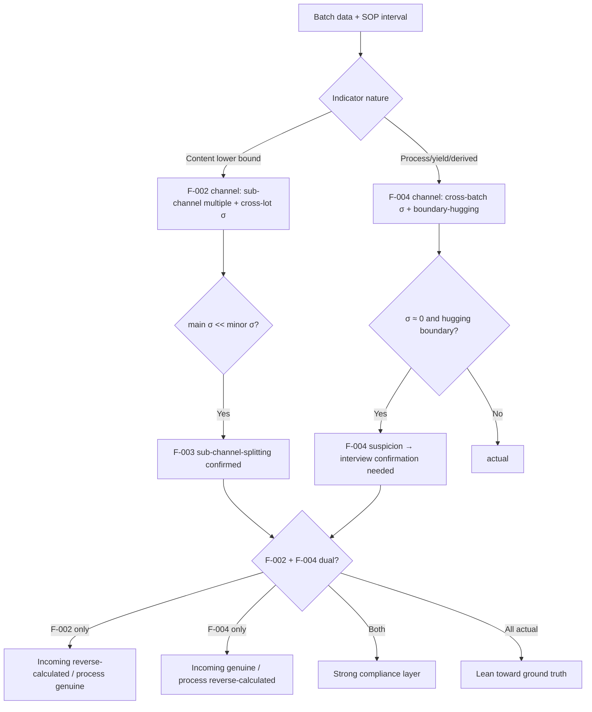

# The Dual Reverse-Calculation Pattern: A Methodology for Auditing Compliance Narratives in Traditional Chinese Medicine Manufacturing

**Author:** Independent Researcher

**Working paper / preprint — not peer reviewed.** Submitted to SSRN (PharmSciRN). License: CC BY 4.0.

---

## Abstract

Batch manufacturing records in Traditional Chinese Medicine (TCM) extraction often appear "perfect"—charging masses precise to 0.01 kg, constant extraction temperatures, fixed solvent-to-material ratios, and batch-to-batch yields that vary by hundredths of a percentage point. Such uniformity is physically implausible. This paper argues that these compliance narratives are products of **dual reverse calculation**, and that a single audit lens misses at least half of the back-calculation signal. We distinguish two co-existing but opposite mechanisms. The first is **culturally driven (F-002)**: because TCM quality standards set only lower bounds on content (no upper bound), the heuristic "higher content equals better quality" biases incoming-material assay figures *upward*. The second is **game-theoretic (F-004)**: front-line operators deliberately record adjustable indicators at the least conspicuous compliant position to preserve a safety margin against future high-baseline assessment and against quality-assurance (QA) investigation, biasing derived indicators such as yield *downward*. We propose an integrated detection framework—a three-layer structural model (F-001), sub-channel splitting (F-003), and a dual reverse-calculation decision tree—operationalized as candidate invariants using a sigma-floor and edge-band test. We stress two boundaries: an n=2 inference limit (single enterprise, two products), and that **identification is not confirmation**—the method raises structured suspicion, it does not prove fraud. We connect the pattern to Goodhart's law, prospect theory, principal–agent theory, actor-network theory, and communities-of-practice scholarship.

**Keywords:** compliance narrative; reverse calculation; Goodhart's law; data integrity; Traditional Chinese Medicine; GMP audit; agentic knowledge engineering; invariant detection; sigma-floor; game theory

---

## 0. Thesis and Positioning

This is the first case-driven methodology paper in Layer 2 of the project's D-route. Where companion papers 00–07 abstract *engineering* methods, this paper abstracts a **domain identification method**. The intended readership is AI engineers working on compliance auditing, industry internal-audit and QA practitioners, and regulators and scholars.

**Core thesis:**

> The key innovation when AI knowledge engineering is applied to compliance-narrative auditing is the identification of a **dual reverse-calculation mechanism**:
> 1. **F-002, culturally driven** ("higher content = better quality" / unconscious / *upward* inflation);
> 2. **F-004, game-theoretically driven** (operator self-protection / conscious / *downward* edge-hugging).
>
> The two **co-exist but run in opposite directions, arise from different drivers, and require different identification methods**. A single identification frame—such as the traditional GMP audit assumption that "the data are genuine, so anomalies should surface"—misses at least half of the reverse-calculation suspicion. Integrated identification requires the F-001 three-layer structure, F-003 sub-channel splitting, and a dual reverse-calculation decision tree.

**Key differences from established GMP audit frameworks:**

| Dimension | PIC/S GMP | FDA Process Validation | This methodology |
|-----------|-----------|------------------------|------------------|
| Data assumption | Genuine + traceable | Genuine + reproducibility verifiable | **Layered artifact** (F-001 / surface ≠ execution ≠ embodied experience) |
| Reverse-calc identification | Document review + deviation log | Control charts + Cpk | **Bidirectional morphology** (F-002 upward + F-004 downward) |
| Cross-batch σ ≈ 0 | Judged as excellent reproducibility | Very high Cpk = conforming | **Reverse-calculation smoking gun** (true σ has been flattened) |
| Interviews | Selective (e.g., during an FDA 483) | Selective | **First-class input / necessary condition for finalizing F-004** |

A traditional framework that sees "six batches with yield σ = 0.022, hugging the 40% lower limit" would judge the process excellent; this methodology judges it a reverse-calculation suspect. This is a **fundamental inversion** of the judgment logic, and the basis for the inversion comes from interview ground truth, not from the data themselves.

---

## 1. Motivation — Why Dual Reverse-Calculation Identification Is Needed

TCM batch records look "perfect" on their face: charging precise to 0.01 kg, constant extraction temperatures, a stable solvent-to-material ratio of 6.000, and yields across six batches confined to a 0.06 percentage-point band. Such perfection is almost physically impossible. The natural moisture content of decoction pieces fluctuates by ±2–5%; operator weighing error runs ±0.05 kg per bag; the electronic balance has ±0.5% precision; and the relative-density endpoint judgment in concentration has ±0.01 precision. Any one of these introduces deviations on the order of hundreds of grams. More suspicious still: for two different products (P1 and P2), with different processes and made in different periods, the charging masses are both "precise to 0.01 kg with cross-batch σ = 0." This can only be the product of reverse calculation back to a template batch size, not of genuine weighing. The case-2 data show that the records have undergone **bidirectional reverse-calculation processing**:

| Dimension | Incoming-material inspection side | Batch-record side |
|-----------|-----------------------------------|-------------------|
| Data morphology | Content hugs the LOQ (one marker glycoside 1.93×, another 1.89×) | Yield hugs the boundary / σ ≈ 0.02 pp |
| Direction | **Upward inflation** | **Downward edge-hugging** |
| Proposition | F-002 cultural discourse | F-004 game theory |

The two directions are opposite, yet both are reverse calculation. F-002 ("high is good") cannot explain why yield would be pushed to the edge; F-004 ("hug the edge to pass") cannot explain why content would be inflated. A user interview (Q-027) directly reveals the F-004 mechanism:

> "Operators tend to bring the parameters that will be inspected into compliance, and then, even if the actual yield is higher, they will not write down the true figure—because they fear the company will later assess them against the higher yield... Front-line operators tend to hug the passing edge every time, so as to leave themselves enough room for future failure."

Q-028 further reveals the operating mechanism: **they do not directly alter the recorded value; instead they control the process so that the outcome lands in the target band.** (Output parameters are constrained by QC and downstream steps, so operators do not falsify them; input parameters have no independent verification, so they are back-filled.)

**Contributions of this paper:** (1) we argue that at least two independent reverse-calculation mechanisms exist within a compliance narrative; (2) the two are identifiable, engineerable as detection logic, and transferable across domains; (3) the dual-identification framework is the core innovation of AI compliance auditing; (4) we deepen the F-004 proposition—operators select the *least conspicuous compliant position*, not simply the lower limit.

---

## 2. F-001 Three-Layer Structure — A Layered Model of the Compliance Narrative

```
Surface (compliance narrative): batch records + incoming inspection + release certificate → visible to GMP inspection
   ↓ structural generation gap
Middle (actual execution): much is never written into records / decided by the workshop head + scheduling / actual equipment availability
   ↓ structural generation gap
Deep (embodied experience): operators' tacit knowledge / self-protection strategy / true production noise
```

**The surface layer comprises three parameter classes** (triggered by Q-028; reverse-calculation cost increases across them):

| Parameter class | Reverse-calculation mechanism | Example | External constraint |
|-----------------|-------------------------------|---------|---------------------|
| Input parameters | Back-filled into the record (no independent verification) | Charge 514.35 kg / temperature 100°C / solvent ratio 6.000 | None |
| Output parameters | Genuinely recorded (not altered) | Relative density / assay / appearance | QC-independent + downstream |
| Derived indicators | Process-controlled to hug the edge (record not altered) | Yield ≈ 40% / 38.3% | Indirect (process control) |

**The middle layer is a level of operations-research decision-making** (workshop head + scheduling; not personal preference, not explicit in the SOP). Two empirical forms appear: P1 exhibits **cross-batch switching** (T101 on equipment E1, 32 h → T102+ on equipment E2, 10 h) versus P2's **within-batch parallelism** (T301 runs three equipment sets in parallel, made explicit by SOP §4.10.5).

**The deep layer** contains true noise (loose execution) + inter-lot incoming variability + the self-protection strategy (the root of F-004) + shift coordination. The strict ABAB alternation of operators is reproduced 100% across 12 batches (P1 + P2)—the shift lead rotates assignments for wage fairness (Q-006). This is one of the few **genuine** fields in the surface layer.

The **three-layer generation gap** is the core of F-001: the surface σ ≈ 0 (the narrative has been flattened by reverse calculation), the middle σ reflects true operations-research fluctuation, and the deep σ_real > 0.5 pp (true process noise). The larger the gap, the deeper the divergence between the compliance narrative and the actual execution. The first-principles task of AI knowledge engineering in compliance auditing is to **explicitly distinguish these three layers and measure the gap**—rather than feeding the surface record to a model as if it were ground truth. This is precisely where F-001 diverges fundamentally from the traditional "clean the data and you can model it" assumption (see companion paper 09).

---

## 3. F-002 Cultural-Discourse Reverse Calculation — Upward Bias

**Proposition:** TCM quality standards set only a lower bound on content (no upper bound) → the "higher content = better quality" cultural discourse → an upward reverse-calculation bias. The **scope is restricted** to "content determination (one-sided lower bound)" for finished TCM and decoction pieces; it does not apply to intermediates, excipients, or packaging materials (which carry dual-limit standards, lack the cultural discourse; see ADR-034).

**F-003 sub-channel splitting** (finalized in three dimensions)—reverse-calculation difficulty ∝ 1 / |standard value × allowable error|:

| Sub-channel | Standard magnitude | Measured multiple | Reverse-calc difficulty |
|-------------|--------------------|-------------------|-------------------------|
| main_component | ≥ 30% | 1.01–1.17× (hugging LOQ) | Low (an absolute difference of 1–4 pp already reads as "just over the line") |
| extract (leachables) | 2–30% | 1.25–1.68× | Medium |
| minor_component | < 30% | 1.30–2.83× | High (an absolute difference of 0.04–2 pp is, conversely, conspicuous) |
| dual_limit (intermediate/excipient/packaging) | Interval-based | Hugs the midpoint / consistent across lots | Low (F-002 does not apply) |

**Cross-product evidence:** the most extreme main-component sample hugging the LOQ is P2's gypsum (CaSO₄·2H₂O) at 1.014× (only 1.3 pp high); the minor sub-channel distributions across products **overlap almost completely** (P1 mean 1.839 vs P2 mean 1.833; difference 0.006; ranges overlap 78%). Main hugging and minor dispersed-but-co-distributed together constitute the cross-product confirmation of F-003.

**The range-ratio matrix** (the strongest evidence of sub-channel splitting): within a single lot (L1), the horizontal main:minor range ratio is approximately **55:1**; across lots (L1 → L2) it widens to **136–370:1** (minor range ~9.98 vs main range ~0.027). That is, the same reverse-calculation bias produces almost no visible fluctuation in the main-component channel (the absolute differences are small and easily "just over the line") yet large dispersion in the minor channel (small absolute differences that are nonetheless conspicuous and hard to back-calculate). An F-001 second-order check that does not split by sub-channel will see the reverse-calculation signal diluted by cross-indicator averaging.

**The strongest form of qualitative reverse calculation:** gypsum's heavy-metal and arsenic results are reported only as "did not exceed X" with no numeric value ("did not exceed" is equivalent to "≤ upper limit," leaving no datum that can be independently scrutinized); and the mercury content across four materials (one material under P1; three under P2) is uniformly reported as 0.1 mg/kg (50% of LOD; A-018). Cross-species physiological bioaccumulation differences should span more than 100-fold, so a uniform fill value is an LOD-boundary reverse-calculation suspect.

---

## 4. F-004 Game-Theoretic Reverse Calculation — Downward Edge-Hugging (Core of This Paper)

**Proposition** (emerged at GO-E-α; X1 finalized at GO-G-γ): out of game-theoretic self-protection, operators write adjustable indicators at the **least conspicuous compliant position**, leaving a "safety cushion" for future failure. The driver is twofold: fear of being assessed against a high baseline + fear of QA investigating an anomaly.

**Deepening of the proposition**—it is not a mechanical "hug the lower limit," but a choice of the "least conspicuous position":

| Product | SOP spec | Hugged position | σ (pp) |
|---------|----------|-----------------|--------|
| P1 | Interval 40–45% / no benchmark | Lower limit 40% | 0.0223 |
| P2 | Interval 36–41% / benchmark 38.3% | Benchmark 38.3% | 0.0275 |

Where the SOP gives an interval → operators choose the lower limit; where it gives a benchmark → they choose the benchmark value. Both forms are empirical evidence of "leaving room for failure." The σ magnitudes are consistent across products (ratio 1.23) and the deviation magnitudes are nearly identical (0.26–0.32 vs 0.264–0.341 pp), constituting a complete empirical demonstration of the cross-product robustness of F-004 X1.

**F-002 vs F-004 comparison (core table):**

| Dimension | F-002 | F-004 |
|-----------|-------|-------|
| Reverse-calc direction | Upward inflation | Downward edge-hugging / benchmark-hugging |
| Applicability | Content lower-bound indicators (incoming) | Yield / derived indicators (batch records) |
| Driver | Cultural discourse ("high is good") | Game-theoretic self-protection (fear of assessment + fear of investigation) |
| Trigger | Mental bias (unconscious) | Rational strategy (conscious) |
| Data morphology | Multiple 1.04–2.83× | σ ≈ 0 + hugging the boundary |
| Identification method | Sub-channel distribution test | Cross-batch σ + boundary-hugging + **interview** |
| Operating mechanism | Directly fill high | Do not alter the record / process-control to target |
| Agent | Inspector / process technician | Front-line operator / shift lead |

**Cross-product σ evidence** (raw data for 12 batches / sample σ): P1, six batches, yields [40.27, 40.26, 40.30, 40.28, 40.32, 40.30] (σ = 0.0223, hugging the 40% lower limit); P2, six batches, yields [38.575, 38.564, 38.586, 38.581, 38.641, 38.575] (σ = 0.0275, hugging the 38.3% benchmark). The two products differ in process, equipment, and batch size, yet their σ values are nearly identical (magnitude ratio 1.23)—itself circumstantial evidence that σ is determined by recording/edge-hugging habit rather than by process fluctuation. Combined with cross-batch σ = 0 for the charging masses of seven materials, the solvent ratio, temperature, and time, this constitutes complete confirmation of the F-001 surface layer.

**Key engineering implication:** traditional statistical auditing looks only at distribution morphology (σ ≈ 0 is treated as excellent); an F-004 determination must overlay interview ground truth (true process σ > 0.5 pp) to flip "excellent" into "reverse-calculated." This is the watershed between this methodology and traditional auditing, and it is the fundamental reason why, in the engineering of §5, the σ threshold must be drawn from interviews rather than set as a constant.

**Cross-domain transfer value:** F-004 is a proposition combining game theory and industrial psychology, applicable to any domain in which three conditions co-exist—external assessment + front-line self-entry authority + bounded indicators (earnings edge-hugging, p-hacking, KPI attainment, clinical endpoints). The proposition formalizes as: **the interaction of reverse-calculation difficulty + operator self-protection strategy + external assessment mechanism.**

---

## 5. Integrated Framework — Dual Reverse-Calculation Identification

**Identification decision tree:**



**This can be engineered into candidate invariants V12–V14** (extending the V1–V11 data-correctness invariants into the compliance-audit domain):

| Invariant | Detection |
|-----------|-----------|
| V12 `reverse_calc_F002` | Test incoming lower-bound indicators by distribution across six sub-channels (single-lot multiple + cross-lot σ) |
| V13 `reverse_calc_F004` | Batch records with cross-batch σ ≈ 0 and deviation from the SOP boundary < 1 pp |
| V14 `dual_limit` | dual_limit sub-channel hugs the midpoint / consistent across lots |

The key engineering contract: the σ threshold (a lower bound on true process noise) **comes from domain interview ground truth, not a constant**—this is the fundamental difference between this methodology and traditional statistical auditing. The V13 detection logic (deterministic, no LLM required):

```python
def detect_f004(batches, spec, sigma_floor_pp):   # sigma_floor comes from interview (e.g., Q-027: >0.5pp)
    yields = [b.yield_pct for b in batches]
    sigma  = pstdev(yields)
    edge   = nearest_spec_edge(mean(yields), spec)         # lower limit / benchmark / midpoint
    if sigma < sigma_floor_pp / 20 and abs(mean(yields) - edge) < 1.0:
        return Suspicion("F-004", form=classify_edge(edge), needs_interview=True)
    return OK()
```

F-002 and F-004 are **two independent paths**; their conclusions feed into the decision tree for integrated judgment, and neither single path is complete on its own. The "suspicion" produced by detection enters human triage (interview / on-site confirmation), and the review conclusion is written back as the next round's ground truth—forming a closed loop of "structural check raises suspicion → interview-confirmation mechanism → ground truth written back."

---

## 6. Applied Example — TCM Extraction Case (case-2)

Two products (P1 and P2) / 12 batches + 29 materials in 6 classes / 6 suppliers. Key findings:

- **F-002 (incoming side):** main hugs the LOQ (gypsum 1.014×, poria 1.07×); minor distributions overlap across products [1.30–2.83×]; qualitative suspicion (gypsum "did not exceed" + uniform mercury 0.1).
- **F-004 (batch-record side):** precise per-batch σ computation—

| Product | Mean | Sample σ (pp) | Hugs | Flattening relative to true σ > 0.5 pp |
|---------|------|---------------|------|----------------------------------------|
| P1 (6 batches) | 40.288 | 0.0223 | Lower limit 40.0 | ~24.6× |
| P2 (6 batches) | 38.587 | 0.0275 | Benchmark 38.3 | ~19.9× |

- **F-001 three layers:** surface charging/yield/process parameters σ ≈ 0; middle layer two forms; deep layer ABAB stable across products + revealed by Q-027.

**Integrated judgment = mixed compliance layer:** incoming main + yield + process parameters = strong reverse-calculation suspicion; incoming minor + output parameters (QC-reviewed) = lean genuine; operators/shifts = genuine. "Mixed" is not vagueness but a **field-by-field layered** conclusion—within one and the same batch record, fields constrained by QC/downstream lean genuine while fields without external verification lean reverse-calculated. The implication for AI knowledge engineering is: **one cannot assign a single trustworthiness score to a whole record; trust must be assigned channel by channel (parameter class × sub-channel × presence of external constraint).** A traditional Cpk lens would judge a yield σ = 0.022 a "perfect process"; this methodology judges it a reverse-calculation smoking gun—a **judgment-logic inversion** whose basis comes from the Q-027 interview, not from the data themselves.

---

## 7. Cross-Domain Transferability

**Applicability conditions (all three co-existing):** external assessment pressure + front-line self-entry authority + indicators with SOP boundaries.

**§7.1 Earnings benchmark-beating — the strongest cross-domain isomorph of F-004.** Burgstahler & Dichev (1997) found a discontinuity in the earnings of U.S. listed firms around the "zero" threshold: the frequency of small losses is anomalously low while small profits just above zero are anomalously high—pushing the indicator just over the boundary. Graham, Harvey & Rajgopal (2005), surveying 401 executives, found that roughly 78% admitted to sacrificing long-term value to meet targets, and that they **prefer real operating actions over accounting adjustments**—isomorphic to F-004's "change the process, not the books" (§4 / Q-028).

**§7.2 Academic p-hacking — isomorph plus methodological caution.** Simmons, Nelson & Simonsohn (2011) showed that undisclosed "researcher degrees of freedom" can push the false-positive rate to roughly 60%, by a mechanism isomorphic to F-004 (controlling process choices to cross the p < 0.05 threshold). A caution is warranted, however: it was once argued that "an anomalous clustering of p-values just below 0.05" is distribution-level evidence of p-hacking (Masicampo & Lalande 2012; Head et al. 2015), but subsequent reanalyses **failed to robustly replicate** this and noted that publication bias is a more likely explanation. This conversely confirms the core claim of this paper: **pure distributional evidence (σ ≈ 0 / a bump at a threshold) is itself ambiguous**; the reason case-2's F-004 is stronger is that it overlays the Q-027 interview as ground truth—**the distribution raises suspicion, the interview confirms the mechanism.** The cross-domain isomorphism of F-002 (cultural-discourse upward) is weaker and requires domain-by-domain identification of the discourse structure.

**§7.3 Relationship to existing theory:**

- **Goodhart's Law / Campbell's Law** (a measure that becomes a target ceases to be a good measure): F-002 + F-004 are a **structural extension** of these—Goodhart's original proposition argues only that "reverse calculation will occur," whereas this paper argues for its **directionality** (within a single system, upward and downward can co-exist, the direction determined by "indicator nature + driving mechanism").
- **Prospect Theory** (Kahneman & Tversky): the cognitive basis of F-004 is loss aversion—"reporting a high yield → being assessed against the high figure in future" is a potentially large loss, while "hugging the passing edge" is the rational, loss-avoiding choice even at the cost of forgoing short-term gain. F-004 further extends single-decision loss aversion into a stable behavioral pattern under **repeated-game** conditions (cross-batch σ ≈ 0).
- **Principal–Agent** (information asymmetry): the F-001 three layers are a multi-level instantiation of it—the principal (company / regulator) sees only the surface inscription, while the agent (operator / process technician) alone knows the middle and deep layers; this is a structurally irreducible asymmetry. The policy implication: intensifying surface inspection is ineffective (the principal cannot see the middle and deep layers); one must change the information structure (a workshop observer / changing the assessment mechanism).
- **Latour ANT / STS:** the surface record is an **inscription** that engraves fluid practice into a circulable document; what GMP audit sees is the inscription black box. σ ≈ 0 hugging the boundary is a **steady-state trace** of a trial of strength reached among the parties, not process excellence. This methodology can be read as an AI-engineering version of ANT—identifying the traces of strategy left on the inscription.
- **Wenger communities of practice / Scott métis:** F-004 is not an individual moral problem but a stable strategy transmitted via apprenticeship within a community of practice (the 100% cross-product reproduction of ABAB shift rotation is its organizational trace). Hence training / SOPs / warnings cannot eliminate F-004—it does not reside at the individual level; the path to its elimination lies in changing the middle-layer operations mechanism + the organizational-cultural structure (e.g., team performance replacing per-batch wages).

---

## 8. Limitations

- **Inference boundary (n=2):** all evidence rests on a single enterprise and two products (P1 + P2 / 12 batches + 29 materials), and the interviews are indirect evidence (not on-site observation, not the operators themselves). The cross-product robustness conclusions are therefore limited to "internal consistency across the two products"; extrapolation across enterprises and across product categories is a **directional hypothesis, not a proven proposition** (X2, see the next item).
- The F-004 X2 cross-enterprise empirical test has not been performed (a decision was made to set it aside for now / documented as unresolvable / generalizability to be strengthened via literature review).
- We lack "second-order ground truth" such as raw HPLC chromatograms or TLC plate photographs.
- **Identification ≠ confirmation (a methodologically self-aware boundary):** dual reverse-calculation identification is a **structural screen that raises suspicion, not a conviction.** σ ≈ 0, boundary-hugging, sub-channel splitting, and the like only flag a field as a "reverse-calculation suspect"; confirmation must overlay interviews / on-site observation / raw instrument data (the closed loop of §5, and the lesson of §7.2 that "distributional evidence is itself ambiguous"). This methodology is positioned as the **first screen** of an audit; it does not replace institutional confirmation.
- Ethics: F-004 is the **rational behavior** of front-line personnel, not a moral problem; technical means (AI auditing) cannot substitute for institutional design. The cross-cultural universality of F-002 is lower than that of F-004.

---

## 9. Relationship to Existing Methodology

**§9.1 Implementing V12–V14 in traceguard (the runtime substrate)**

> **[PoC-validated 2026-06-04 / GO-Z-η]** The E1–E3 + V13 design in this section has been landed on the real traceguard architecture and run end-to-end (a real 6-batch σ matrix run through the real CLI `guardian check` → `action=alert` / σ = 0.0203 hugging the 40.0 lower limit / DEGRADED with no LLM / dogfood 246 passed / 0 regressions). The real run corrected naming and units relative to the design draft: the method name is `output.output_as_dict()` (not `as_dict()`); core mode uses the generic `"sigma_floor"` (dropping the `F004_` prefix, with F-004 semantics moved into a config comment); and core fields use `sigma_floor` / `edge_band` (dropping the `_pp` unit, with pp moved into a config comment). **A new E4 candidate = structured-output persistence:** `EvalTrace` stores only a truncated `output_preview`, so cross-batch scalar retrieval requires structured persistence—something a pure design draft could not have surfaced; it has been registered as a candidate input for the D-route 2027-01 framework v0.1. See `../cases/tcm-extraction/traceguard-poc/poc-results-v0.1.md`.

The two Layer-1 substrates divide labor: the HuaDian knowledge-side framework (`identity_resolver` / `invariant_scaffold` / `audit_triage`) and the traceguard runtime QA substrate are complementary. V12–V14 are deterministic statistical checks that land in traceguard's **structural layer** (`validators/structural.py::validate_structural → StructuralResult`), **requiring no LLM**—they run as usual in `env.py`'s DEGRADED mode (structural-only). Mapping points:

- Cross-batch σ needs historical data → read the eval_store via `store/reader.py::TraceReader.query_traces()` (state lives in the eval_store; guardian remains stateless);
- Suspicion is persisted → `TraceWriter.write(action="alert", passed=False, issues=[...])` (reverse calculation is an audit flag, not an abort);
- Review → `optimizer/suggestion.py::generate_suggestions()` (advisory / human-in-the-loop / never auto-applied);
- σ_floor / sub-channel definitions / spec boundaries → domain config (`configs/examples/tcm_extraction.yaml`), not the generic core.

**The stateless × cross-batch-σ solution:** the traceguard guardian is per-step stateless, but V13 needs to span six batches. Following the principle "all state lives in eval_store," V13 pulls the prior N batches via `TraceReader.query_traces(limit=6)`, computes σ in memory, and writes back—so guardian itself remains stateless. Domain parameters (including the interview-derived σ_floor) go in config, not the generic core:

```yaml
# configs/examples/tcm_extraction.yaml (reverse_calc extension block / PoC-validated as-built naming)
reverse_calc:
  mode: "sigma_floor"          # generic / core does not contain F004; the F-004 downward edge-hugging semantics are noted here
  window_batches: 6
  sigma_floor: 0.5             # pp / ★ ground truth from interview Q-027 (not a constant / core field drops the pp unit)
  spec_edges: { "P1": {type: interval_low, value: 40.0},
                "P2": {type: benchmark, value: 38.3} }
```

The implementation requires three framework extension points (= case-2's framework-abstraction output for traceguard / D-route 2027-01 v0.1 candidates): **E1** a new `reverse_calc` structural-check type (a generic statistical reverse-calculation capability, not bound to TCM); **E2** pluggable check registration (currently four are hard-wired / they need to be enabled by config declaration); **E3** "suspicion vs failure" audit-flag semantics (`passed=False` but the data are not "wrong," and must not pollute `get_step_stats().pass_rate`). These three are a textbook separation of generic capability into core and domain parameters into config. The full implementation design (mapping table + V13 real-signature pseudocode + closed loop) is in the unabridged draft, archive §9.1.

**§9.2 Relationship to existing framework papers:** V12–V14 extend paper 04 (invariants); F-002/F-004 suspicion → the triage of paper 05 (audit trail); cross-lot/batch linkage uses R1–R6 from paper 03 (identity resolver); ADR-033/034/035 are instances of paper 06 (ADR for KE). **§9.3 Relationship to the Layer-3 case library:** this paper is the methodological distillation of case-2, and other cases (earnings, clinical, etc.) are encouraged to cite, validate, and refute it. With paper 09 (layered compliance narrative / structural identification), it forms a "structure × mechanism" mutual-confirmation panel.

---

## 10. References

> All entries have been verified by web search; volume, issue, and page numbers have been finalized. Goodhart's (1975) original (RBA *Papers in Monetary Economics*) has no standard pagination, so the precise volume and pages of the authoritative reprint are appended.

- Burgstahler, D., & Dichev, I. (1997). Earnings Management to Avoid Earnings Decreases and Losses. *Journal of Accounting and Economics*, 24(1), 99–126.
- Graham, J. R., Harvey, C. R., & Rajgopal, S. (2005). The Economic Implications of Corporate Financial Reporting. *Journal of Accounting and Economics*, 40(1–3), 3–73.
- Simmons, J. P., Nelson, L. D., & Simonsohn, U. (2011). False-Positive Psychology. *Psychological Science*, 22(11), 1359–1366.
- Masicampo, E. J., & Lalande, D. R. (2012). A peculiar prevalence of p values just below .05. *Quarterly Journal of Experimental Psychology*, 65(11), 2271–2279.
- Head, M. L., Holman, L., Lanfear, R., Kahn, A. T., & Jennions, M. D. (2015). The Extent and Consequences of P-Hacking in Science. *PLoS Biology*, 13(3), e1002106.
- Kahneman, D., & Tversky, A. (1979). Prospect Theory: An Analysis of Decision under Risk. *Econometrica*, 47(2), 263–291.
- Jensen, M. C., & Meckling, W. H. (1976). Theory of the Firm: Managerial Behavior, Agency Costs and Ownership Structure. *Journal of Financial Economics*, 3(4), 305–360.
- Goodhart, C. A. E. (1975). Problems of Monetary Management: The U.K. Experience. In *Papers in Monetary Economics* (Vol. I). Sydney: Reserve Bank of Australia. (Reprinted in C. A. E. Goodhart (1984), *Monetary Theory and Practice: The U.K. Experience*, pp. 91–121. London: Macmillan.)
- Campbell, D. T. (1979). Assessing the Impact of Planned Social Change. *Evaluation and Program Planning*, 2(1), 67–90.
- Latour, B. (1987). *Science in Action: How to Follow Scientists and Engineers through Society*. Cambridge, MA: Harvard University Press.
- Wenger, E. (1998). *Communities of Practice: Learning, Meaning, and Identity*. Cambridge: Cambridge University Press.
- Scott, J. C. (1998). *Seeing Like a State: How Certain Schemes to Improve the Human Condition Have Failed*. New Haven, CT: Yale University Press.

---

## 11. Notes on Data and Reproducibility

This paper and all case-2 accompanying data have undergone systematic de-identification. Product names (P1/P2/P3), batch numbers (B1–B12), incoming-material lots (L1/L2), equipment models (E1–E6), and enterprise, supplier, and personnel names are all pseudonyms. Computation-input values—σ, range ratios, multiples, and the like—retain their original values, so the conclusions are recomputable. The pseudonym mapping is not published.

The source corpus is a TCM extraction case (a single enterprise, two products P1 + P2; 28 incoming-material inspection records + 12 batch manufacturing records + a 5-question user interview). Associated findings: F-001 / F-002 / F-003 / F-004. Associated decision records: ADR-033 / ADR-034 / ADR-035. The companion paper is "The Layered Compliance-Narrative Pattern" (paper 09), which provides "structure × mechanism" mutual confirmation.

**Correspondence:** lizhuojun@gmail.com (Independent Researcher). Project repository: https://github.com/lizhuojunx86/huadian.

**Acknowledgments and drafting note:** This working paper was produced in a human–AI collaboration workflow: drafting, statistical computation, and reference verification were AI-assisted (Claude, Anthropic). The author supplied the domain ground truth (industry experience and the interviews cited in the text), made and approved all methodological decisions, and takes sole responsibility for the content.

**Data availability:** The de-identified structured dataset underlying this paper—including the per-batch yield series and σ computations, the sub-channel multiple distributions, and the range-ratio matrix—is openly available under CC BY 4.0 in the project repository (directory `docs/cases/tcm-extraction/`): https://github.com/lizhuojunx86/huadian. The pseudonym mapping that links published values to the enterprise, products, batches, suppliers, or personnel is not published and will not be shared under any terms. Further de-identified numeric detail is available from the author on reasonable request, subject to the same de-identification constraints.

---

*Preprint / working paper — not peer reviewed. Comments welcome. © The Author. Licensed under Creative Commons Attribution 4.0 International (CC BY 4.0).*
