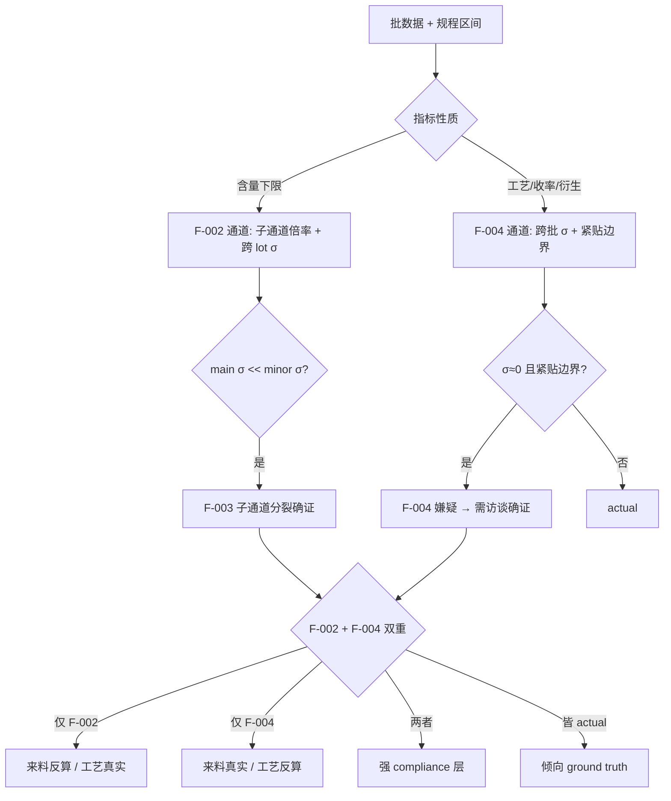

# 双重反算识别模式 — 中药合规叙事的方法论框架
# Dual Reverse Calculation Identification Pattern — Methodology for TCM Compliance Narrative Audit

> Status: **v0.3 完整初稿（精炼版 / 2026-06-01 GO-R-η）+ v0.4 审稿前置批（author-side / 2026-06-05 GO-AA-η）** — 内容项 8/8 完成后精简到目标字数
> Owner: 首席架构师
> 脱敏说明（2026-06-11）: 本文及全部 case-2 配套数据已完成系统性脱敏——产品名（P1/P2/P3）、批号（B1~B12）、来料 lot（L1/L2）、设备型号（E1~E6）、企业/供应商/人名均为假名；σ、极差比、倍率等计算输入数值保留原值，结论可复算。假名映射不公开。
> Source: case-2 中药提取案例（企业 A / P1 + P2双产品 / 28 物料来料检验 + 12 批生产记录 + 5 题用户访谈）
> 关联 finding: F-001 v0.4 / F-002 v0.3 / F-003（finalized 三维）/ F-004（X1 finalized）
> 关联 ADR: ADR-033 / ADR-034 / ADR-035（schema v0.1→v0.4）
> 版本史与逐批进度：见 git 历史 + `docs/CHANGELOG.md` + case-2 §10；全量未精简稿见 `archive/08-dual-reverse-calculation-pattern-v0.3-full-2026-06-01.md`
> 配对文章：`09-layered-compliance-narrative-pattern.md`（结构 × 机制 互证）

---

## 0. 论点与定位

D-route Layer 2 首篇案例驱动的方法论文章（00-07 抽象工程方法；本文抽象**领域识别方法**）。目标读者：合规审计方向的 AI 工程师 / 行业内审与 QA / 监管与学界。

**核心论点**：

> AI 知识工程做合规叙事审计的关键创新，是识别**双重反算机制**：
> 1. **F-002 文化话语驱动**（"含量高=质量好" / 无意识 / **upward 推高**）；
> 2. **F-004 博弈论驱动**（操作工自我保护 / 有意识 / **downward 压线**）。
>
> 两者**并存但方向相反、驱动不同、识别方法不同**。单一识别框架（如传统 GMP 审计假设"数据真实、异常应显现"）会漏掉至少一半反算嫌疑。整合识别需要：F-001 三层结构 + F-003 子通道分裂 + 双重反算决策树。

**与既有 GMP 审计框架的关键差异**：

| 维度 | PIC/S GMP | FDA Process Validation | 本文方法论 |
|------|-----------|------------------------|-----------|
| 数据假设 | 真实 + 可追溯 | 真实 + 重复性可验证 | **分层制品**（F-001 / 表层≠执行≠经验）|
| 反算识别 | 文档审查 + 偏差日志 | 控制图 + Cpk | **双向形态**（F-002 upward + F-004 downward）|
| 跨批 σ≈0 | 判优秀重复性 | Cpk 极高 = 合格 | **反算 smoking gun**（真实 σ 被压平）|
| 访谈 | 选择性（FDA 483 时）| 选择性 | **一等输入 / F-004 finalize 必要条件** |

传统框架若见"6 批收率 σ=0.022、紧贴下限 40%"会判优秀工艺；本方法论判反算嫌疑——这是判断逻辑的**根本反转**，且反转依据来自访谈 ground truth，而非数据本身。

---

## 1. 引子 — 为什么需要双重反算识别

中药批生产记录表面"完美"：投料精确到 0.01 kg、提取温度恒定、料液比稳定 6.000、跨 6 批收率窄至 0.06 个百分点。这种完美在物理上几乎不可能：饮片含水量自然波动 ±2-5%、操作工称量误差 ±0.05 kg/袋、电子秤精度 ±0.5%、浓缩终点相对密度判定精度 ±0.01——任一项都会引入数百克级偏差。更可疑的是，P1与P2两个不同产品、不同工艺、不同时期，投料量都"精确到 0.01 kg 且跨批 σ=0"，这只能是反算到模板批量的产物，而非真实称量。case-2 数据显示，记录经过**双向反算加工**：

| 维度 | 来料检验侧 | 批生产记录侧 |
|------|---------|----------|
| 数据形态 | 含量紧贴 LOQ（甘草苷 1.93x / 栀子苷 1.89x）| 收率紧贴边界 / σ≈0.02pp |
| 方向 | **upward 推高** | **downward 压线** |
| 命题 | F-002 文化话语 | F-004 博弈论 |

两个方向相反但都是反算——F-002"高即好"解释不了收率为何被压线，F-004"压线合格"解释不了含量为何被推高。用户访谈（Q-027）直接揭示 F-004 机制：

> "操作工往往将需检验的参数控制到位后，即便收率更高也不会写真实的数据，因为怕以后公司按照较高的收率考核他……一线操作工倾向于每次都压线合格，以便给自己留足未来的失败空间。"

Q-028 进一步揭示操作机制：**不直接改记录值，而是通过控制工艺过程让结果落到目标区间**（输出参数受 QC + 下游约束，操作工不造假；输入参数无独立验证，倒推填表）。

**本文贡献**：(1) 论证合规叙事中存在至少两种独立反算机制；(2) 二者可识别、可工程化检测、可跨域迁移；(3) 双重识别框架是 AI 合规审计的核心创新；(4) F-004 命题深化——操作工选"最不引人注目的合规位置"，而非简单压在下限。

---

## 2. F-001 三层结构 — 合规叙事的分层模型

```
表层（合规叙事）：批生产记录 + 来料检验 + 放行单 → GMP 检查可见
   ↓ 结构性代差
中层（实际执行）：多未写入记录 / 由车间主任 + 排产决定 / 设备实际可用性
   ↓ 结构性代差
深层（身体化经验）：操作工隐性知识 / 自我保护策略 / 真实生产噪声
```

**表层分三类参数**（Q-028 触发 / 反算成本递增）：

| 参数类型 | 反算机制 | 实例 | 外部约束 |
|---------|---------|-----|---------|
| 输入参数 | 倒推填表（无独立验证）| 投料 514.35 kg / 温度 100°C / 料液比 6.000 | 无 |
| 输出参数 | 真实记录（不修改）| 相对密度 / 含量测定 / 外观 | QC 独立 + 下游 |
| 衍生指标 | 工艺控制压线（不改记录）| 收率 ≈ 40% / 38.3% | 间接（过程控制）|

**中层为运筹层决策**（车间主任 + 排产 / 非个人偏好、非规程明文），实证两形态：P1**跨批切换**（T101 E1 32h → T102+ E2 10h）vs P2**同批并行**（T301 三套设备并行 / 规程 §4.10.5 明示）。

**深层**含真实噪声（操作不严谨）+ 来料批间差异 + 自我保护策略（F-004 根源）+ 班次配合。操作人 ABAB 严格交替跨 12 批（P1 + P2）100% 复现（班长按工资公平轮值 / Q-006）——这是表层少数**真实**字段之一。

**三层代差**是 F-001 的核心：表层 σ ≈ 0（叙事被反算抹平）、中层 σ 为真实运筹波动、深层 σ_real > 0.5pp（真实工艺噪声）。代差越大，合规叙事与实际执行的偏离越深。AI 知识工程做合规审计的第一性任务，是**显式区分这三层并测量代差**——而不是把表层记录当 ground truth 直接喂给模型。这正是 F-001 与传统"数据清洗即可建模"假设的根本分歧（详见配对文章 09）。

---

## 3. F-002 文化话语反算 — Upward 偏向

**命题**：中成药质量标准只设含量下限（不设上限）→ "含量高=质量好"文化话语 → upward 反算偏向。**适用范围限定**为中药材成品 / 饮片的"含量测定（单边下限）"；不适用于中间体 / 辅料 / 包材（dual_limit 标准 / 无文化话语 / 见 ADR-034）。

**F-003 子通道分裂**（finalized 三维）—— 反算难度 ∝ 1 / |标准值 × 允许误差|：

| _subchannel | 标准量级 | 实测倍率 | 反算难度 |
|-------------|---------|---------|---------|
| main_component | ≥30% | 1.01–1.17x（紧贴 LOQ）| 低（绝对差 1-4pp 即"刚过线"）|
| extract（浸出物）| 2–30% | 1.25–1.68x | 中 |
| minor_component | <30% | 1.30–2.83x | 高（绝对差 0.04-2pp 反而显眼）|
| dual_limit（中间体/辅料/包材）| 区间制 | 紧贴中点 / 跨 lot 一致 | 低（F-002 不适用）|

**跨产品实证**：main 紧贴 LOQ 的最极端样本是P2**石膏 CaSO₄·2H₂O 1.014x**（仅高 1.3pp）；minor 子通道跨产品分布**完全重叠**（P1均值 1.839 vs P2 1.833 / 差 0.006 / 范围重叠 78%）——main 紧贴、minor 离散但同分布，是 F-003 的跨产品确证。

**极差比矩阵**（最有力的子通道分裂证据）：lot-L1 单 lot 横向 main:minor 极差比 ≈ **55:1**；跨 lot（L1→L2）扩大到 **136–370:1**（minor 极差 ~9.98 / main 极差 ~0.027）。即：同一反算偏向，在主成分通道几乎无可见波动（绝对差小、易"刚过线"），在微量通道却呈现大幅离散（绝对差小却显眼、难反算）。F-001 二阶检验若不分子通道，反算信号会被跨指标平均稀释。

**定性化反算最强形态**：石膏重金属/砷只报"未过 X"无具体数值（"未过"等价于"≤上限"，无任何数据可被独立审查）；汞含量跨 4 物料（P1三七 + P2栀子/玄参/柴胡）统一报 0.1 mg/kg（50% LOD / A-018）——跨物种生理性富集差异应达 100 倍以上，统一填值是 LOD 边界反算嫌疑。

---

## 4. F-004 博弈论反算 — Downward 压线（本文核心）

**命题**（GO-E-α 浮现 / GO-G-γ finalize X1）：操作工出于博弈论自我保护，把可调整指标写入**最不引人注目的合规位置**，给未来失败留"安全垫"。双重驱动：怕被高基线考核 + 怕 QA 调查异常。

**命题深化**——不是机械"压下限"，而是选"最不引人注目的位置"：

| 产品 | 规程 | 紧贴位置 | σ(pp) |
|------|------|---------|-------|
| P1 | 区间 40–45% / 无标杆 | 下限 40% | 0.0223 |
| P2 | 区间 36–41% / 标杆 38.3% | 标杆 38.3% | 0.0275 |

规程只给区间→选下限；给标杆→选标杆值。两形态都是"留失败空间"的实证。跨产品 σ 量级一致（比 1.23）、偏离量级几乎相同（0.26–0.32 vs 0.264–0.341 pp）= F-004 X1 跨产品稳健性完整实证。

**F-002 vs F-004 对比（核心图表）**：

| 维度 | F-002 | F-004 |
|------|-------|-------|
| 反算方向 | upward 推高 | downward 压线 / 贴标杆 |
| 适用 | 含量下限指标（来料）| 收率 / 衍生指标（批记录）|
| 驱动 | 文化话语（"高即好"）| 博弈论自保（怕考核+怕调查）|
| 触发 | 心智偏向（无意识）| 理性策略（有意识）|
| 数据形态 | 倍率 1.04–2.83x | σ≈0 + 紧贴边界 |
| 识别方法 | 子通道分布检验 | 跨批 σ + 紧贴边界 + **访谈** |
| 操作机制 | 直接填高 | 不改记录 / 工艺控制达标 |
| 主体 | 检验员 / 工艺员 | 一线操作工 / 班长 |

**跨产品 σ 实证**（12 批原始数据 / 样本 σ）：P1 B1~106 收率 [40.27, 40.26, 40.30, 40.28, 40.32, 40.30]（σ=0.0223 / 紧贴下限 40%）；P2 B7~306 收率 [38.575, 38.564, 38.586, 38.581, 38.641, 38.575]（σ=0.0275 / 紧贴标杆 38.3%）。两产品工艺、设备、批量都不同，σ 却几乎相同（量级比 1.23）——这本身就是"σ 由填表/压线习惯而非工艺波动决定"的旁证。配合 7 物料投料量、料液比、温度、时间跨批 σ=0，构成 F-001 表层完整确证。

**关键工程含义**：传统统计审计只看分布形态（σ≈0 视为优秀）；F-004 判定必须叠加访谈 ground truth（真实工艺 σ>0.5pp）才能把"优秀"翻转为"反算"。这是本方法论与传统审计的分水岭，也是 §5 工程化时 σ 阈值必须取自访谈而非常量的根本原因。

**跨域迁移价值**：F-004 = 博弈论 + 行业心理学命题，适用于"外部考核 + 一线自填权限 + 指标有边界"三者并存的任何领域（财报压线、p-hacking、KPI 达标、临床终点）。命题形式化：**反算难度 + 操作者自我保护策略 + 外部考核机制 三者交互**。

---

## 5. 整合框架 — 双重反算识别

**识别决策树**：



**可工程化为 V12-V14 候选 invariant**（扩展 V1-V11 数据正确性 invariant 到合规审计领域）：

| Invariant | 检测 |
|-----------|------|
| V12 `reverse_calc_F002` | 来料下限指标按 6 子通道分布检验（单 lot 倍率 + 跨 lot σ）|
| V13 `reverse_calc_F004` | 批记录跨批 σ≈0 且偏离规程边界 < 1pp |
| V14 `dual_limit` | dual_limit 子通道紧贴中点 / 跨 lot 一致 |

关键工程契约：σ 阈值（真实工艺噪声下界）**来自领域访谈 ground truth**，非常量——这是本方法论与传统统计审计的根本差异。V13 检测逻辑（确定性 / 无需 LLM）：

```python
def detect_f004(batches, spec, sigma_floor_pp):   # sigma_floor 来自访谈（如 Q-027: >0.5pp）
    yields = [b.yield_pct for b in batches]
    sigma  = pstdev(yields)
    edge   = nearest_spec_edge(mean(yields), spec)         # 下限 / 标杆 / 中点
    if sigma < sigma_floor_pp / 20 and abs(mean(yields) - edge) < 1.0:
        return Suspicion("F-004", form=classify_edge(edge), needs_interview=True)
    return OK()
```

F-002 与 F-004 是**两条独立路径**，结论汇入决策树整合判定；任一单路径都不完整。检测产出的"嫌疑"进入人工 triage（访谈/现场确证），复核结论回写为下一轮 ground truth——形成"结构检验提嫌疑 → 访谈确证机制 → ground truth 回写"的闭环。

---

## 6. 应用示例 — 中药提取案例 (case-2)

双产品（P1 P1-CODE + P2 P2-CODE）/ 12 批 + 29 物料 6 类 / 6 供应商。关键发现：

- **F-002（来料侧）**：main 紧贴 LOQ（石膏 1.014x / 茯苓 1.07x）；minor 跨产品分布重叠 [1.30–2.83x]；定性化嫌疑（石膏"未过" + 汞统一 0.1）。
- **F-004（批记录侧）**：逐批 σ 精确计算 ——

| 产品 | 均值 | 样本 σ(pp) | 紧贴 | 相对真实 σ>0.5pp 压平 |
|------|------|-----------|------|---------------------|
| P1（6 批）| 40.288 | 0.0223 | 下限 40.0 | ~24.6× |
| P2（6 批）| 38.587 | 0.0275 | 标杆 38.3 | ~19.9× |

- **F-001 三层**：表层投料/收率/工艺参数 σ≈0；中层两形态；深层 ABAB 跨产品稳定 + Q-027 揭示。

**整合判定 = mixed compliance layer**：来料 main + 收率 + 工艺参数 = 强反算嫌疑；来料 minor + 输出参数（QC 复核）= 倾向真实；操作人/班次 = 真实。"mixed"不是含糊，而是**逐字段分层**的结论——同一份批记录里，受 QC/下游约束的字段倾向真实，无外部验证的字段倾向反算。这对 AI 知识工程的含义是：**不能对整份记录给单一可信度评分，必须按字段（参数类型 × 子通道 × 是否有外部约束）分通道赋信**。传统 Cpk 视角会把收率 σ=0.022 判"完美工艺"，本方法论判反算 smoking gun——**判断逻辑反转**，且反转的依据来自 Q-027 访谈而非数据本身。

---

## 7. 跨域可迁移性

**适用条件**（三者并存）：外部考核压力 + 一线自填权限 + 指标有规程边界。

**§7.1 财报 benchmark-beating — F-004 最强跨域同构**。Burgstahler & Dichev (1997) 发现美国上市公司盈余在"零"阈值附近存在不连续：小幅亏损频数异常偏低、紧贴零上方的小幅盈利异常偏高——把指标推到刚越过边界。Graham, Harvey & Rajgopal (2005) 调查 401 名高管：约 78% 承认为达标牺牲长期价值，且**更倾向真实经营动作而非账务调整**——与 F-004"改过程不改账"（§4 / Q-028）同构。

**§7.2 学术 p-hacking — 同构 + 方法论警示**。Simmons, Nelson & Simonsohn (2011) 的"researcher degrees of freedom"证明未披露的分析灵活性可把假阳性率推高到约 60%，机制与 F-004 同构（控制过程选择越过 p<0.05 阈值）。但需警示：曾有人主张"p 值在 0.05 正下方异常聚集"是 p-hacking 的分布级证据（Masicampo & Lalande 2012；Head et al. 2015），后续重分析**未能稳健复现**，并指出更可能由发表偏倚解释。这反向印证本文核心论断：**纯分布证据（σ≈0 / 阈值凸起）本身模糊**，case-2 的 F-004 之所以更强，是因为叠加了 Q-027 访谈这一 ground truth——**分布提嫌疑，访谈确证机制**。F-002（文化话语 upward）跨域同构较弱，需逐域识别话语结构。

**§7.3 与现有理论的关系**：

- **Goodhart's Law / Campbell's Law**（测量变目标即失效）：F-002 + F-004 是其**结构性扩展**——Goodhart 原命题只论证"反算会发生"，本文论证反算的**方向性**（同一系统中 upward 与 downward 可并存，方向由"指标性质 + 驱动机制"决定）。
- **Prospect Theory**（Kahneman & Tversky）：F-004 的认知基础是损失厌恶——"报高收率→未来被按高考核"是潜在大幅损失，"压线合格"是规避损失的理性选择，即使放弃了短期收益。F-004 进一步把单次决策的损失厌恶扩展到**重复博弈环境**下的稳定行为模式（跨批 σ≈0）。
- **Principal-Agent**（信息不对称）：F-001 三层是其多层级具象——principal（公司/监管）只见表层 inscription，agent（操作工/工艺员）独知中层与深层；这是结构性不可消除的不对称。政策含义：加强表层检查无效（principal 看不到中深层），须改变信息结构（车间观察员 / 改考核机制）。
- **Latour ANT / STS**：表层记录是把流动实践"镌刻"成可流通文档的 **inscription**，GMP 审计看到的是 inscription 黑箱；σ≈0 紧贴边界是各方 trial of strength 达成的**稳态痕迹**，而非工艺优秀。本方法论可视为 AI 工程版的 ANT 应用——识别 inscription 上的博弈痕迹。
- **Wenger 实践共同体 / Scott métis**：F-004 不是个体道德问题，而是实践共同体内部经学徒制传承的稳定策略（ABAB 班次轮值跨产品 100% 复现即其组织痕迹）。故培训 / SOP / 警示无法消除 F-004——它不在个体层面，消除路径在改中层运筹机制 + 组织文化结构（如团队绩效替代按批工资）。

---

## 8. 局限性

- **推断边界（n=2）**：全部证据基于单企业·双产品（P1 + P2 / 12 批 + 29 物料），访谈为间接证据（非现场观察、非操作工本人）。故跨产品稳健性结论仅限"双产品内部一致"；对跨企业、跨品类的外推是**有方向的假说**而非已证命题（X2 见下条）。
- F-004 X2 跨企业实证未做（已决定先放着 / documented unresolvable / 由文献综述补强 generalizability）。
- 缺原始 HPLC 谱图 / TLC 板照片等"二阶 ground truth"。
- **识别 ≠ 证实（方法论自觉边界）**：双重反算识别是**提嫌疑的结构筛查**，不是定罪。σ≈0、紧贴边界、子通道分裂等只把字段标为"反算嫌疑"；证实必须叠加访谈 / 现场观察 / 原始仪器数据（§5 闭环、§7.2"分布证据本身模糊"的教训）。本方法论定位为审计**第一道筛**，不替代制度性确证。
- 伦理：F-004 是一线人员的**理性行为**而非道德问题；技术手段（AI 审计）不能替代制度设计。F-002 跨文化普适性低于 F-004。

---

## 9. 与现有方法论的关系

**§9.1 在 traceguard 中实现 V12-V14（运行时底座）**

> **[PoC-validated 2026-06-04 / GO-Z-η]** 本节的 E1–E3 + V13 设计已在 traceguard 真实架构落地、端到端跑通（真 6 批 σ 矩阵经真实 CLI `guardian check` → `action=alert` / σ=0.0203 贴 40.0 下限 / DEGRADED 无 LLM / dogfood 246 passed / 0 回归）。真跑对设计稿的命名·单位修正：方法名 `output.output_as_dict()`（非 `as_dict()`）；core mode 用 generic `"sigma_floor"`（去 `F004_` 前缀，F-004 语义移入 config 注释）；core 字段用 `sigma_floor` / `edge_band`（去 `_pp` 单位，pp 移入 config 注释）。**新增 E4 候选 = 结构化输出持久化**：`EvalTrace` 仅存截断的 `output_preview`，跨批标量回取需结构化持久化——纯设计稿发现不了，已登记为 D-route 2027-01 框架 v0.1 候选输入。详见 [`../cases/tcm-extraction/traceguard-poc/poc-results-v0.1.md`](../cases/tcm-extraction/traceguard-poc/poc-results-v0.1.md)。

两个 Layer 1 底座分工：HuaDian 知识侧框架（`identity_resolver` / `invariant_scaffold` / `audit_triage`）与 traceguard 运行时 QA 底座互补。V12-V14 是确定性统计检验，落 traceguard 的 **structural 层**（`validators/structural.py::validate_structural → StructuralResult`），**无需 LLM**——在 `env.py` DEGRADED 模式（structural-only）下照常运行。映射要点：

- 跨批 σ 需历史数据 → 经 `store/reader.py::TraceReader.query_traces()` 读 eval_store（状态在 eval_store / guardian 仍 stateless）；
- 嫌疑落库 → `TraceWriter.write(action="alert", passed=False, issues=[...])`（反算是 audit flag / 不 abort）；
- 复核 → `optimizer/suggestion.py::generate_suggestions()`（advisory / human-in-the-loop / 永不 auto-apply）；
- σ_floor / 子通道定义 / spec 边界 → domain config（`configs/examples/tcm_extraction.yaml`），不进 generic core。

**stateless × 跨批 σ 的解法**：traceguard guardian 是 per-step stateless，但 V13 需跨 6 批。遵循"all state lives in eval_store"原则，V13 经 `TraceReader.query_traces(limit=6)` 拉取前 N 批，在内存算 σ 后写回——guardian 本身仍无状态。domain 参数（含取自访谈的 σ_floor）放配置，不进 generic core：

```yaml
# configs/examples/tcm_extraction.yaml（reverse_calc 扩展块 / PoC-validated as-built 命名）
reverse_calc:
  mode: "sigma_floor"          # generic / core 不含 F004；F-004 downward 压线语义在此注释
  window_batches: 6
  sigma_floor: 0.5             # pp / ★ ground truth 来自访谈 Q-027（非常量 / core 字段去 pp 单位）
  spec_edges: { "P1": {type: interval_low, value: 40.0},
                "P2": {type: benchmark, value: 38.3} }
```

实现需 3 个框架扩展点（= case-2 对 traceguard 的框架抽象产出 / D-route 2027-01 v0.1 候选）：**E1** 新增 `reverse_calc` 结构检查类型（通用统计反算能力，不绑定中药）；**E2** check 可插拔注册（现硬连 4 个 / 需按 config 声明启用）；**E3** "嫌疑 vs 失败"audit-flag 语义（`passed=False` 但数据非"错误"，不污染 `get_step_stats().pass_rate`）。这 3 点是通用能力进 core、领域参数进 config 的典型分离。完整实现设计（映射表 + V13 真实签名伪代码 + 闭环）见全量稿 archive §9.1。

**§9.2 与既有框架文章**：V12-V14 扩展 04-invariant；F-002/F-004 嫌疑 → 05-audit-trail 的 triage；跨 lot/批关联用 03-identity-resolver 的 R1-R6；ADR-033/034/035 是 06-adr-for-ke 的实例。**§9.3 与 Layer 3 案例库**：本文是 case-2 的方法论提炼，鼓励其他案例（财报/临床等）引用、验证、反驳。与 09（分层合规叙事 / 结构识别）形成"结构 × 机制"互证 panel。

---

## 10. 参考文献

> 全部条目经 web 检索核实，卷期·页码已最终化（v0.4 审稿前置批 / 2026-06-05 / GO-AA-η）。Goodhart (1975) 原版（RBA *Papers in Monetary Economics*）无通用页码，附权威重印之精确卷页。

- Burgstahler, D., & Dichev, I. (1997). Earnings Management to Avoid Earnings Decreases and Losses. *Journal of Accounting and Economics*, 24(1), 99–126.
- Graham, J. R., Harvey, C. R., & Rajgopal, S. (2005). The Economic Implications of Corporate Financial Reporting. *Journal of Accounting and Economics*, 40(1–3), 3–73.
- Simmons, J. P., Nelson, L. D., & Simonsohn, U. (2011). False-Positive Psychology. *Psychological Science*, 22(11), 1359–1366.
- Masicampo, E. J., & Lalande, D. R. (2012). A peculiar prevalence of p values just below .05. *Quarterly Journal of Experimental Psychology*, 65(11), 2271–2279.
- Head, M. L., Holman, L., Lanfear, R., Kahn, A. T., & Jennions, M. D. (2015). The Extent and Consequences of P-Hacking in Science. *PLoS Biology*, 13(3), e1002106.
- Kahneman, D., & Tversky, A. (1979). Prospect Theory: An Analysis of Decision under Risk. *Econometrica*, 47(2), 263–291.
- Jensen, M. C., & Meckling, W. H. (1976). Theory of the Firm: Managerial Behavior, Agency Costs and Ownership Structure. *Journal of Financial Economics*, 3(4), 305–360.
- Goodhart, C. A. E. (1975). Problems of Monetary Management: The U.K. Experience. In *Papers in Monetary Economics* (Vol. I). Sydney: Reserve Bank of Australia. （重印于 C. A. E. Goodhart (1984), *Monetary Theory and Practice: The U.K. Experience*, pp. 91–121. London: Macmillan.）
- Campbell, D. T. (1979). Assessing the Impact of Planned Social Change. *Evaluation and Program Planning*, 2(1), 67–90.
- Latour, B. (1987). *Science in Action: How to Follow Scientists and Engineers through Society*. Cambridge, MA: Harvard University Press.
- Wenger, E. (1998). *Communities of Practice: Learning, Meaning, and Identity*. Cambridge: Cambridge University Press.
- Scott, J. C. (1998). *Seeing Like a State: How Certain Schemes to Improve the Human Condition Have Failed*. New Haven, CT: Yale University Press.

---

> v0.3 完整初稿（精炼版）。逐批进度（v0.1 outline → v0.3 / GO-F-α~GO-R-η）见 git 历史 + CHANGELOG + case-2 §10；全量未精简稿见 archive。
> **v0.4 审稿前置批（author-side / 2026-06-05 / GO-AA-η）**：§9.1 标 PoC-validated + E4 候选 + 去 F004/去 pp；§10 全 12 条卷页 web 最终化（Goodhart 重印页码 + 三书出版地）；§8 n=2 推断边界 + 识别≠证实 canonical 化（供 09/10 后续批镜像）。不改论点，仅审稿前编辑。
> 待 v0.4 审稿（用户 + 行业专家 + 学界）→ v1.0 发布（2026-10 / 与 09 双文章同步）。
