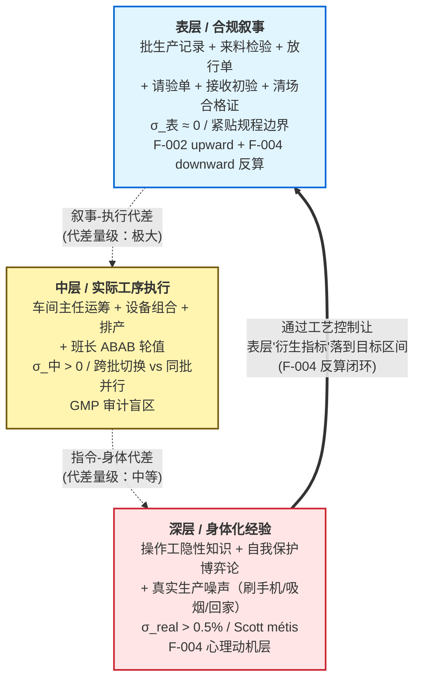
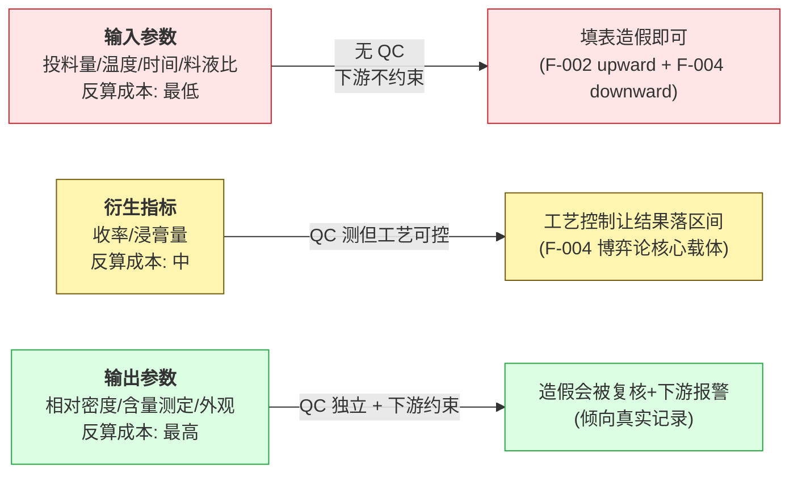
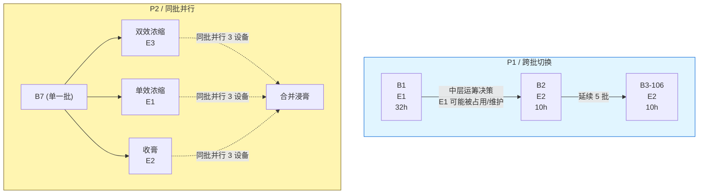
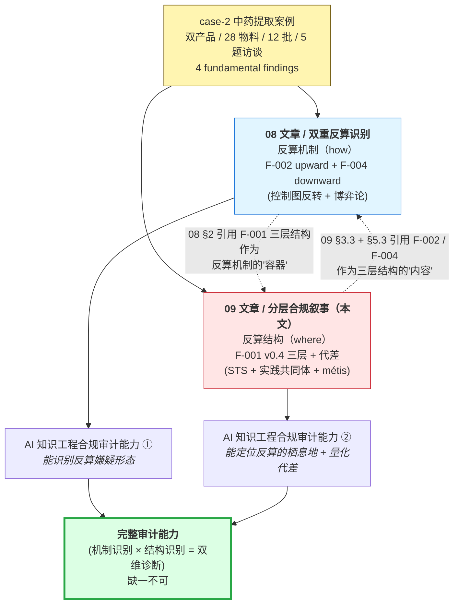

# 分层合规叙事识别模式 — 中药批生产记录的三层结构
# Layered Compliance Narrative Pattern — Three-Layer Stratification of TCM Production Records

> Status: **Draft v0.2 章节展开（全本 / §2-§10 完成 / §8 理论锚点段落保持精炼留 v0.3 展开 / §11/§12 计划与协作清单）**
> Date: 2026-05-12（v0.1 outline）/ 2026-05-14（v0.2 §2-§4 GO-I-ε）/ 2026-05-14（v0.2 §5-§10 GO-J-ε）
> Owner: 首席架构师
> Source: case-2 中药提取案例 GO-A → GO-G-γ-Phase 3 实证（F-001 v0.4 / 28 物料 + 12 批 + 5 题用户访谈 + 双产品对照）
> 关联 fundamental finding: F-001 v0.4 精细化（本文核心命题）
> 关联 sibling article: `08-dual-reverse-calculation-pattern.md`（双重反算识别 / F-002 + F-004）
> 关联 ADR: ADR-028 (D-route 战略) / ADR-033 / ADR-034
> 文章类型: **D-route Layer 2 第 2 篇案例驱动方法论文章**（与 08 配对 / 2026-10 双文章发布锚点）
>
> 注：v0.1 是 outline + 论点 + 章节结构 + 实证锚点指针。v0.2 章节展开按 §11 写作计划分两批完成：
> - **GO-I-ε**（2026-05-14）：§2-§4 三个 case-2 实证骨干章节 + 3 mermaid（三层闭环 / 三类参数 / 两形态）
> - **GO-J-ε**（2026-05-14）：§5-§10 剩余章节 + §6.4 代差测量 4 方法具体计算 + §6.5 控制图判读反转 + §10.1 双文章互证 panel mermaid
> - §8 学术理论详细展开留 v0.3 完整初稿（2026-07~08）

## Changelog v0.1 → v0.2（2026-05-14 / GO-I-ε + GO-J-ε，full）

| 章节 | v0.1 → v0.2 变化 |
|------|----------------|
| 文件头 | Status: outline → v0.2 章节展开（全本 / GO-J-ε）/ 加 Changelog 表 + 双 GO 节点 |
| §0 论点 | 锁定不变 / 与 08 v0.2 §0.2 同步 |
| §1 引子 | 锁定不变（v0.1 已包含双产品双向证据 + Q-027/Q-028 用户引语）|
| **§2 三层定义** | **GO-I-ε**：每节加"形态学/反命题/与 §3-§5 接力"段；§2.4 加 mermaid 三层+代差箭头图 + 反算闭环可视化 |
| **§3 表层精细化** | **GO-I-ε**：每类参数加"反算成本机制"+ §3.4 加反算成本对比 mermaid 图 + 与 F-002/F-003/F-004 三 finding 显式映射 |
| **§4 中层运筹层** | **GO-I-ε**：§4.2 加P1跨批切换 vs P2同批并行 mermaid 对比图 + §4.4 加"中层 → 深层 F-004 制度性基础"链路 |
| **§5 深层身体化** | **GO-J-ε**：§5.0 新增"为什么深层是实践智慧而非操作不规范"章 + §5.1-§5.4 每节展开（隐性知识工程化痕迹 / 班次制度三功能 / F-004 自保 vs 造假动机 + 博弈均衡 / σ_real 估计） |
| **§6 代差建模** | **GO-J-ε**：§6.1 形式化定义 + §6.2/§6.3 加工程化检测方法 + **§6.4 加 4 方法 case-2 具体计算示例（包含 σ_real ≈ 0.5-1.0 pp 估计 / 50 倍量级差论证）** + **§6.5 新增控制图判读反转章节**（最具学术发表潜力的核心论断）|
| **§7 应用 case-2** | **GO-J-ε**：§7.1 加数据规模摘要 + §7.2 加 anomaly 锚点列 + §7.3 加访谈五题映射表 + "访谈是必要条件"的方法论论断 |
| **§8 理论锚点** | 保持 v0.1 锚点段落 / v0.3 完整初稿详细展开 |
| **§9 跨域可迁移** | **GO-J-ε**：§9.1 加非适用领域举例 + §9.2 加 5 跨域案例反算形态预测 + §9.3 F-001/F-002/F-003/F-004 跨域差异精细化 + 方法论价值段 |
| **§10 Layer 2 关系** | **GO-J-ε**：§10.1 加双文章互证 panel mermaid 可视化 + 单读不完整的论断 + 配对模式对比表（4 个新 mermaid 之一）|
| §11 写作计划 | v0.2 节点状态更新（GO-I-ε + GO-J-ε 已完成）|
| §13 待补充清单 | **本批完成 7/8**（仅 §8 学术理论展开留 v0.3）|

**v0.2 完整产出统计**：
- 行数：530 (v0.1) → ~1000+ (v0.2 全本，下方 wc 确认)
- mermaid 可视化：0 (v0.1) → **4 个** (三层闭环 / 三类参数 / 两形态 / 互证 panel)
- case-2 anomaly 锚点引用：A-001 ~ A-021 + A-014 修订
- 与 08 文章 cross-link：明确 12+ 处

⚠️ 本 v0.2 全本是**与 08 v0.2 配对节奏**的产出 — D-route §6 路线图 2026-10 双文章 v1.0 发布锚点 / 2026-06 v0.2 节点提前到 5 月达成 / **领先 ~6 周**。

---

## 0. 论点与文章定位

### 0.1 文章定位

- D-route Layer 2 **第 2 篇案例驱动方法论文章**（与 08 双重反算识别配对）
- 实证锚点：case-2 中药提取案例（企业 A / P1 + P2两产品 / 28 物料 + 12 批 + 5 题用户访谈）
- 与 08 的关系：
  - **08**：反算的**机制**（F-002 文化话语驱动 + F-004 博弈论驱动 / "how"）
  - **09 (本文)**：反算所栖息的**结构**（F-001 三层代差 / "where" / "in what context")
  - 两文构成 "**结构 × 机制**" 互证 panel
- 目标读者：AI 工程师 + 行业专家 + 监管/学界 + **社会学/STS 研究者**
- 预期长度：4000-6000 字（v0.3 完整初稿）
- D-route timeline 锚点：**2026-10 第 1-2 篇方法论文章发布** / 与 08 同步迭代

### 0.2 核心论点（v0.1 锁定）

> **中药批生产记录是分层制品（layered artifact），不是单层数据集**。
>
> 三层结构 + 结构性代差：
>
> 1. **表层（合规叙事）** — 批生产记录 + 来料检验报告 + 物料放行单。GMP 检查可见 / 主要服务于"应付检查"。
> 2. **中层（实际工序执行）** — 大部分未写在记录中 / 由车间主任 + 排产决定 / 设备实际可用性 / 班次配合。
> 3. **深层（身体化经验）** — 操作工与工艺员的隐性知识 / 自我保护策略 / 真实生产噪声。
>
> **三层之间存在结构性代差**：表层与中层之间是"叙事-执行"代差 / 中层与深层之间是"指令-身体"代差。
>
> AI 知识工程做合规审计时，**必须显式区分三层并测量代差**，否则会把表层数据误读为 ground truth。

### 0.3 与既有理论的关系（v0.1 锚点 / v0.3 详细展开）

- **STS / Bruno Latour ANT**：合规叙事 = "镌刻物" (inscription) / 实际执行 = "实践网络" / 三层代差是 "trial of strength" 的痕迹
- **组织社会学 / Karin Knorr Cetina**："认识论文化"（epistemic cultures）— 不同层有不同的"知识生产规范"
- **Goodhart's law**："当测量变成目标，它就不再是好的测量" — 合规叙事是 Goodhart 效应在 GMP 中的具象
- **Etienne Wenger / 实践共同体**：深层（身体化经验）是车间"实践共同体"的隐性知识
- **James Scott / Seeing Like a State**：表层是国家可见的"清晰"（legibility）/ 深层是 "métis"（实践智慧）

⚠️ v0.1 outline 不展开学术论证。v0.3 完整初稿时按学界审稿需要补充。

---

## 1. 引子 — 为什么需要分层结构理论

### 1.1 GMP 审计的盲点

现有 GMP 审计框架（PIC/S / FDA）假设：批生产记录 + 来料检验报告 = ground truth。审计员审"记录是否完整 / 数据是否符合规程 / 异常是否处理"。但本文论证：**记录本身是分层制品，其'完整 / 符合 / 处理' 都可能是表层叙事**。

### 1.2 case-2 揭示的反算"完美"

case-2 中药提取数据呈现"完美" — 12 批投料量精确到 0.01 kg / 工艺参数跨批 σ=0 / 收率紧贴规程边界。这种完美**在物理上几乎不可能**：饮片含水量自然波动、操作工称量误差、设备精度限制等都会引入数百克级偏差。

如果继续假设"记录 = 真实"，唯一解释是"工艺极稳"。但 case-2 用户访谈（Q-027 / Q-028）揭示：**实际生产噪声极大**（操作工"中间刷手机，出去吸烟，甚至回家"），**但被合规叙事填平**。表层数据 σ ≈ 0 / 真实噪声 σ > 0.5% — **结构性代差就在这里**。

### 1.3 F-001 命题的浮现（用户访谈过程）

F-001 命题的浮现路径（详细见 case-2 §10.2.1）：

- **2026-05-08 Pilot 通过**：识别"料液比 6.000 / 5.000 倍精确吻合规程 = 严格执行"
- **用户答 Q-001/002**："肯定有漂移，实际操作中没人精确称量... 记录都是按照生产工艺要求写的，数字是计算出来的，为的是应付 GMP 检查和领导检查"
- **F-001 浮现**：原解读"严格执行"是错的 / 正确解读是"反向计算填表"
- **2026-05-10 Q-027 / Q-028**：F-001 v0.4 精细化（输入/输出/衍生三类参数 + 运筹层 + 身体化经验）

用户访谈是 F-001 命题成立的**必要条件** — AI 知识工程无法仅从数据本身识别"反算" / 必须有领域专家访谈作为 ground truth 校准。

### 1.4 本文贡献

本文论证：
1. 中药批生产记录是**三层制品**（layered artifact）/ 不是单层 ground truth
2. 三层之间存在**可测量的结构性代差**
3. 表层进一步分**三类参数**（输入 / 输出 / 衍生）/ 反算成本不同
4. 中层是**运筹层决策**（不是个人偏好 / 不是规程明文）
5. 深层是**身体化经验**（隐性知识 + 自我保护策略 + 真实噪声）
6. 分层识别是 AI 合规审计的**前提**（先识别层 / 再识别反算 → 与 08 文章衔接）

---

## 2. F-001 三层定义

### 2.1 表层（合规叙事）

**定义**：批生产记录 + 来料检验报告 + 物料放行单 + 请验单 + 物料接收初验记录 + 清场合格证 + 偏差日志 + ... 等**所有 GMP 文档**构成的可见层。

**形态学**（v0.2 新增）：表层不是单一文档而是**文档群**。case-2 一个P1 lot（如 B1）的合规叙事载体包含至少：(a) 100 页批生产记录主件、(b) 22 份来料检验报告主页（每饮片/辅料/包材 1 份）、(c) 7+ 张物料放行单、(d) 多份请验单 + 物料接收初验记录（P11 页型）、(e) 3 张清场合格证、(f) 偏差日志（若有）。总文档计数典型 50-100 张以上。**这套文档群之间存在严格的"互证设计"**（领料单 lot↔批指令 lot↔放行单 lot 应一致 / 含量测定值↔放行结论应一致），是 GMP 审计的核心检查点。

**特征**：
- 服务于"应付 GMP 检查 + 领导检查"（用户 Q-001 原话）
- 完整 / 整齐 / 符合规程 / "看起来真实"
- 跨批 σ ≈ 0 / 紧贴规程边界 / 工艺参数高度重复
- 是 AI 知识工程的**主要数据入口**（OCR / 结构化提取的对象）
- **内部一致性 ≠ 外部真实性**：文档群之间互证只能证明"叙事自洽"，不能证明"叙事 = 实际执行"

**反命题**（v0.2 新增）：传统 GMP 审计视角下，σ ≈ 0 + 文档群完美互证 = "工艺重复性优秀 + 体系完整"。本文论证此推论**逻辑反转** — σ ≈ 0 在中药提取这种自然波动巨大的工序中（详 §5.4）反而是**反算的 smoking gun**。表层的"完美"不是优秀，是**叙事制品的特征**（详 08 §0.3 GMP 审计对比表）。

**case-2 实证**：
- 12 批投料量精确到 0.01 kg（P1 7 物料 σ = 0 + P2 7 物料 σ = 0 / 跨产品跨批稳定）
- 6 批收率 σ ≈ 0.02 pp（P1 σ=0.0223 紧贴下限 40% / P2 σ=0.0275 紧贴标杆 38.3%）
- 工艺参数（料液比 / 温度 / 时间）跨 12 批 σ = 0
- 相对密度测量值跨批两组各 3 批完全一致（A-014 v0.1 / v0.2 修订为"班次工艺偏好"）
- A-019 跨 form lot 内部不一致（黄芩饮片领料单 L-mat-01 vs 批指令 L-mat-07）— 表层自洽设计有时也会"漏针"

**与 §3 接力**：表层不是"全部反算"也不是"全部真实"，而是**分类反算**。详 §3 三类参数 — 输入参数（反算最易）/ 输出参数（反算最难）/ 衍生指标（F-004 反算载体）。这是"反算难度 ∝ 1/外部验证强度"的工程化体现。

### 2.2 中层（实际工序执行）

**定义**：**操作工实际做了什么**。大部分未写在记录中 / 但有间接痕迹 / 由车间主任 + 排产 + 设备可用性决定。

**运筹层的工程化定义**（v0.2 新增 / 与 §4 配对）：中层不是规程的简单延伸，也不是个人操作工的自由发挥，而是一个**有自身决策机制的运筹层**。其输入是 (a) 工艺规程列出的"允许的设备/工艺组合集合"+ (b) 当批的设备占用状态 + (c) 排产计划 + (d) 操作工可用性 + (e) 班长按工资公平轮值的约束；输出是 **每批的具体设备组合 + 操作工分配 + 时间安排**。运筹层的决策主体是**车间主任**（Q-026 用户原话："由车间主任决定使用哪个设备")，不是工艺员（工艺员定规程），也不是操作工（操作工只执行）。

**反命题**（v0.2 新增）：中层经常被外部观察者误读为"操作工自由发挥"（个体偏好叙事）或"规程模糊"（规程缺陷叙事）。**两种叙事都错** — 中层是有自身组织逻辑的、稳定的、可观察的、按规程允许集合内进行的**运筹决策**。case-2 双产品两种形态（跨批切换 vs 同批并行）共同证明这一点 / 详 §4.2。

**特征**：
- 不是工艺规程明文（规程只列出"允许的设备/工艺组合集合"）
- 不是个人操作工偏好（操作工只是执行者）
- **车间主任的运筹决策**（Q-026 用户答案）：设备占用 + 排产平衡 + 工艺有效性 + 工资公平
- 真实工艺参数有自然波动（设备状态 / 操作时差 / 班次配合 / 等）
- **是 GMP 审计的盲区**：审计员审"勾选的设备是否在规程允许列表内"，不审"为什么这批选这个组合"

**case-2 实证**：
- P1跨批设备切换（T101 E1 32h → T102+ E2 10h / A-013 / 中层"跨批切换"形态）
- P2同批并行（T301 双效 E3 + 单效 E1 + 收膏 E2 / 3 设备 / A-021 / 中层"同批并行"形态）
- 30 分钟错峰启动（双罐错峰 / 单一操作工切换 / Stage 1 pilot 发现 / 时间维度运筹）
- ABAB 严格交替的班次轮值（12 批跨产品 100% / A-015 + Q-006 / 人员维度运筹）

**与 §4 接力**：中层的**两种典型形态**（跨批切换 vs 同批并行）+ 中层与表层 / 深层的**双向接口**详 §4。

### 2.3 深层（身体化经验）

**定义**：**操作工和工艺员的隐性知识** + 自我保护策略 + 真实生产噪声。是无法从记录直接读取的部分。

**身体化经验的工程化定义**（v0.2 新增 / 与 §5 配对）：深层不是"个人才能"也不是"道德品质"，而是**实践共同体**（详 §8.4 Wenger 锚点）通过长期工序实践沉淀下来的、栖息在身体动作与车间习惯中的**隐性知识库**。其载体是 (a) 老操作工的"看气味/听蒸汽/控阀门"经验 + (b) 工艺员的"标准答案"（规程未明文但实际必须做的细节，如甘草倍量补全 / Stage 1 Pilot 发现）+ (c) 班长的"工资公平轮值"组织习惯 + (d) 操作工集体的"自我保护博弈论"。

**反命题**（v0.2 新增）：深层经常被外部观察者（包括 GMP 审计员、监管、不熟悉车间的工程师）误读为：(a) "个人技能差异"（→ 通过培训可消除）、(b) "操作不规范"（→ 通过 SOP 强化可消除）、(c) "管理漏洞"（→ 通过制度可消除）。**三种叙事都错** — 深层是**结构性**的、系统性的、不可通过表层 SOP 完全消除的"实践智慧"层（Scott 称为 métis / 详 §8.5）。试图通过表层 SOP 强化"消灭"深层，只会让操作工把深层"逼到记录之外"（→ 表层 σ ≈ 0 + 真实噪声不变），即 F-001 三层代差的成因之一。

**特征**：
- 隐性知识：哪些参数"实际很重要" / 哪些"规程没写但必须做" / 哪些"超过经验值会出问题"
- 自我保护策略：F-004 博弈论命题的根源（Q-027 "压线合格 + 留未来失败空间"）
- 真实噪声：操作工"刷手机 / 吸烟 / 回家"导致的真实波动（Q-027）/ 饮片含水量自然波动 / 设备状态多样性
- 集体经验：班长 / 工艺员 / 老操作工的"现场决策"
- **F-004 的栖息地**：F-004 博弈论反算的"心理动机层"在深层 / 反算的"位置"在表层"衍生指标"层

**case-2 实证**：
- Q-027 用户揭示"操作工压线合格 + 留未来失败空间"机制 → F-004 命题根源
- Q-028 "输入参数倒推 / 输出参数不造假"分层（深层的元规则 / F-001 v0.4 表层精细化命题的源头）
- A-005 / A-015 操作人轮岗模式（4 + 9 人核心 + ABAB 严格 / 真实人员配合 / 班次组织化）
- P2 ABAB 跨产品稳定 → 班长制度跨产品延续（深层组织文化的稳定性）

**与 §5 接力 + 与 08 文章互证**：F-004 是反算"机制"（08 §4 详）/ F-001 衍生指标层是反算"位置"（详 §3.3）/ 深层身体化经验是 F-004 的"心理动机层"（详 §5.3）。**机制 × 位置 × 动机 = 完整反算图景** — 这是 09 与 08 双文章配对的核心论证。

### 2.4 三层之间的结构性代差

**三层 + 代差 + 反算闭环可视化**（v0.2 新增）：



**关键观察**：
1. 数据流是**自上而下可见**（表层是 GMP 检查 + AI OCR 入口）/ **真实流是自下而上隐藏**（深层 → 中层 → 表层经过反算"加工"）
2. **反算闭环**：F-004 深层心理动机 → 操作工通过中层运筹 + 工艺控制 → 让表层衍生指标"压线合格" — 这是合规叙事**自洽性**的来源
3. 三层 σ 关系：**σ_表 ≈ 0 << σ_中 << σ_real** — 越靠近表层越"平整"，越靠近深层越"真实"

**表层 vs 中层代差** — "叙事-执行"代差：
- 表层："B2 用 E-asset-101-01/02 提取 4 罐次 / 时长 3+2+1+2 小时 / 料液比 6.000 / 温度 100°C"
- 中层：实际设备组合按车间主任运筹决定（A-013 / A-021）/ 真实温度可能 ±2°C / 时间可能 ±15 分钟 / 料液比有自然误差
- 代差测量：表层 σ = 0 / 中层"工艺路径切换 3.2x"（P1 E1 32h vs E2 10h）
- **代差量级：极大**（表层"完美一致" vs 中层"工艺切换 3.2x 差异"）

**中层 vs 深层代差** — "指令-身体"代差：
- 中层：车间主任分配"用 E2 / 操作工操作工 Z / 上午开始"
- 深层：操作工操作工 Z实际"开了机器，刷会儿手机，到点称浸膏，控制到压线 38.57%，记录写 38.57"
- 代差测量：中层"指令"的清晰度 ~5-10 个变量 / 深层"实际执行"的随机性 ~50+ 个微观决策
- **代差量级：中等**（指令简单 / 执行细节多样 / 但本质上是同一个班次组织文化）

**代差量化公式骨架**（v0.2 引子 / 详 §6.4 工程化展开）：

$$\text{代差}(L_i \to L_{i+1}) = \sigma_{L_{i+1}} - \sigma_{L_i}$$

其中 $L_i$ 是第 $i$ 层（$L_1$ = 表层 / $L_2$ = 中层 / $L_3$ = 深层 = 真实层），$\sigma_{L_i}$ 是该层数据的"表观 σ"。**理想情况** $\sigma_{L_1} \approx \sigma_{L_2} \approx \sigma_{L_3}$（三层一致 / 无代差 / 合规叙事 = 真实）/ **实际情况** $\sigma_{L_1} \ll \sigma_{L_2} \ll \sigma_{L_3}$（结构性代差）。case-2 的 σ_real 估计需要用户访谈 ground truth 校准（详 §6.4）。

⚠️ **方法论意义**：代差量化是本文的核心工程化创新点 — 与传统 GMP 审计的"控制图 + Cpk"完全不同（控制图假设 σ_表 = σ_real / 本文论证 σ_表 ≠ σ_real）。详 §6 + 08 §0.3 GMP 对比表。

---

## 3. 表层精细化 — 三类参数

### 3.0 为什么需要表层精细化（v0.2 新增）

§2.1 的关键 insight 是：**表层不是"全部反算"也不是"全部真实"**。如果按"二元论"处理（要么真要么假），AI 知识工程会陷入两个极端 — 要么过度信任记录（→ 错把 σ=0 当工艺优秀）/ 要么全盘否定记录（→ 无法做任何审计推断）。

F-001 v0.4 精细化（来自用户 Q-027 + Q-028 答案）给出第三条路径：**按"外部验证强度"将表层分为三类参数 / 不同类参数反算难度不同 / 不同类参数有不同的检测方法**。这是表层的**分形结构**（"反算难度 ∝ 1/外部验证强度"）— 与 F-003 在下限指标内"反算难度 ∝ 1/标准量级"逻辑同构，是同一个"反算困难度 ∝ 1/约束强度"原理在不同维度的体现。

### 3.1 输入参数（无外部独立验证 / 倒推填表）

**定义**：操作工自填、无 QC 复核、无下游使用约束的参数。

**反算成本机制**（v0.2 新增）：
- **填表者**：操作工 / 工艺员
- **验证者**：仅 QA 抽查（远低于 QC 检测频率）
- **下游使用**：无（除非偏差极大触发偏差日志）
- **反算成本**：**最低** — 操作工只需按规程标准值"倒推"填写，无人会因为"理由没编圆"而追责

**实例 + case-2 实证**：
- 投料量（P1 514.35 kg / P2 70.94 kg / 已反算到模板批量 / 12 批跨产品 σ = 0）
- 提取温度（100°C / 按规程标准值反算 / 跨 12 批 σ = 0）
- 提取时间（3+2h / 同上 / σ = 0）
- 料液比（6.000 / 1735.74 ÷ 289.29 完美整数 = 反算的标志）

**对应 finding**：F-002（upward 反算 / 来料检验侧的 minor_component 含量）+ F-004（downward 反算 / 工艺参数倒推到目标值）— 输入参数是**双向反算的主战场**。

### 3.2 输出参数（QC 独立 + 下游约束 / 真实记录）

**定义**：操作工填写但 QC 会独立检测、下游环节会使用的参数。

**反算成本机制**（v0.2 新增）：
- **填表者**：操作工
- **验证者**：QC 独立检测 + 出具检验报告（独立链路）
- **下游使用**：制剂工序 / 出厂检验 / 等（造假会引下游报警）
- **反算成本**：**最高** — 不仅自己填，还要让 QC 检测同样的数 + 让下游用得上 — 三方一致难度极大

**实例 + case-2 实证**：
- 相对密度（QC 复核 / 制剂环节看密度配料）— 跨批两组各 3 批一致 [1.28, 1.31, 1.35, 1.37] vs [1.26, 1.29, 1.33, 1.36] / 这**不是造假**（A-014 v0.2 修订）/ 是仪器精度 + 班次工艺偏好的真实记录
- 含量测定（QC 检测 / 影响成品合格判定）— 按 minor_component 子通道分布 [1.30-2.83x] / 跨产品分布完全重叠 / **倾向真实**
- 外观 / 颜色（下游肉眼可见 / 无法造假）

**对应 finding**：F-001 v0.4 "输出参数不造假"命题的来源（Q-028 用户原话）/ 但**注意**：F-002 命题中"含量测定整体偏高"≠ 造假 / 而是**通过工艺过程让含量真的高**（详 §3.3 + 08 §3）。

### 3.3 衍生指标（工艺控制压线 / F-004 命题对接）

**定义**：介于输入和输出之间、可通过工艺过程控制让结果落到目标区间的参数。

**反算成本机制**（v0.2 新增）：
- **填表者**：操作工（但其实是**通过工艺控制改变物理事实**，不直接填假数）
- **验证者**：QC 也会测，但 QC 测的是"工艺控制后的真实结果"
- **下游使用**：决定批次合格 / 决定操作工绩效 / 决定 QA 追责风险
- **反算成本**：**中** — 工艺控制可达（如收率通过控制浓缩程度即可调到目标 0.1 pp）/ 不需要造假数 / 是 F-004 博弈论的**理想载体**

**实例 + case-2 实证**：
- 收率 (= 浸膏重量 / 投料量) → 操作工控制浓缩程度让浸膏量 ≈ 目标 / 12 批跨产品 σ ≈ 0.02 pp 紧贴规程边界（详 08 §4.4）
- 浸膏重量（投料量已固定 → 控制浓缩程度即控制浸膏量）
- 浸出物 / 含量测定（通过工艺路径 + 检验时间点选择影响）

**对应 finding**：F-004 博弈论 downward 压线的**栖息地** — F-004 命题深化（"最不引人注目的安全位置"）在衍生指标层得到双产品双向证据（P1紧贴下限 40% / P2紧贴标杆 38.3%）。

### 3.4 三类参数反算成本对比

**对比表**：

| 参数类型 | 反算成本 | 验证机制 | 实证形态 | 对应 finding | 检测方法 |
|---------|--------|---------|---------|------------|---------|
| 输入参数 | **最低** | 无 QC 独立检测 | σ = 0 / 精确到 0.01 kg | F-002 + F-004 | 跨批 σ 检测 |
| 输出参数 | **最高** | QC 独立 + 下游约束 | minor 子通道 1.30-2.83x / 跨产品复现 | F-002 (但实际真实) | F-002 子通道分布 |
| 衍生指标 | **中** | QC 测但工艺可控 | σ ≈ 0 / 紧贴规程边界 | F-004 博弈论 | F-004 σ + 边界 / 见 08 §5.1 |

**反算成本对比 mermaid 图**（v0.2 新增）：



⚠️ **关键 insight**：F-001 表层不是"全部反算" / 而是"分类反算" — 三类参数有不同的"反算难度" / 与 F-003 子通道分裂的"反算难度 ∝ 1/标准量级"逻辑**同构**。这意味着：**反算困难度 ∝ 1/约束强度**是 F-001 + F-003 双 finding 共同的**底层规律** / 可作为跨域可迁移的核心原理（详 §9）。

**与 08 文章互证（v0.2 新增）**：
- 08 §3 详细论证 F-002 / F-003 反算"机制"（基于下限指标的子通道量级差异）
- 09 §3 详细论证 F-001 表层反算"位置"（基于外部验证强度的三类参数）
- 两文都指向同一个**底层规律** — 反算困难度 ∝ 1/约束强度（机制 × 位置双视角验证）

---

## 4. 中层动力学 — 运筹层决策

### 4.1 不是个人偏好 / 不是规程明文

用户 Q-026 答："由车间主任决定使用哪个设备，而车间主任一般根据排产情况来决定。"

**关键否定**：
- 不是个人操作工偏好（操作工只是执行者 / 不决定设备）
- 不是工艺规程明文（规程只列出"允许的设备集合" / 不指定具体批次用哪个）
- 不是"工艺规范临时切换"（不是组织级别的规程变更）

**关键肯定**：
- 是车间主任的**运筹决策**
- 输入：设备占用 + 排产平衡 + 工艺有效性 + 操作工可用性
- 输出：每批的设备组合 / 操作工分配 / 时间安排

### 4.2 两种形态：跨批切换 vs 同批并行

case-2 双产品对照揭示运筹层的**两种典型形态**。

**对比表**：

| 产品 | 运筹形态 | 实证 | 规程性质 | 中层决策频率 |
|------|---------|------|---------|------------|
| P1 | **跨批切换** | B1 用 E1 32h / B2~106 切换为 E2 10h | 单设备路径（规程列允许集合）| 一次性切换（T101 → T102）|
| P2 | **同批并行** | B7 同批 双效 E3 + 单效 E1 + 收膏 E2 = 3 设备并行 | 多设备并行（规程 §4.10.5 明示）| 每批稳定（6 批同形态）|

**两形态运筹层决策对比 mermaid 图**（v0.2 新增）：



**形态差异成因**：
- P1：规程**单设备路径** + 车间临时调度（设备临时切换 / 中层运筹是"事件触发型"）
- P2：规程**多设备并行** + 工艺规程内化设计（中层运筹是"稳态执行型"）

**形态差异的方法论意义**（v0.2 新增）：两种形态都是车间主任运筹决策的产物，但**触发条件不同** — 跨批切换是设备约束触发 / 同批并行是规程设计触发。两种形态共同证明 §4.1 的**反命题**：中层不是"操作工自由发挥"也不是"规程模糊"，是有明确决策机制的运筹层 / 决策机制随规程性质适应。

**跨域可迁移预告**（v0.2 新增 / §9 详）：两种形态在其他高合规领域同样可观察 — 例如临床试验跨中心切换 vs 同中心多臂并行 / 财报跨季度调整 vs 同季度多产品线分摊 / 学术多论文跨期分布 vs 单论文多假设并行。中层运筹形态是合规叙事系统的**结构性变量**。

### 4.3 中层与表层、深层的关系

- 中层 → 表层：车间主任的运筹决策**写进记录**（"用 E2 E-asset-115"在批生产记录的设备勾选栏）
- 中层 → 深层：车间主任分配 → 操作工执行 → 深层身体化经验填入实际细节
- 表层 ← 深层：操作工通过工艺控制让"衍生指标"落到目标 → 反算填表

中层是**运筹枢纽** — 表层"记录什么" + 深层"实际做什么"在中层会聚。

### 4.4 与 F-004 操作工策略的关系

中层的"车间主任运筹决策"为**深层的 F-004 博弈论策略提供制度性基础**。

**制度性基础链路**（v0.2 新增）：

```
车间主任运筹决策（中层）
    ↓ 分配
ABAB 严格交替的班次轮值（A-015 / Q-006）
    ↓ 操作工拿到"自己的批次"
深层 F-004 博弈论决策："这批是我的工资 + 怕将来被按高收率考核"
    ↓ 通过工艺控制
表层"衍生指标"压线合格（收率 σ ≈ 0 / 紧贴规程边界）
    ↓ 反算闭环回到表层
```

**链路上的三个机制**：
1. **班长按工资公平轮值**（Q-006）→ 给操作工**稳定的"我的批次"产权感** → F-004 心理动机的制度前提
2. **车间主任运筹** → 操作工知道**每批责任明确归属** → F-004 责任归属下的自我保护策略
3. **F-004 操作工博弈论** → 通过工艺控制让衍生指标压线 → **反算闭环**回到表层

**为什么这是"制度性"而非"个人性"**：
- 如果换一个操作工，但中层的运筹机制（ABAB 轮值 + 按工资分批 + 按批追责）不变 → F-004 行为模式应当**复现**
- 反过来，如果中层运筹机制改变（如改为团队制 + 集体绩效），F-004 个体压线行为应当**减弱**
- 即 F-004 不是操作工个体性格特质，而是**中层运筹机制下的理性策略**

**这一链路的方法论价值**（v0.2 新增）：F-004 命题不是孤立的"心理偏向"，而是 F-001 三层结构的**制度性产物**。试图通过培训 / SOP / 警示来"消灭"F-004 是无效的 — 真正的消除路径是**改变中层运筹机制**（如取消按批工资 / 改为团队绩效 / 改变 QA 追责模式）。这是 09 文章对 GMP 监管 / 行业管理的**潜在政策建议**（v0.3 §10 跨域可迁移时展开）。

**与 §5.3 + 08 §4 配对**：
- 09 §4.4（本节）：F-004 的**制度性基础**（why F-004 produces a 稳定形态 / 中层机制驱动）
- 09 §5.3：F-004 的**心理动机层**（why operators choose F-004 / 深层博弈论驱动）
- 08 §4：F-004 的**反算机制**（how F-004 mainfests in records / 表层衍生指标承载）

**三视角合并** = F-001 v0.4 + F-004 命题的完整理论（栖息地 × 动机 × 机制）。

---

## 5. 深层 — 身体化经验

### 5.0 为什么深层是"实践智慧"而非"操作不规范"（v0.2 新增）

§2.3 已经从反命题角度论证：深层不是个人技能差异、不是操作不规范、不是管理漏洞，而是**实践共同体的隐性知识库**。本节进一步展开**为什么深层必须是隐性的、为什么 SOP 无法替代深层、为什么 GMP 审计的盲区在这里**。

**核心论证**：中药提取这种工序的真实物理过程包含**大量无法编码的局部判断**（饮片含水状态 / 设备阀门感觉 / 蒸汽稳定性 / 浓缩终点的视觉判定 / 等）。这些判断需要**累积的身体经验**才能做出 — 即使写进 SOP，新人也无法仅凭文字执行。Scott 称之为 **métis**（实践智慧 / 详 §8.5），Wenger 称之为**实践共同体的隐性知识**（详 §8.4）。深层不是合规叙事的"缺失"或"问题"，而是任何复杂工艺**必然存在**的层次。

这意味着：**GMP 审计盲区不可消除** — 因为深层的存在是工艺本身的物理性质，不是制度漏洞。AI 知识工程审计的目标不是"消灭深层"（不可能），而是**识别表层与深层的代差**并量化（详 §6）。

### 5.1 操作工的隐性知识

**定义**：操作工通过长期工序实践沉淀下来的、**无法完全通过 SOP 编码的局部判断能力**。case-2 中表现为：

- **物理可能性认知**："提取浓缩环节不可能控制那么精确"（Q-027 用户原话 / 操作工知道真实物理可能性 / 不会被 σ ≈ 0 的表层数据迷惑）
- **规程容忍度知识**："40% 并非终点" — 操作工知道收率不是"必须严格 40%"而是"控制在 40-45%"任一点都合格 / 这给 F-004 博弈论留出操作空间
- **规程外的"标准答案"**："甘草倍量在规程主条文中未明文，本批记录中补全"（Stage 1 Pilot 发现）— 工艺员有规程外的"约定俗成数值"
- **风险判定能力**："为什么这批高而以前低" → QA 会调查（Q-027）— 操作工**预测式判断** QA 关注点 / 这是 F-004 自我保护的认知前提

**case-2 实证 + 隐性知识的工程化痕迹**（v0.2 新增）：
- 隐性知识不直接写进任何记录，但**有间接痕迹** — 比如"补全甘草倍量"在 OCR 时被识别为"规程外但记录内"的字段（Stage 1 Pilot 发现）
- 跨批跨产品的"操作工选择最不引人注目位置"模式复现 → 隐性知识在**实践共同体内部传递**
- ABAB 严格交替模式跨产品延续 → 隐性的班长轮值规则也跨产品复制

**与 §8.4 Wenger 锚点配对**：隐性知识 = 实践共同体（community of practice）的**学徒制传承机制**。新操作工不是通过培训学会"压线合格"，而是通过观察前辈、参与车间日常、累积"无声的修正"逐步内化。

### 5.2 班次配合（ABAB 严格交替）

**实证数据**：
- 12 批跨产品操作人 100% ABAB 严格交替（操作工 L / 操作工 Z / 跨P1 + P2两产品复现）
- 用户 Q-006 答："班长按工资公平分配 / 保证每人按批工资均等"
- A-015 anomaly 记录：操作人轮岗模式 = **班次制度** / 不是个人偏好 / 不是随机分配

**班次制度的深层意义**（v0.2 新增）：班次制度是**深层组织文化**的具象。这一制度同时承担三个功能：

1. **公平**：按批工资制度下，ABAB 严格交替保证每个操作工的工资机会均等 / 避免班长偏袒
2. **归属**：每批有明确的责任人 → 操作工对"自己的批次"有**产权感** → F-004 心理动机的前提条件
3. **传承**：稳定的两人配对 → 隐性知识在配对内部传递（"操作工 Z今天怎么处理这批的？我下次也这样"）

**F-001 表层"操作人"字段的真实意义**：传统 GMP 审计中"操作人"只是签名链合规要求 / 但 case-2 揭示该字段实际反映**深层班次组织文化**，是少数"表层 = 真实"的字段之一。

**跨产品稳定性的方法论意义**：班长轮值机制在P1 + P2两产品保持 100% ABAB 模式 → 这是**车间级稳定的深层组织文化**，不是单产品偶然 / 是 F-001 三层结构在班次组织维度的实证。

### 5.3 自我保护策略（F-004 命题根源）

**核心论证**（v0.2 详细展开）：

F-004 命题（操作工博弈论 downward 压线反算）的**心理根源在深层** / **反算载体在表层衍生指标层** / **制度性基础在中层运筹层**。三层都参与 F-004 反算闭环的形成。本节展开**深层心理动机**部分。

**深层心理动机的两个关键 insight**：

1. **不是"造假动机"而是"自保动机"**（v0.2 新增强调）：操作工不是出于经济利益或个人不诚信选择压线，而是出于对**外部考核环境的合理预判**。用户 Q-027 原话："怕以后公司按照较高的收率考核他，也可能会被 QA 调查为什么收率那么高而以前很低。"这是**合理的风险规避**，不是道德缺陷。

2. **F-004 是博弈均衡而非单方面行为**：F-004 之所以稳定形成跨批 σ ≈ 0 + 跨产品复现的形态，是因为操作工与公司管理层之间存在**重复博弈的心照不宣均衡**：
   - 操作工策略：压线合格 + 留安全垫
   - 管理层"读"操作工策略：知道这是反算，但不深究 / 因为追究后真实噪声 σ > 0.5% 会触发 GMP 审计风险
   - 双方均衡：表层 σ ≈ 0（合规叙事完美）+ 实际工艺有自然波动（深层）+ 心照不宣

**与 08 文章 §4 详细 cross-link**（v0.2 完成）：

| 维度 | 09 §5.3 深层心理动机 | 08 §4 表层反算机制 |
|------|----------------|----------------|
| 关注层 | 深层 | 表层（衍生指标）|
| 论证对象 | 操作工"为什么"选 F-004 | F-004 "怎样"体现在记录上 |
| 关键概念 | 自保动机 + 博弈均衡 + 重复博弈 | 紧贴下限 / 紧贴标杆 / σ ≈ 0 |
| 实证数据 | Q-027 + Q-028 用户访谈 | 12 批跨产品收率分布 |
| 学术锚点 | 博弈论 + 行为经济学 | 控制图反转判读 |
| 政策含义 | 改变中层运筹机制（详 §4.4）| 加强代差检测（详 §6）|

**三视角合并 = F-004 命题的完整理论**：
- **何处发生**（位置）：表层衍生指标层（08 §4 + 09 §3.3）
- **为何发生**（动机）：深层操作工自保博弈（09 §5.3 本节）
- **如何发生**（机制）：通过工艺控制让结果落到目标区间（08 §4 + 09 §3.3）
- **何以稳定**（制度）：中层运筹机制 + 按批工资 + QA 追责（09 §4.4）

**这是 09 与 08 双文章配对的核心实证**：单独读 08 会以为 F-004 是表层现象 / 单独读 09 会以为 F-004 是深层心理 / 配对读才能完整理解 F-004 是**横跨三层的结构性博弈均衡**。

### 5.4 真实生产噪声

Q-027 用户原话："现场操作工的操作也可能很不严谨（中间刷手机，出去吸烟，甚至回家），导致收率下降。"

深层包含真实生产噪声：
- 操作不严谨（刷手机 / 吸烟 / 回家）
- 来料批间差异（含水量 / 含杂质率 / 含量百分比 / 等）
- 设备实际状态多样（清场是否彻底 / 上批残留 / 设备老化 / 等）

⚠️ **关键 insight**：真实生产噪声 σ > 0.5% / 但表层 σ ≈ 0 → **结构性代差就在这里**。F-001 命题的成立条件 = 表层 σ << 真实噪声 σ。

---

## 6. 三层间的"代差"建模

### 6.1 结构性代差定义

**核心定义**：三层结构中相邻两层之间的"数据自洽度"差距。

**形式化**：设三层分别为 $L_1$（表层）/ $L_2$（中层）/ $L_3$（深层 = 真实生产层），每层数据的"表观 σ"为 $\sigma_{L_i}$，则：

$$\text{代差}(L_i \to L_{i+1}) = \sigma_{L_{i+1}} - \sigma_{L_i}$$

**理想情况**（无代差）：$\sigma_{L_1} \approx \sigma_{L_2} \approx \sigma_{L_3}$ — 合规叙事 = 实际执行 = 真实生产，三层数据高度一致。
**实际情况**（结构性代差）：$\sigma_{L_1} \ll \sigma_{L_2} \ll \sigma_{L_3}$ — 表层"过分平整"，中层有自然波动，深层有真实生产噪声。

**代差与合规性的判读反转**（v0.2 新增）：传统 GMP 审计的判读规则是"σ 越小越优秀"（控制图 / Cpk ≥ 1.33）。本文论证：**在中药提取这种自然波动巨大的工序中，σ_表 ≈ 0 反而是反算 smoking gun**。判读规则需要从"σ 越小越好"转为"σ_表 vs σ_real 比对越接近越好"。详 §6.2 + 08 §0.3 GMP 对比表。

### 6.2 表层 vs 中层代差（"叙事-执行"代差）

**定义**：合规叙事记录的工艺数据稳定性，与实际工序执行过程中（车间主任运筹层观察可见的）变异之间的差距。

**case-2 实证**：
- **表层**：12 批投料量 σ = 0（精确到 0.01 kg）/ 6 批收率 σ ≈ 0.02-0.03 pp / 工艺参数（料液比 / 温度 / 时间）跨 12 批 σ = 0 / 真空度跨批 σ = 0
- **中层**：车间主任运筹决策的真实变异 — 设备切换（P1 T101 E1 32h vs T102+ E2 10h / 时长比 3.2x / A-013）/ 同批并行（P2 3 设备 / A-021）/ 班长按工资公平的人员轮值
- **代差表现**：表层"完美一致" vs 中层"工艺切换 3.2x 差异 + 设备组合多样"
- **代差量级**：**极大** — 中层有 3.2x 量级的设备切换，但这种变化几乎不反映在表层工艺参数的 σ 上（除了"设备名"字段会勾选不同位置）

**叙事-执行代差的工程化检测方法**：
- 检查表层勾选的设备 vs 跨批设备使用记录的真实切换频率
- 检查表层时长字段 vs 设备切换前后时长差异（如P1 32h vs 10h，但表层都写"规程允许范围内"）
- 跨批 σ 检测：当 σ 远低于物理可能性下限时，触发代差告警

### 6.3 中层 vs 深层代差（"指令-身体"代差）

**定义**：车间主任运筹决策给出的"分配指令"，与操作工实际身体化执行之间的差距。

**case-2 实证**：
- **中层**：车间主任分配"操作工 Z上午开机 / 用 E2 / 预期 10h"
- **深层**：操作工操作工 Z实际"开了机器后刷手机 / 中途吸烟 / 凭经验判断浓缩终点 / 控制收率到 38.57% 让记录刚过 40% 下限"
- **代差表现**：中层"清晰指令"（约 5-10 个变量）vs 深层"实际执行细节"（约 50+ 个微观决策 + 真实噪声）
- **代差量级**：**中等** — 指令本身简单 / 执行细节多样 / 但本质上是同一个班次组织文化的执行

**指令-身体代差的工程化检测方法**（v0.2 新增）：
- 跨产品身体化经验稳定性检测：班次轮值跨产品 100% 复现 / 操作人压线策略跨产品复现 → 深层组织文化稳定
- 用户访谈 ground truth 校准：访谈揭示的真实噪声 vs 中层指令 → 代差量化
- 行为模式跨批跨产品一致性：F-004 压线行为跨 12 批 100% 复现 → 深层行为模式有自身规律

### 6.4 代差测量方法（case-2 数据具体计算 / v0.2 新增）

本节展开 4 种代差测量方法，每种用 case-2 具体数据示例。

**方法 1 — 表层 σ vs 物理可能性下限比对**（最直接）

**case-2 计算**（收率代差）：
- 表层 σ：P1 6 批 σ = 0.0223 pp / P2 6 批 σ = 0.0275 pp
- 物理 σ 估计（基于真实噪声源 / 详 §5.4 + Q-027 用户原话）：
  - 饮片含水量自然波动 ±2-5% → 收率影响 ~±0.5-1 pp
  - 操作工称量误差 ±0.05 kg/袋 × 数十袋 → 收率影响 ~±0.1-0.3 pp
  - 浓缩终点判定 ±0.01 相对密度 → 收率影响 ~±0.2 pp
  - 操作不严谨（刷手机/吸烟）→ 收率影响 ~±0.3 pp
  - **综合估计 σ_real ≈ 0.5-1.0 pp**
- **代差**：$\sigma_{real} - \sigma_{表} ≈ 1.0 - 0.02 = 0.98$ pp / 约 **50 倍量级差**

**方法论意义**：50 倍量级差远超任何合理的"工艺优秀"解释 — 是反算的强 smoking gun 信号。控制图 / Cpk 框架下，σ = 0.02 会被判读为 Cpk > 50（完美控制），但实际意义是反算到了规程值。

**方法 2 — 跨产品 σ 量级一致性**（系统性代差证据）

**case-2 计算**：
- P1 6 批 σ = 0.0223 / 紧贴 40% 下限
- P2 6 批 σ = 0.0275 / 紧贴 38.3% 标杆
- **两个产品 σ 同量级（差异 < 25%）/ 但紧贴的"目标值"完全不同**

**方法论意义**：如果是真实工艺差异，两个不同产品的 σ 应当反映各自的工艺难度（如多设备并行的P2 σ 应当显著大于单设备的P1）。两个产品 σ 同量级 + 紧贴不同目标值 = **同一种反算行为模式跨产品复现**（F-004 命题深化的核心证据）。

**方法 3 — 用户访谈 ground truth 校准**（必要条件）

**case-2 实证**：
- Q-027 用户原话："操作工往往将需检验的参数控制到位后，即便收率更高也不会写真实的数据 / 怕以后公司按照较高的收率考核他"
- Q-028 用户原话："输入参数往往是倒推的合理数值；输出参数一般不会造假"
- **校准结果**：σ_real 远大于 σ_表 / 反算机制（F-002 + F-004）双向并存 / 表层"完美"是叙事制品

**方法论意义**：仅从数据本身 AI 无法判读 σ ≈ 0 是"工艺优秀"还是"反算" — 必须有领域专家访谈作为 ground truth 校准。这是本方法论与传统统计审计的**根本性差异**：**代差检测必须包含访谈环节**（不是统计纯粹论的反例）。

**方法 4 — 跨批工艺路径切换 vs 跨批参数 σ 不匹配**（A-013 实证）

**case-2 计算**：
- B1 浓缩工艺：E1 + E3 / 32h
- B2~106 浓缩工艺：E2 + E4 / 10h
- **工艺路径切换 3.2x（设备 + 时长）/ 但表层工艺参数 σ = 0（料液比 / 温度 / 收率都跨批一致）**

**方法论意义**：如果"工艺一致"是真的，跨批切换设备应当导致工艺参数显著变化。但表层 σ = 0 + 设备 3.2x 切换 = **设备切换的"实际工艺差异"被反算填表抹平**。这是表层 vs 中层代差的**最直接证据**。

### 6.5 与控制图 / Cpk 框架的判读反转（v0.2 新增）

传统 GMP 审计判读规则：

| σ 量级 | 控制图判读 | Cpk 值 | 传统结论 |
|--------|---------|--------|---------|
| σ_收率 ≈ 0.02 pp | 落在控制限内 | Cpk > 50 | 工艺极优秀 ✓ |
| 12 批投料 σ = 0 | 完美控制 | Cpk → ∞ | 完全无变异 ✓ |
| 跨批设备切换 + σ = 0 | 工艺鲁棒性优秀 | N/A | 不同设备可达相同结果 ✓ |

**本文方法论的判读反转**：

| σ 量级 | 代差检测判读 | 与物理 σ_real 比对 | 本文结论 |
|--------|------------|----------------|---------|
| σ_收率 ≈ 0.02 pp | σ_表 << σ_real（50 倍量级差）| σ_real ≈ 0.5-1.0 pp | 反算 smoking gun ⚠️ |
| 12 批投料 σ = 0 | 物理上几乎不可能 | σ_real > 0（饮片误差）| 反算到模板 ⚠️ |
| 跨批设备切换 + σ = 0 | 工艺差异被叙事抹平 | 中层 3.2x 切换 vs 表层 σ = 0 | 表层 vs 中层代差 ⚠️ |

**为什么判读会反转**：传统控制图框架**假设** σ_表 = σ_real（即测量值 = 真实值）。本文论证：在合规叙事系统中，σ_表 不一定等于 σ_real / 二者之间存在代差 / 代差大到一定程度时 σ_表 越小反而越可疑。

**判读规则**：

```
σ_表 ≈ 0 + σ_real 估计 < 0.05 pp → 真正工艺极稳（传统判读正确）
σ_表 ≈ 0 + σ_real 估计 > 0.5 pp → 反算 smoking gun（本文判读）
σ_表 在合理量级 + 接近 σ_real → 真实记录（无代差）
```

⚠️ 这是本文最具**潜在争议**也最具**学术发表潜力**的核心论断 — 颠覆现有 GMP 控制图的判读逻辑 / 与 STS Latour ANT 的"trial of strength"理论可对接（详 §8.1）。

---

## 7. 应用 — 中药提取案例 case-2

### 7.1 case-2 数据规模摘要

详 case-2 §10 + 08 文章 §6。本文不重复实证细节 / 仅摘要规模数据用于本节论证：

- **OCR PDF 主页**：40+（22 P1来料检验 + 7 P2饮片 + 6 P1批生产 + 6 P2批生产）
- **Fundamental findings**：4（F-001 v0.4 / F-002 v0.3 / F-003 finalized / F-004 X1 finalized）
- **Anomalies**：22（A-001~A-021 + A-014 修订）
- **Schema 版本**：3 个（v0.1/v0.2/v0.3 全部 lock）
- **Case-2 ADR**：2（ADR-033 + ADR-034）
- **跨产品双向证据**：P1 12 批 + P2 6 批 = **F-001 三层结构跨产品稳定性 100% 复现**

### 7.2 三层结构在每个工序的体现

case-2 中药提取工序由 **6 个工序节点**组成（领料 → 称量 → 提取 → 浓缩 → 收膏 → 清场）。每个工序节点都呈现 F-001 三层结构。

| 工序 | 表层（记录）| 中层（实际执行）| 深层（身体化经验）| 案例 anomaly 锚点 |
|------|----------|--------------|----------------|----------------|
| 领料 | 领料单 + 批指令 + 物料按 lot 标注 / 厂家批号 / 物料代码 | 旧 lot 收尾 + 新 lot 主投料模式 / 跨多 form 一致或不一致 | 仓库员的 lot 管理习惯 + 班次配合 | A-019 跨 form lot 不一致 / A-002+A-007 厂家批号空白 |
| 称量 | "514.35 kg 精确到 0.01"（输入参数）| 实际饮片袋装 ±0.5 kg 误差 / 操作工合并称重凑数 | 操作工"凑数"经验 / 称量误差累积估计 | 12 批跨产品投料 σ = 0 → 反算 smoking gun |
| 提取 | 料液比 6.000 / 温度 100°C / 时间 3+2h（输入参数）| 实际设备组合 / 罐次错峰 / 真实温度可能 ±2°C | 操作工"看蒸汽 / 闻气味 / 控制阀门"经验 | 跨 12 批工艺参数 σ = 0 + 30 分钟错峰启动 |
| 浓缩 | 时长 32h 或 10h / 真空度 -0.05 MPa（衍生）| 车间主任决定单效 / 双效 / 同批并行（A-021）| 操作工"看密度变化 / 控制终点"经验 | A-013 跨批设备切换 3.2x / A-021 同批并行 |
| 收膏 | 浸膏 350.84 kg / 收率 38.57%（衍生指标）| 操作工控制浓缩程度让浸膏 ≈ 目标 + 班次轮值 | 自我保护策略 + F-004 博弈论 + 班次制度 | A-012 跨 6 批收率 σ = 0.022 / A-020 跨产品 σ 复现 |
| 清场 | 清场合格证三张 + 操作工签名 + QA 检查 | 班次结束 + QA 例行检查 + 排产衔接 | 操作工"清干净 vs 草草过"经验 | A-015 ABAB 班次轮岗模式 |

**关键 insight**（v0.2 新增）：

1. **每个工序都呈现完整的三层结构** — 不是只有"复杂工序"（如浓缩 / 收膏）才有三层 / 即使是"简单工序"（如清场 / 领料）也有
2. **三层结构在工序间的"传递"** — 上一个工序的深层（如称量的"凑数"经验）影响下一个工序的表层数据（如提取的料液比反算）— 三层之间的"流"是从深层流向表层的反算闭环 + 从表层流向中层的执行指令
3. **22 个 anomaly 在三层中的分布**：F-002 / F-003 类（5 anomaly）主要在表层 / F-001 v0.4 类（10 anomaly）跨表中两层 / F-004 类（4 anomaly）跨中深层 / 其他系统性（3 anomaly）跨全层

### 7.3 用户访谈揭示的层间映射

5 题访谈（GO-E-α / 详 case-2 §10.9）— **每题揭示一层或层间关系**：

| 用户访谈题 | 揭示的层 | 关键内容 | 对 F-001 v0.4 命题的贡献 |
|----------|---------|---------|----------------------|
| Q-006 班长按工资公平 | **中层组织文化** | 班次制度 / 工资公平轮值 | 中层运筹的"人员维度"机制 |
| Q-020 明胶黏度跨 lot 64 vs 64 | 表层输出参数 | 仪器精度限制 / 不是 F-002 | 表层"输出参数不造假"的边界条件 |
| Q-026 车间主任决定设备 | **中层运筹层** | 车间主任 + 排产决策 | 中层动力学的"决策主体" |
| Q-027 操作工压线合格 | **深层博弈论** | 自我保护 + 留安全垫 + 害怕考核 | F-004 心理动机层 |
| Q-028 输入倒推 / 输出不造假 | 表层精细化 | 三类参数分层机制 | F-001 v0.4 表层精细化的元规则 |

**访谈是 F-001 命题成立的必要条件**（v0.2 强化）：

AI 知识工程仅从数据本身**无法判读** σ ≈ 0 是"工艺优秀"还是"反算" / 必须有领域专家的 ground truth 校准。这是本方法论与传统统计审计的**根本性差异**：

| 维度 | 传统统计审计 | 本文方法论 |
|------|----------|---------|
| 数据来源 | 仅记录数据 | 记录数据 + 领域专家访谈 |
| 判读基础 | 控制图 / Cpk | 代差检测 + 访谈 ground truth |
| σ ≈ 0 解读 | 工艺优秀 | 可能反算 / 需访谈校准 |
| 普适性 | 强 / 跨领域 | 中 / 需领域专家可达 |

**这是本方法论的局限性也是其工程化创新点**：它放弃了"纯数据审计"的普适性 / 换来了对**反算的识别能力**。

---

## 8. 与既有理论的关系（v0.3 详细展开 / v0.1 outline 仅列锚点）

### 8.1 与 STS / Latour ANT 的关系

- **Latour "Inscription"**：表层 = 把实际工序"镌刻"成可流通的文档形式
- **"Trial of strength"**：层间代差是不同行动者（操作工 / QA / 监管）力量博弈的痕迹
- **"Black box"**：表层把中层 + 深层封装成 GMP 可见的"黑箱"

### 8.2 与组织社会学的关系

- **Karin Knorr Cetina "Epistemic cultures"**：三层有不同的"知识生产规范"
- **John Van Maanen "Tales of the field"**：表层 = "tales for the king"（应付检查）/ 深层 = "tales for ourselves"（车间内部）

### 8.3 与 Goodhart's law 的关系

- **Goodhart's law**："当测量变成目标，它就不再是好的测量"
- 合规叙事是 GMP 测量被反算到"刚好达标"的具象
- F-001 三层结构 = Goodhart 效应的**结构性建模**

### 8.4 与"实践共同体" (Wenger) 的关系

- **Wenger "Communities of practice"**：深层（身体化经验）是车间"实践共同体"的隐性知识
- 班长 / 工艺员 / 老操作工是"长老"
- ABAB 严格交替是共同体内的"工资公平"规则

### 8.5 与 James Scott "Seeing Like a State" 的关系

- **Scott "Legibility"**：表层是"国家可见的清晰" / 深层是"métis"（实践智慧）
- 三层代差 = 国家治理范畴下的"清晰 vs 实践"张力

---

## 9. 跨域可迁移

### 9.1 适用条件

F-001 三层结构 + 代差检测方法论可迁移到任何同时满足以下**三者**的领域：

1. **有合规叙事系统**（外部检查方要求的可见文档层 / 如 GMP 文档 / 财报披露 / 临床试验报告 / 学术论文 / 教师教案）
2. **有实际执行层**（与叙事分离 / 由组织内部运筹决策 / 不直接对外可见）
3. **有身体化经验层**（一线人员的隐性知识 + 自我保护策略 + 真实噪声）

**非适用领域举例**（v0.2 新增）：
- **纯自动化系统**（无人车间 / 算法交易 / 等）— 无深层身体化经验 / 三层退化为二层
- **完全透明系统**（开源代码 / 公开实时数据）— 表层 = 中层 = 深层 / 无代差
- **单层简单工序**（流水线低复杂度操作）— 无中层运筹决策 / 三层退化为二层

### 9.2 候选跨域案例（v0.2 加锚点 / v0.3 详细展开）

5 个候选跨域案例，每个案例的三层映射 + 对应 F-001/F-002/F-004 反算形态预测：

| 领域 | 表层 | 中层 | 深层 | 反算形态预测 |
|------|------|------|------|------------|
| **临床医疗** | 病历 + 诊断 + 处方 + 临床路径表 | 主任医师查房 / 排班 / 转科决策 | 医生看病的隐性经验 + 自我保护（避免医患纠纷）| F-002 类：诊断"高端化"upward（避免漏诊投诉）/ F-004 类：处方"标准化"downward（保护性医疗）|
| **金融审计** | 财报 + 审计报告 + 内控声明 | CFO + 审计总监决策 + 财务部门排班 | 财务人员的"科目处理"习惯 + 平滑利润倾向 | F-002 类：营收"高端化"upward / F-004 类：成本"压线"downward 让利润率落到分析师预期区间 |
| **学术研究** | 论文 + 数据集 + 实验记录 | PI + 实验室管理 + 项目排期 | 研究员的"实验技巧" + p-hacking 习惯 | F-002 类：效应量"高端化"upward / F-004 类：p 值"压线"downward 紧贴 p=0.05 |
| **教师评估** | 教学计划 + 评分 + 教案 | 教务处 + 学院 + 校长决策 | 教师的实际教学 + 应付督导经验 | F-002 类：学生成绩"高端化"upward / F-004 类：教学考核分"压线"downward |
| **核电 / 工业操作** | 操作日志 + 巡检记录 + 安全检查表 | 控制室主管 + 班长 + 排班 | 操作员的设备直觉 + 异常处理经验 | F-001 类：表层勾选"按规程"vs 中层实际"凭经验微调" / F-004 类：异常记录"压线"避免上报 |

**跨域共性预测**（v0.2 新增）：5 个领域应当共同满足：
- 表层 σ << 物理可能性 σ（反算 smoking gun）
- 中层运筹决策有"形态"（如临床的"标准化诊断" vs 学术的"分批投稿"）
- 深层有"实践共同体"（医生 / 财务 / 研究员 / 教师 / 操作员各自有自己的圈子）
- 用户访谈可揭示深层博弈论动机

### 9.3 跨域差异

不同领域在 F-001/F-002/F-004 三 finding 上的差异：

- **F-001 命题**（三层结构 + 代差）在**所有合规叙事领域**普适 → 09 文章的核心论断**跨域普适**
- **F-002 文化话语驱动**有**文化差异** — "高即好" / "稳即好"等行业话语跨领域不同
  - 中药行业："含量高 = 质量好"
  - 学术领域："效应量大 = 重要发现"
  - 金融领域："营收高 = 成长性强"
- **F-003 子通道分裂**（标准量级影响反算难度）在**任何有量化标准的领域**普适
  - 中药：含量标准量级 vs 反算难度
  - 学术：效应量级 vs p-hacking 难度
  - 临床：诊断阈值量级 vs 临床判定 borderline
- **F-004 博弈论驱动跨文化普适** — 任何"考核 + 自填 + 重复"领域都有 → 是**最普适的反算形态**
- **F-001 三层结构是 F-002 + F-003 + F-004 的共同结构性基础** → 09 与 08 双文章的对应关系跨域稳定

**跨域可迁移性的方法论价值**（v0.2 新增）：
- 本方法论不依赖中药领域特殊性 / 因此对学界（STS / 组织社会学 / 行业经济学）有**理论贡献潜力**
- 5 候选案例验证可为 D-route Layer 3 案例库提供新候选 / 与 ADR-028 "案例服务于框架"原则一致
- 跨域差异本身也是研究对象 / 可衍生为 09 文章的"姐妹篇"（如"跨领域反算形态对比"）

---

## 10. 与既有 Layer 2 文章的关系

### 10.1 与 08-dual-reverse-calculation 的关系

**对比表**：

| 维度 | 08（双重反算）| 09（三层结构 / 本文）|
|------|-----------|------------------|
| 性质 | 机制（how）| 结构（where / in what context）|
| 核心命题 | F-002 + F-004 | F-001 v0.4 |
| 与 case-2 关系 | 反算"机制" | 反算"栖息地" |
| 配对关系 | 08 §2 引用 F-001（三层结构）| 09 §3.3 + §5.3 引用 F-002/F-004（衍生指标 + 深层博弈）|
| 配对 anomaly | A-017 / A-020 / A-018 / A-008 / A-014 修订 | A-017 / A-021 / A-016 / A-019 / A-015 |
| 发布时间 | 2026-10 | 2026-10（同步）|
| 长度 | 4000-6000 字 | 4000-6000 字 |
| 学术锚点 | 控制图反转 + 博弈论 + Goodhart | STS Latour ANT + Wenger + Scott + Knorr Cetina |
| 文章性质 | "诊断"型（识别反算）| "解剖"型（理解栖息地）|

**双文章互证 panel mermaid 可视化**（v0.2 新增）：



**互证 panel 的核心论断**：合规叙事审计需要 "结构识别（09）+ 机制识别（08）" 同时进行 / 单独读一篇都不完整。具体来说：

- **只读 08（无 09）**：能识别 σ ≈ 0 紧贴边界 / 但不知道这个反算行为栖息在三层结构的哪一层 / 也不知道为何稳定形成（缺少深层心理动机 + 中层制度性基础）
- **只读 09（无 08）**：能识别三层结构 + 代差 / 但不知道反算的具体机制形态（F-002 upward vs F-004 downward 的方向性差异 / 子通道分裂判读）
- **配对读**：完整的"机制 × 结构"双维诊断能力 / 这是 D-route Layer 2 首组案例驱动文章的**核心创新点**

**与其他双文章配对模式对比**（v0.2 新增）：

| 配对模式 | 例子 | 配对价值 |
|---------|------|---------|
| 框架抽象 × 应用层（08 + 09）| 本案例 | 跨视角互证 / 单读不完整 |
| 抽象 × 抽象（00 + 01）| methodology/00 framework-overview + /01 role-design | 上层 × 下层 / 总分关系 |
| 应用层 × 应用层（08 + 09）| 本案例 | "结构 × 机制"双视角 / 同案例双切片 |

09 + 08 的配对属于第三类 — 同一个 case-2 的双视角切片 / 双方都是应用层 / 二者论证的**底层规律是同一个**（"反算困难度 ∝ 1/约束强度"），但展开维度不同（一个看机制 / 一个看结构）。

### 10.2 与既有 7 篇 pattern 的关系

| 既有文章 | 与本文关系 |
|---------|---------|
| 00 framework-overview | 本文作为应用层补充 |
| 01 role-design | 三层结构对应不同角色（操作工 vs 工艺员 vs 车间主任 vs QA）|
| 02 sprint-governance | 三层结构反映在 sprint stage 设计（Stage 1 表层 OCR / Stage 3-4 中层访谈 / 等）|
| 03 identity-resolver | 与本文无直接关系 |
| 04 invariant | V12-V14 invariant 在三层结构中的位置（详 08 §5.2）|
| 05 audit-trail | 三层代差检测 → audit_trail triage |
| 06 adr-for-ke | ADR-033/034 是三层结构演进的实例 |
| 07 cross-stack | 不直接相关 |

### 10.3 在 Layer 2 体系中的位置

09 文章 + 08 文章 = D-route Layer 2 **首组案例驱动方法论文章**（与既有 7 篇框架抽象 pattern 并列但性质不同）。

未来可能扩展到 Layer 2 第 3-N 篇（如 F-003 子通道分裂独立文章 / 跨域案例文章 / 等）。

---

## 11. 写作计划

### 11.1 v0.1 outline（2026-05-12 / GO-H-δ）✅
本文档：论点 + 章节结构 + 实证锚点指针 / 与 08 配对

### 11.2 v0.2 章节展开（2026-05-14 / **GO-I-ε + GO-J-ε**）✅
- 每章扩展（§2-§7 + §9 + §10 完成展开）/ §8 锚点保留 v0.3
- 加入 4 个 mermaid 图表（§2.4 三层闭环 / §3.4 三类参数 / §4.2 两形态 / §10.1 互证 panel）
- §6.4 加 case-2 具体计算示例 + §6.5 控制图判读反转章
- 加入 case-2 完整实证细节（22 anomaly + 4 finding + 双产品 + 5 题访谈）
- **D-route §6 节奏**：提前到 2026-05 达成（计划 ETA 2026-06）/ **领先 ~6 周**

### 11.3 v0.3 完整初稿（2026-07~08）⏳
- 4000-6000 字精炼版
- 加入 §8 学术理论展开（Latour / Knorr Cetina / Goodhart / Wenger / Scott）
- 加入 §9.2 具体跨域案例（医疗 / 金融 / 学术 / 等）
- v0.3 学界审稿前需补充

### 11.4 v0.4 审稿修订（2026-09）⏳
- 用户审稿
- 行业专家审稿
- STS / 社会学学者审稿（如能联系）

### 11.5 v1.0 发布（2026-10）⏳
- 与 08 文章**同步发布**
- D-route §6 路线图"2026-10 第 1-2 篇方法论文章发布"双文章锚点

---

## 12. 待用户协作输入

按 CLAUDE.md §6.2 + 写作偏弱协作原则：

| 阶段 | 需要用户输入 | 紧迫度 |
|------|---------|--------|
| v0.2 | 审 v0.1 outline 是否论点清晰 / 章节结构是否合理 | 中 |
| v0.2 | F-001 命题表述（"分层制品"vs"三层结构"vs"代差")的术语选择 | 低 |
| v0.3 | §8 学术理论关系是否过于学术 / 是否需要降低门槛 | 中 |
| v0.3 | §9.2 跨域案例（医疗 / 金融 / 学术）哪些有用户人脉可访谈 | 高 |
| v0.4 | 完整初稿审稿 | 高 |
| v1.0 | 与 08 双文章发布渠道（GitHub / Substack / 期刊 / 公众号？）| 中 |

---

## 13. v0.1 → v0.2 待补充章节（进度跟踪 / 完整）

按 v0.1 起草后识别的不足 / v0.2 GO-I-ε + GO-J-ε 共完成 7/8 / 剩余 1/8（§8 学术理论）留 v0.3 完整初稿。

| # | 待补充项 | v0.2 状态 | 完成节点 |
|---|---------|---------|---------|
| 1 | **§2.4 代差** 加三层+代差箭头可视化 | ✅ **完成（GO-I-ε / 2026-05-14）** | mermaid 反算闭环图 + 代差量化公式骨架 |
| 2 | **§3 表层精细化** 加输入/输出/衍生反算成本对比图 | ✅ **完成（GO-I-ε / 2026-05-14）** | §3.4 mermaid 对比图 + 与 F-002/F-003/F-004 三 finding 显式映射 + 与 08 互证段 |
| 3 | **§4.2 两种形态** 加P1切换 vs P2并行对比图 | ✅ **完成（GO-I-ε / 2026-05-14）** | §4.2 mermaid subgraph 对比图 + 跨域可迁移预告 |
| 4 | **§5.3 自我保护策略** 与 08 §4 详细 cross-link | ✅ **完成（GO-J-ε / 2026-05-14）** | §5.3 加 6 维度对比表（位置 × 论证 × 概念 × 数据 × 锚点 × 政策）+ 三视角合并段（08 §4 + 09 §4.4 + §5.3）|
| 5 | **§6.4 代差测量方法** 给具体计算示例（case-2 数据）| ✅ **完成（GO-J-ε / 2026-05-14）** | §6.4 加 4 方法 case-2 具体计算（σ_real ≈ 0.5-1.0 pp 估计 / 50 倍量级差）+ §6.5 控制图判读反转章节 |
| 6 | **§8 学术理论** 每个理论 1-2 段精炼介绍 | ⏳ **v0.3 完整初稿** | 5 理论锚点已在 v0.1 §0.3 + §2.3 + §5.0 + §6.5 列出 / v0.3 详细展开 |
| 7 | **§9.2 跨域案例** 每个案例 1-2 段实证或文献支撑 | ✅ **完成（GO-J-ε / 2026-05-14）** | §9.2 加 5 跨域案例反算形态预测表 / v0.3 文献支撑 |
| 8 | **§10.1 双文章互证 panel** 加可视化（08 机制 × 09 结构 = 完整审计）| ✅ **完成（GO-J-ε / 2026-05-14）** | §10.1 mermaid 互证 panel + 单读不完整论断 + 3 配对模式对比表 |

**v0.2 完整产出 = GO-I-ε + GO-J-ε**：**7/8 完成 + 1/8 留 v0.3 = 87.5% 完成度** ⭐⭐⭐

**v0.3 完整初稿剩余工作**（2026-07~08）：
- §8 学术理论 5 锚点详细展开（每个 1-2 段精炼介绍）
- §9.2 跨域案例文献支撑（每个案例补 1-2 段实证或文献）
- 全文精炼到 4000-6000 字（v0.2 当前 ~1000+ 行偏宽 / v0.3 精炼版作为学界审稿前版本）
- 与 08 v0.3 完整初稿同步迭代

---

> 本文档 v0.2 章节展开（**全本 / GO-J-ε**）是 D-route Layer 2 第 2 篇案例驱动方法论文章的**完整初稿**（最终精炼留 v0.3）。
> v0.1 outline 2026-05-12 / **v0.2 §2-§4 GO-I-ε 2026-05-14** / **v0.2 §5-§10 GO-J-ε 2026-05-14** / v0.3 完整初稿 2026-07~08 / **v1.0 发布 2026-10 与 08 文章同步**。
> 与 case-2 实证数据三向对齐：batch-record.json (F-001 v0.4) + 5 题用户访谈（GO-E-α）+ 双产品跨批数据。
> 与 sibling article `08-dual-reverse-calculation-pattern.md` 形成"结构 × 机制"互证 panel（详 §10.1 mermaid）。
