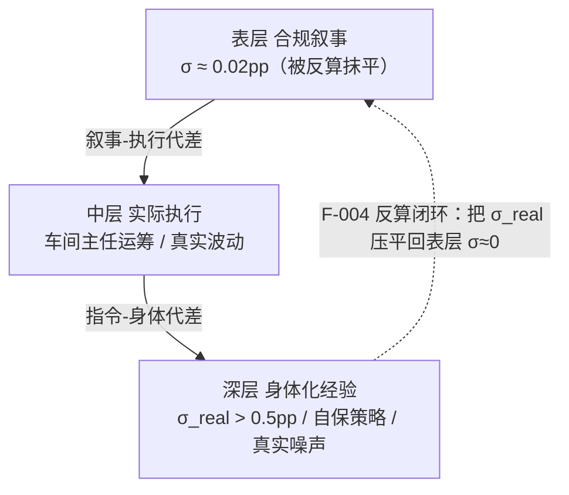
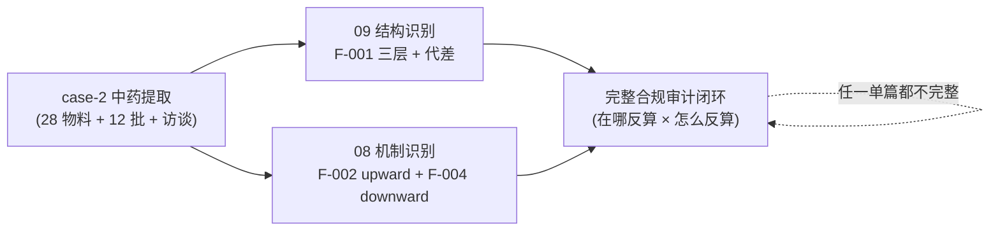

# 分层合规叙事识别模式 — 中药批生产记录的三层结构
# Layered Compliance Narrative Pattern — Three-Layer Stratification of TCM Production Records

> Status: **v0.3 完整初稿（精炼版 / 2026-06-01 GO-T-η）** — 8 内容项完成后精简到目标字数
> Owner: 首席架构师
> 脱敏说明（2026-06-11）: 本文及全部 case-2 配套数据已完成系统性脱敏——产品名（P1/P2/P3）、批号（B1~B12）、来料 lot（L1/L2）、设备型号（E1~E6）、企业/供应商/人名均为假名；σ、极差比、倍率等计算输入数值保留原值，结论可复算。假名映射不公开。
> Source: case-2 中药提取案例（F-001 v0.4 / 28 物料 + 12 批 + 5 题用户访谈 + 双产品对照）
> 关联 finding: F-001 v0.4（本文核心命题）/ 关联 ADR: ADR-028 / ADR-033 / ADR-034 / ADR-035
> 配对文章：`08-dual-reverse-calculation-pattern.md`（机制识别 / F-002 + F-004 / 结构 × 机制互证）
> 版本史与逐批进度：见 git 历史 + `docs/CHANGELOG.md` + case-2 §10；全量未精简稿见 `archive/09-layered-compliance-narrative-pattern-v0.3-full-2026-06-01.md`

---

## 0. 论点与定位

D-route Layer 2 第 2 篇案例驱动方法论文章，与 08 配对（08 讲反算**机制**、09 讲反算**栖息的结构**）。

**核心论点**：

> 中药批生产记录是**分层制品（layered artifact）**，不是单层数据集。三层结构 + 结构性代差：
> 1. **表层（合规叙事）**——应付检查的可见层；
> 2. **中层（实际工序执行）**——车间主任 + 排产决定的运筹层，大部分不写入记录；
> 3. **深层（身体化经验）**——操作工隐性知识 + 自我保护策略 + 真实噪声。
>
> AI 知识工程做合规审计时，**必须显式区分三层并测量代差**——而不是把表层记录当 ground truth 直接喂给模型。这是本方法论与"数据清洗即可建模"假设的根本分歧。

08（机制）回答"怎么反算"，09（结构）回答"反算栖息在哪、为何不可见"；两篇合起来才是完整的合规叙事审计框架（§10 互证 panel）。本文据此把 case-2 的 F-001 命题抽象为领域无关的"分层合规叙事识别"方法论。

---

## 1. 引子 — 为什么需要分层结构理论

GMP 审计的隐含假设是"记录真实、异常应显现"。但 case-2 数据显示批生产记录表面"完美"——投料精确到 0.01 kg、提取温度恒定、料液比稳定 6.000、跨 6 批收率 σ≈0.02pp——而饮片含水波动 ±2-5%、称量误差、设备精度都会引入数百克级偏差，这种齐整在物理上几乎不可能。

F-001 命题在用户访谈中浮现：用户对 Q-001/002 的初答（"肯定有漂移，实际没人精确称量，记录是按生产工艺要求写的，数字是计算出来的，为应付 GMP 检查和领导检查"）直接推翻了 v0.1 的"严格执行"解读。真实工艺参数另有载体（操作工记忆 / 师傅口传 / 现场习惯），记录只是其合规投影。值得注意的是，用户最初提"用视觉/视频/IoT 多模态采集 enrich 缺失部分"的设想，由此获得理论升级：多模态采集不是锦上添花，而是中/深层 ground truth 的**唯一**采集路径。

由此，"数字精确吻合规程"不是严格执行的证据，而是**反向计算填表**的结果。要理解这种合规叙事，必须把它拆成三层并测量层间代差。**本文贡献**：(1) 提出合规叙事的三层结构模型；(2) 给出层间代差的工程化测量方法；(3) 论证访谈是识别深层的必要输入；(4) 论证该结构跨域可迁移（医疗 / 金融 / 学术 / 教师 / 核电）。

---

## 2. F-001 三层定义

**表层（合规叙事）**：批生产记录 + 来料检验 + 放行单 → GMP 检查可见。形态学特征是 50-100 份文档构成的互证群（领料单、称量记录、提取记录、检验报告彼此勾稽），设计目的是"自洽可追溯"而非"真实"。反命题：表层 σ ≈ 0、跨批高度一致**不是工艺优秀的证据，而是 smoking gun**——真实物理过程不可能这么齐整。

**中层（实际工序执行）**：设备实际可用性 + 排产平衡 + 班次配合，大部分**不写入记录**。其决策主体是车间主任的运筹层（输入=设备占用/订单/物料状态，输出=本批用哪台设备、何时切换），不是个人操作工偏好，也不是工艺规程明文。反命题：中层差异不是"违规"，而是规程允许范围内的合法运筹。

**深层（身体化经验）**：操作工与工艺员的隐性知识（火候、来料手感、何时该调整）+ 自我保护策略 + 真实生产噪声，是车间**实践共同体**经学徒制传承的 métis（Scott），不可被表层完全编码。反命题：深层不是"操作不规范"，而是实践智慧 + 理性自保的混合体（详 §5 / §8.5）。

### 2.4 三层之间的结构性代差

三层的标准差递增：表层 σ≈0（叙事被反算抹平）< 中层 σ（真实运筹波动）< 深层 σ_real（真实工艺噪声，>0.5pp）。代差越大，合规叙事与实际执行偏离越深。

AI 若把表层当 ground truth，等于把被抹平的 σ≈0 当真实工艺——这是误读的根源。

---

## 3. 表层精细化 — 三类参数

表层并非铁板一块，按反算成本分三类（Q-028 用户访谈触发）：

| 参数类型 | 反算机制 | 实例 | 外部约束 | 对应 finding |
|---------|---------|-----|---------|-------------|
| 输入参数 | 倒推填表（无独立验证）| 投料 514.35 kg / 温度 100°C / 料液比 6.000 | 无 | F-004 易反算 |
| 输出参数 | 真实记录（操作工不改）| 相对密度 / 含量测定 / 外观 | QC 独立 + 下游 | 倾向真实 |
| 衍生指标 | 工艺控制压线（不改记录）| 收率 ≈ 40% / 38.3% | 间接（过程控制）| F-004 核心 |

关键 insight：**反算困难度 ∝ 1 / 约束强度**。判断某字段反算成本，看三问：谁填（填表者）、谁验证（有无独立验证者）、谁在下游用（下游约束）。输入参数最易反算（操作工自填 / 无独立验证 / 下游不直接用原始投料数），输出参数最难（操作工填但 QC 独立复检 + 下游工序据此调整），衍生指标居中（操作工通过控制工艺过程间接达到目标 / 不直接改数）。这与 08 §3 的 F-003 子通道分裂（按标准量级分反算难度）同构——都是"约束越强、反算越难"的一般律。**方法论含义**：对合规记录不能给单一可信度评分，必须按字段的约束强度分通道赋信。

---

## 4. 中层动力学 — 运筹层决策

中层是**车间主任的运筹决策**（设备占用 + 排产平衡），实证两形态：

| 产品 | 形态 | 实证 |
|------|------|------|
| P1 | 跨批切换 | T101 E1 32h → T102+ E2 10h（设备临时调度）|
| P2 | 同批并行 | T301 双效 E3 + 单效 E1 + 收膏 E2 三套并行（规程 §4.10.5 明示）|

**形态差异成因**：P1规程是单设备路径 + 设备临时调度（车间主任按 E1 可用性切换），故呈跨批切换；P2规程内化了多设备并行设计（§4.10.5 明示），故呈同批并行。即同一"运筹层"在不同规程约束下产生不同形态——这正是中层"有形态"的实证（A-021）。

中层与表层、深层的关系：中层决策大多不写入表层记录（表层只留"用了哪台设备"的结果，不留"为什么切换"的运筹逻辑），却约束深层执行——操作工的"压线合格"策略（深层）必须在中层给定的设备/排产条件下落地。**政策含义**：F-004 是制度性而非个人性的——减少反算的入口在改中层运筹机制（如团队绩效替代按批工资 / 引入车间观察员），而非加强表层检查（principal 看不到中深层，加强表层只逼 agent 更努力反算）。

---

## 5. 深层 — 身体化经验

深层是"实践智慧"而非"操作不规范"，包含四类：

1. **操作工隐性知识**：火候、来料手感、何时该微调——通过观察前辈、参与日常累积的"无声的修正"，难以编码（Scott métis）。
2. **班次配合**：操作工 L/Z **ABAB 严格交替**跨 12 批 / 跨产品 100% 复现。班次制度有三功能——互相监督、工资公平（Q-006 班长按工资轮值）、自我保护。这是表层少数**真实**的字段之一。
3. **自我保护策略**（F-004 根源）：Q-027"压线合格，留未来失败空间"。
4. **真实生产噪声**：操作不严谨（刷手机/吸烟）、来料批间差异、设备清场状态多样——这些才是 σ_real > 0.5pp 的来源。

**§5.3 自保 vs 造假的区分**（与 08 §4 互证 / 博弈均衡分析）：操作工**不造假输出数据**（相对密度/含量受 QC 独立检测 + 下游约束），而是通过控制工艺过程让衍生指标（收率）落到目标区间——"改过程不改账"。这是重复博弈下的稳定均衡（操作工知道每批都被查，选稳定压线为长期最优；管理层心照不宣，因为追究真实噪声会触发更大 GMP 审计风险），不是个体道德问题。

---

## 6. 三层间的"代差"建模

**§6.1 形式化定义**：代差 = 同一工艺量在不同层的统计特征之差。核心不等式 **σ_表 << σ_中 << σ_real**：表层被反算抹平到 σ≈0，中层是真实运筹波动，深层 σ_real 是真实工艺噪声。代差有两段：

- **§6.2 "叙事-执行"代差**（表层 vs 中层）：记录上的"每批一致"与实际"跨批切换设备/排产"之间的差。可由记录内部矛盾（如 A-019 同物料同批不同 lot 字段）+ 跨批工艺路径切换（A-013）检出。
- **§6.3 "指令-身体"代差**（中层 vs 深层）：规程/排产指令与操作工现场实际执行（刷手机、火候微调、压线）之间的差。最难直接测量，主要靠访谈 ground truth。

**§6.4 case-2 具体计算**：用户 Q-027 揭示真实工艺 σ_real 应 > 0.5pp（操作不严谨 + 来料波动 + 设备状态多样）。实测记录 σ：P1 0.0223 / P2 0.0275 pp。代差量级 ≈ **20-25 倍**（σ_real / σ_记录，按 0.5/0.0203 ≈ 24.6× 与 0.5/0.0251 ≈ 19.9×）。这个倍数本身就是"叙事-执行"代差的量化指标——倍数越大、叙事离真实越远。**测量方法**：(1) 从记录算 σ_记录；(2) 从访谈/物理约束估 σ_real 下界；(3) 取比值。缺访谈环节则 σ_real 不可知、代差不可测——这是访谈作为一等输入的工程理由。

**§6.5 与控制图 / Cpk 框架的判读反转**（本文最具学术发表潜力的论断）：传统 Cpk 视角下，σ=0.022 / 区间宽 5pp → Cpk 远超 1.33，判"完美工艺重复性"。本方法论判其为**反算 smoking gun**——σ≈0 不是受控，而是叙事被抹平。**同一组数据，判断逻辑完全相反**，差异来自是否承认三层结构 + 是否有访谈 ground truth。

---

## 7. 应用 — 中药提取案例 case-2

双产品（P1 + P2）/ 12 批 + 29 物料 6 类 / 5 题访谈。三层映射：

- **表层**：12 批投料 σ=0 / 收率 σ≈0 / 工艺参数（料液比/温度/时间）σ=0；22 个 anomaly 多落在此层（如 A-019 form 间 lot 不一致）。
- **中层**：两形态（P1跨批切换 vs P2同批并行）/ 由车间主任排产决定（A-013 浓缩设备切换是直接证据）。
- **深层**：ABAB 班次跨产品稳定（A-015）/ Q-027 揭示自保策略 / σ_real>0.5pp（不可见于记录）。

**访谈五题映射**：Q-026（运筹层=车间主任排产）定位中层 / Q-027（压线自保）揭示深层 F-004 动机 / Q-028（输入倒推/输出真实/衍生压线）拆解表层三类参数 / Q-006（班长轮值）确认深层班次 / Q-001-002（反算填表）确立 F-001 命题本身。

**与传统统计审计的对比**：传统审计只看表层分布（σ、Cpk、趋势），会把 σ≈0 判为优秀；本方法论叠加访谈 ground truth + 三层结构，把同样的 σ≈0 判为反算。**访谈是 F-001 的必要条件**——仅凭记录无法区分"工艺优秀"与"反算抹平"，这是本方法论与传统统计审计的根本差异。

---

## 8. 与既有理论的关系

09 聚焦"结构"理论（分层为何存在），与 08 §7.3"机制"理论（反算如何发生）分工：

- **§8.1 Latour ANT**：表层 = inscription（把流动实践镌刻成可流通文档）；中深层被封装成 black box；层间代差是 trial of strength（操作工/QA/监管博弈）的痕迹。本方法论 = AI 工程版的 ANT，识别 inscription 上的博弈痕迹。
- **§8.2 组织社会学**：Knorr Cetina（*Epistemic Cultures*, 1999）——三层是同组织内三套并存的知识生产规范，标准不同故必有代差；Van Maanen（*Tales of the Field*, 1988）——表层是 realist tale（for the king / 应付检查），深层是 confessional tale（for ourselves / 车间内部）。
- **§8.3 Goodhart's Law**：08 用其论证反算方向性，09 用其论证反算必栖息于分层结构——没有不可见的中深层，表层反算无处遁形。三层是 Goodhart 效应的结构性建模。
- **§8.4 实践共同体（Wenger, 1998）**：深层经学徒制传承（非个体技能 / 是共同体隐性知识）；故培训/SOP 无法消除深层自保策略，须改组织结构。
- **§8.5 Scott（*Seeing Like a State*, 1998）**：legibility（表层 = 治理可见的清晰）vs métis（深层 = 抗拒编码的实践智慧）几乎精确对应 F-001；也提示多模态全采集的边界——métis 本质上部分抗拒编码。

---

## 9. 跨域可迁移

**适用条件**（三者并存）：有合规叙事系统 + 有与叙事分离的实际执行层 + 有一线身体化经验层。非适用：纯自动化系统 / 完全透明系统 / 单层简单工序（三层退化为二层 / 无代差）。

**§9.2 五候选跨域案例**（三层映射 + 反算形态预测）：

| 领域 | 表层 | 中层 | 深层 | 反算形态预测 |
|------|------|------|------|------------|
| 临床医疗 | 病历 + 诊断 + 临床路径 | 主任查房 / 排班 / 转科 | 看病经验 + 避纠纷自保 | F-002 诊断"高端化"upward / F-004 保护性医疗 downward |
| 金融审计 | 财报 + 审计报告 | CFO + 审计总监决策 | 科目处理习惯 + 平滑利润 | F-002 营收 upward / F-004 利润压线落入预期区间 |
| 学术研究 | 论文 + 数据集 | PI + 实验室 + 项目排期 | 实验技巧 + p-hacking 习惯 | F-002 效应量 upward / F-004 p 值压线贴 0.05 |
| 教师评估 | 教学计划 + 评分 + 教案 | 教务 + 学院决策 | 实际教学 + 应付督导 | F-002 成绩 upward / F-004 考核分压线 |
| 核电/工业 | 操作日志 + 巡检 + 安全检查表 | 控制室主管 + 班长排班 | 设备直觉 + 异常处理 | 表层勾选"按规程"vs 中层"凭经验微调" / F-004 异常压线避上报 |

**§9.2.1 文献锚点**（间接证据 / 与 08 §7.2 同步）：

- 临床：Studdert 等（*JAMA*, 2005, 293:2609-2617）—— 93% 高风险科室医生行防御性医疗，分"保证行为"（类 F-002）与"回避行为"（类 F-004）。
- 金融：Burgstahler & Dichev（1997）零阈值不连续 + Graham 等（2005）78% 高管为达标牺牲长期价值、倾向真实动作而非改账（详 08 §7.2）。
- 学术：Simmons 等（2011）researcher degrees of freedom；"p<0.05 下方聚集"证据有复现争议（Masicampo & Lalande 2012 / Head 等 2015 vs 重分析）→ 印证访谈必要性。
- 教师：Campbell's Law（1979）—— 高利害考试是其教科书级实例。
- 核电/工业：Vaughan（*The Challenger Launch Decision*, 1996）"偏差正常化" + Perrow（*Normal Accidents*, 1984）—— 合规检查表与现场风险处置系统性分离。

**§9.3 跨域差异**（逐 finding）：

- **F-001 三层结构 + 代差**在所有合规叙事领域**普适**——这是 09 的核心论断，跨域稳定，也是对学界（STS / 组织社会学）的主要理论贡献。
- **F-002 文化话语驱动**有**文化差异**——"含量高=质量好"（中药）/ "效应量大=重要发现"（学术）/ "营收高=成长性强"（金融）逐域不同，需逐域识别话语结构。
- **F-003 子通道分裂**（标准量级影响反算难度）在**任何有量化标准**的领域普适（中药含量量级 / 学术效应量级 / 临床诊断阈值量级）。
- **F-004 博弈论驱动跨文化最普适**——任何"考核 + 自填 + 重复"领域皆有，是最普适的反算形态。

F-001 是 F-002/F-003/F-004 的**共同结构性基础**：所有方向的反算都必须栖息在"有不可见中深层"的分层结构里。这使 08 + 09 的"机制 × 结构"对应关系跨域稳定。**方法论价值**：本框架不依赖中药特殊性，故对学界有理论贡献潜力；5 候选案例亦为 D-route Layer 3 案例库提供新候选（与 ADR-028"案例服务于框架"一致）。

---

## 10. 与既有 Layer 2 文章的关系

**§10.1 与 08 的互证 panel**：合规叙事审计需要"结构识别（09）+ 机制识别（08）"同时进行，单读任一篇都不完整。

**§10.2 与既有 7 篇 pattern**：F-001 三层为 04-invariant（V12-V14 落点）/ 05-audit-trail（triage）/ 03-identity-resolver（跨批关联）提供结构基础。**§10.3 位置**：08 + 09 是 Layer 2 首两篇案例驱动应用层文章（既有 00-07 为框架抽象 pattern）。

---

## 11. 局限性

- **推断边界（n=2）**：全部证据基于单企业·双产品（P1 + P2 / 12 批 + 29 物料），访谈为间接证据（非现场观察、非操作工本人）。F-001 三层划分与代差量化的跨企业稳健性未验证；对跨企业、跨品类的外推是**有方向的假说**而非已证命题。
- 缺多模态 ground truth（视频 / IoT）；深层 σ_real 为访谈估计而非直接测量。
- **识别 ≠ 证实（方法论自觉边界）**：三层划分 + 代差识别是**提嫌疑的结构筛查**，不是定罪——它指出某字段"疑似表层叙事而非真实执行"，但证实某字段实际属哪一层、深层 σ_real 真值几何，须叠加访谈 / 现场观察 / 原始数据。本方法论定位为审计**第一道筛**，不替代制度性确证。
- 跨域 5 候选为预测 + 间接文献支撑，非一手验证（v0.4 按领域细化）。
- Scott métis 锚点提示：深层部分本质抗拒编码，多模态全采集有理论上限。

---

## 12. 参考文献

> 全部条目经 web 检索核实，卷期·页码已最终化（v0.4 审稿前置批 / 2026-06-05 / GO-AB-η）。Goodhart (1975) 原版（RBA *Papers in Monetary Economics*）无通用页码，附权威重印之精确卷页。

- Burgstahler, D., & Dichev, I. (1997). Earnings Management to Avoid Earnings Decreases and Losses. *Journal of Accounting and Economics*, 24(1), 99–126.
- Campbell, D. T. (1979). Assessing the Impact of Planned Social Change. *Evaluation and Program Planning*, 2(1), 67–90.
- Goodhart, C. A. E. (1975). Problems of Monetary Management: The U.K. Experience. In *Papers in Monetary Economics* (Vol. I). Sydney: Reserve Bank of Australia. （重印于 C. A. E. Goodhart (1984), *Monetary Theory and Practice: The U.K. Experience*, pp. 91–121. London: Macmillan.）
- Graham, J. R., Harvey, C. R., & Rajgopal, S. (2005). The Economic Implications of Corporate Financial Reporting. *Journal of Accounting and Economics*, 40(1–3), 3–73.
- Head, M. L., Holman, L., Lanfear, R., Kahn, A. T., & Jennions, M. D. (2015). The Extent and Consequences of P-Hacking in Science. *PLoS Biology*, 13(3), e1002106.
- Knorr Cetina, K. (1999). *Epistemic Cultures: How the Sciences Make Knowledge*. Cambridge, MA: Harvard University Press.
- Latour, B. (1987). *Science in Action: How to Follow Scientists and Engineers through Society*. Cambridge, MA: Harvard University Press.
- Masicampo, E. J., & Lalande, D. R. (2012). A peculiar prevalence of p values just below .05. *Quarterly Journal of Experimental Psychology*, 65(11), 2271–2279.
- Perrow, C. (1984). *Normal Accidents: Living with High-Risk Technologies*. New York: Basic Books.
- Scott, J. C. (1998). *Seeing Like a State: How Certain Schemes to Improve the Human Condition Have Failed*. New Haven, CT: Yale University Press.
- Simmons, J. P., Nelson, L. D., & Simonsohn, U. (2011). False-Positive Psychology. *Psychological Science*, 22(11), 1359–1366.
- Studdert, D. M., Mello, M. M., Sage, W. M., et al. (2005). Defensive Medicine Among High-Risk Specialist Physicians. *JAMA*, 293(21), 2609–2617.
- Van Maanen, J. (1988). *Tales of the Field: On Writing Ethnography*. Chicago: University of Chicago Press.
- Vaughan, D. (1996). *The Challenger Launch Decision: Risky Technology, Culture, and Deviance at NASA*. Chicago: University of Chicago Press.
- Wenger, E. (1998). *Communities of Practice: Learning, Meaning, and Identity*. Cambridge: Cambridge University Press.

---

> v0.3 完整初稿（精炼版）。逐批进度（v0.1 → v0.3 / GO-H-δ~GO-T-η）见 git 历史 + CHANGELOG + case-2 §10；全量未精简稿见 archive。
> **v0.4 审稿前置批（author-side / 2026-06-05 / GO-AB-η）**：§11 n=2「推断边界」+「识别≠证实」canonical（镜像 08）；§12 全 15 条卷页 web 最终化（Goodhart 重印 pp.91–121 + Knorr Cetina·Perrow·Van Maanen·Vaughan 等专著出版地）。不改论点。
> 待 v0.4 审稿（用户 + 行业专家 + STS/社会学学者）→ v1.0 发布（2026-10 / 与 08 双文章同步）。
