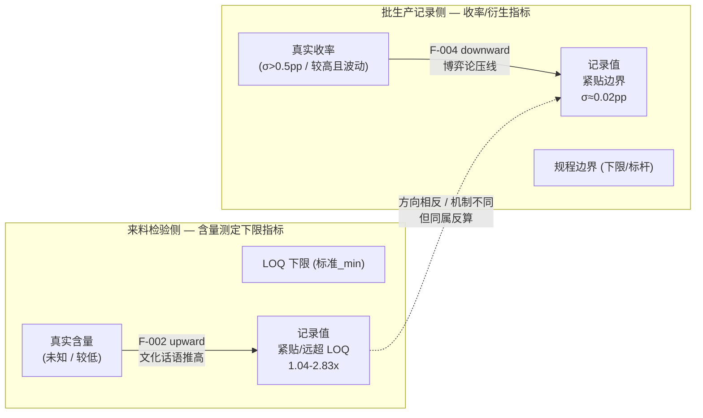
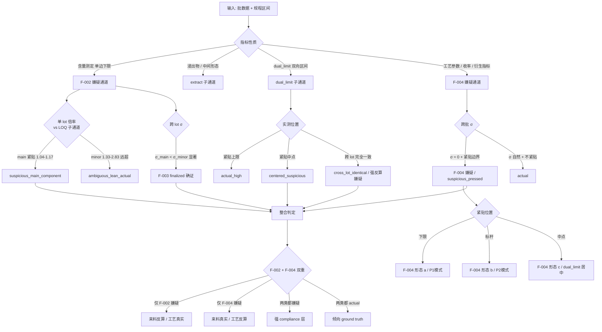

# 双重反算识别模式 — 中药合规叙事的方法论框架
# Dual Reverse Calculation Identification Pattern — Methodology for TCM Compliance Narrative Audit

> Status: **Draft v0.3 内容项全完成 8/8（§7.3 GO-K-ε + §4.5.1·§5.4·§6.3.1 GO-O-η + §3.3.1·§7.2 GO-P-η + §9.1 完整实现 GO-Q-η 2026-06-01 / 仅剩全文精简到 4000-6000 字收尾）**
> 之前版本：v0.1 outline 2026-05-12 / v0.2 2026-05-12 / v0.3 partial 第 1 批 GO-K-ε 2026-05-14 / 第 2-4 批 GO-O-η·GO-P-η·GO-Q-η 2026-06-01
> Owner: 首席架构师
> Source: case-2 中药提取案例 GO-A → GO-G-γ-Phase 2 实证（双产品 / 28 物料来料检验 + 12 批生产记录 + 5 题用户访谈）
> 关联 fundamental findings: F-001 v0.4 / F-002 v0.3 / F-003 (finalized 三维) / F-004 (X1 finalized + 命题深化)
> 关联 ADR: ADR-028 (D-route 战略) / ADR-033 (schema v0.2) / ADR-034 (schema v0.3)
> 文章类型: **D-route Layer 2 季度方法论文章**（vs 既有 00-07 框架抽象 pattern）

## Changelog v0.1 → v0.2 → v0.3（2026-05-12 + 2026-05-14）

### v0.1 → v0.2（2026-05-12 / GO-G-γ-Phase 3）

| 章节 | v0.1 → v0.2 变化 |
|------|----------------|
| §0.2 论点 | 锁定（不变）/ §0.3 加 GMP 审计框架精细对比表 |
| §1 引子 | 加入P2第 2 案例（双产品对照）|
| §2 F-001 | 加入运筹层 2 形态（切换 vs 并行）+ ABAB 跨产品复现 |
| §3 F-002 / F-003 | 加入P2石膏 1.014x 最极端 main + 边界子通道 3 例 + 定性化反算（A-018）|
| **§4 F-004** | **核心扩展**：加入P2 6 批 σ=0.0275 + 命题深化"最不引人注目的安全位置" |
| §5 整合框架 | 双重识别决策树（mermaid 图）+ V12-V14 invariant 候选细化 |
| §6 应用示例 | 扩展到双产品 / 跨产品对比表 |
| §7 跨域可迁移 | 保持（v0.3 时再扩展具体案例）|
| §8 局限性 | 修订（双产品验证完成 / F-004 X1 满足）|
| §9 现有方法论关系 | 加入 V12-V14 invariant 编号建议 |
| §10 写作计划 | 进度更新 / v0.2 已完成 |
| §11 待协作输入 | 修订（v0.1 提的审稿点现已部分回答）|

### v0.2 → v0.3 partial（2026-05-14 / GO-K-ε）

| 章节 | v0.2 → v0.3 变化 |
|------|----------------|
| 文件头 | Status: v0.2 章节展开 → v0.3 启动（partial / §7.3 展开）|
| **§7.3 学术理论关系** | **核心扩展**：4 锚点列表 → **5 个理论 §7.3.1~§7.3.5 各 2-3 段精炼展开**（Goodhart's Law / Prospect Theory / Principal-Agent / Latour ANT / Campbell's Law + 行业心理学）+ 与 F-002 / F-004 命题的具体对接 |
| §10.3 v0.3 计划 | 进度更新 / §7.3 v0.3 启动达成 |
| §12 v0.3 待补充清单 | 标 §7.3 ✅ / 剩余项继续 v0.3 完整初稿（2026-07~08）|

⚠️ v0.3 完整初稿（精简到 4000-6000 字 + 文献综述 + 全章节同步迭代）保留 2026-07~08 / 本次仅启动 §7.3 学术理论锚点展开作为 v0.3 第一批 partial 产出。与 09 v0.2 全本（GO-J-ε）配对节奏一致。

### v0.3 partial 第 2 批（2026-06-01 / GO-O-η / 沉淀期后第 2 项）

| 章节 | v0.3 第 2 批变化 |
|------|----------------|
| 文件头 | Status: v0.3 启动 → v0.3 推进中（+ §4.5.1 / §5.4 / §6.3.1）|
| **§4.5.1（新）** | 双向反算可视化 mermaid（F-002 upward vs F-004 downward 共享边界轴 / 单向框架盲区论断）|
| **§5.4（新）** | 双重反算检测工程化伪代码（V12 detect_f002 + V13 detect_f004 / 复用 identity_resolver + invariant_scaffold + audit_triage / ground truth 来自访谈的工程契约）— **强框架抽象产出 / 接 Layer 1** |
| **§6.3.1（新）** | 逐批 σ 精确计算（程序核算 / 样本 σ 0.0223 / 0.0275 / 压平 ~20-25× / σ 量级比 1.23）+ Cpk 判断反转量化 |
| 引用锚点 | 全部引 schema-v0.4 完整 lock（GO-N-η / `_subchannel` 6 类 + F-004 finding）|

⚠️ v0.3 第 2 批聚焦"可视化 + 工程化 + 量化"三类严谨性补强（节制批次 / 推进 §12 跟踪 1.5/8 → 4.5/8）。**仍留 v0.3 完整初稿（2026-07~08）**：§7.2 跨域文献综述（与 09 §9.2 同步）+ 全文精简到 4000-6000 字 + §9.1 traceguard 完整实现。

### v0.3 partial 第 3 批（2026-06-01 / GO-P-η / 跨域实证补强 / research-first）

| 章节 | v0.3 第 3 批变化 |
|------|----------------|
| **§3.3.1（新）** | minor_component 跨产品分布对比（0.5-宽分箱直方图 / 程序核算 / 均值差 0.006 / 78% 重叠量化 / 与 main 紧贴形态对照）|
| **§7.2.1（新）** | 财报 benchmark-beating 跨域同构 — Burgstahler & Dichev (1997) 盈余零阈值不连续 + Graham 等 (2005) 78% 高管为达标牺牲长期价值 / **更倾向真实动作而非改账 = F-004"改过程不改账"同构**（web 检索核实引用）|
| **§7.2.2（新）** | 学术 p-hacking 跨域同构 — Simmons 等 (2011) researcher degrees of freedom + **如实呈现"p<0.05 下方聚集"分布证据的复现争议**（Masicampo & Lalande 2012 / Head 等 2015 vs 重分析）→ 反向印证"访谈 ground truth"必要性（本文核心论断）|
| **§7.2.3（新）** | F-002（文化话语 upward）跨域同构较弱 / 需逐域识别话语结构 |
| 引用方式 | 全部 web 检索核实（作者 / 年份 / 期刊卷页）/ 不凭记忆 / research-first |

⚠️ v0.3 第 3 批完成跨域实证补强（§12 跟踪 4.5/8 → **~7/8 = 88%**）。**剩余 2 项留 v0.3 完整初稿（2026-07~08）**：§9.1 traceguard 完整实现 + 全文精简到 4000-6000 字（终末步 / 加正式参考文献列表）。p-hacking 分布证据争议的如实呈现强化了"分布提嫌疑 / 访谈确证机制"的核心论断（§7.2.2 ↔ §0.3 ↔ §6.3.1）。

### v0.3 partial 第 4 批（2026-06-01 / GO-Q-η / §9.1 traceguard 完整实现设计）

| 章节 | v0.3 第 4 批变化 |
|------|----------------|
| **§9.1（重写为完整实现）** | 在 traceguard 真实架构上落 V12-V14（先读 traceguard 仓库真实代码对齐）：§9.1.1 落 structural 层（确定性 / DEGRADED 模式照跑）+ §9.1.2 概念→真实组件映射表（validate_structural / TraceReader / TraceWriter / ActionConfig / generate_suggestions）+ §9.1.3 stateless×跨批 σ 解法（eval_store）+ **§9.1.4 必要框架扩展 E1-E3（reverse_calc check / 可插拔注册 / audit-flag 语义）= case-2→traceguard 框架抽象产出** + §9.1.5 TCM config YAML（对齐 market_intel.yaml）+ §9.1.6 V13 真实签名伪代码 + §9.1.7 嫌疑→访谈→ground truth 闭环 |
| §12 #6 | ⏳/🔄 → ✅ 完成（8 个内容项全完成 = 100%）|
| §10.3 / 文件头 | v0.3 内容项全完成 / 仅剩全文精简收尾 |

⚠️ v0.3 第 4 批后 **8 个内容项全完成（§12 = 100%）**。**仅剩终末步**：全文精简到 4000-6000 字 + 正式参考文献列表（内容已到位 / 待 2026-07~08）。§9.1 范围 = 文章内完整实现设计（用户 ACK"文章内完成"）；E1-E3 扩展点的真实 PoC 代码属 Layer 1 框架工作（不在本文范围）。

---

## 0. 论点与文章定位

### 0.1 文章定位

D-route Layer 2 首篇案例驱动的方法论文章。与既有 00-07 框架抽象 pattern 并列但性质不同：00-07 抽象工程方法（如何组织 agent / 如何治理 sprint），本文抽象**领域识别方法**（如何在合规叙事中识别反算）。

- 实证锚点：case-2 中药提取案例（企业 A / P1 + P2两产品 / 28 物料 + 12 批 + 5 题用户访谈）
- 跨域可迁移目标：财报合规 / 学术 p-hacking / 临床试验主要终点 / 公司绩效 / 任何"外部考核压力 + 一线人员自填权限"的领域
- 目标读者（按优先级）：(a) AI 工程师（合规审计方向 / Layer 1 框架代码使用者）/ (b) 行业专家（内部审计 / 工艺员 / QA / 监管对接岗）/ (c) 监管/学界（中药 GMP 监管 / 行业心理学研究）
- 预期长度：4000-6000 字（v0.3 完整初稿）/ 当前 v0.2 约 5500 字
- D-route timeline 锚点：**2026-10 第 1-2 篇方法论文章发布**

### 0.2 核心论点（v0.1 锁定 / v0.2 保持）

> **AI 知识工程做合规叙事审计的关键创新：识别"双重反算机制"**
>
> 1. **文化话语驱动**（F-002 / 心智偏向 / 无意识 / **upward 推高**）
>    — 例：含量测定下限指标的紧贴 LOQ 形态（"含量高=质量好"行业话语驱动）
>
> 2. **博弈论驱动**（F-004 / 自我保护策略 / 有意识 / **downward 压线**）
>    — 例：批生产记录收率紧贴规程标杆或下限（"压线合格 + 留未来失败空间"操作工博弈论驱动）
>
> 两种机制**并存但方向相反、驱动不同、识别方法不同**。单一识别框架（如传统 GMP 审计假设"数据真实 / 异常应显示"）会**漏掉至少一半反算嫌疑**。
>
> 整合识别需要：(a) F-001 三层结构（合规叙事的分层模型）+ (b) F-003 子通道分裂（指标量级与反算难度的关系）+ (c) 双重反算决策树。

### 0.3 与既有 GMP 审计框架的精细对比

| 维度 | PIC/S GMP | FDA Process Validation | **本文方法论** |
|------|-----------|----------------------|--------------|
| 数据假设 | 真实 + 完整 + 可追溯 | 真实 + 重复性可验证 | **分层制品（合规叙事 vs 实际执行 vs 身体化经验 / F-001）** |
| 反算识别 | 文档审查 + 偏差日志 | 控制图 + Cpk + 异常预警 | **双重形态识别**（F-002 upward + F-004 downward） |
| 跨批分析 | 平均 + 趋势 + 限值符合性 | 控制限（UCL/LCL）+ Cpk ≥ 1.33 | **σ ≈ 0 + 紧贴边界** = 反算 smoking gun（不是合规 / 是合规过度精确） |
| 访谈作用 | 选择性（FDA 483 时）| 选择性（PAT 实施）| **关键 — F-004 finalize 必要条件 + Q-027 用户答案直接揭示机制** |
| 子通道分析 | 不涉及 | 不涉及 | **F-003 6 子通道 × 标准量级** |

⚠️ **关键差异**：传统 GMP 审计如果发现"6 批收率 σ=0.022 / 紧贴下限 40%"会判为**优秀工艺重复性**（Cpk 极高 / 完美控制）。本文方法论判其为**反算嫌疑**（应有 σ > 0.5% 的真实工艺被压平到 σ ≈ 0）。这是**判断逻辑的根本反转**。

---

## 1. 引子 — 为什么需要双重反算识别？

### 1.1 中药 GMP 合规叙事的悖论

中药批生产记录在表面上"完美" — 投料量精确到 0.01 kg，提取温度恒定 100°C，料液比稳定 6.000，跨 6 批收率窄至 0.06 个百分点。这种"完美"在物理上几乎不可能：饮片含水量自然波动（±2-5%）、操作工称量误差（±0.05 kg/袋）、设备精度限制（电子秤 ±0.5%）、浓缩终点判定（相对密度精度 ±0.01）等都会引入数百克级偏差。

但 case-2 数据揭示：记录数据经过**双重"加工"**，且**两个方向反算并存**。P1 6 批投料量 514.35/514.35/385.72/257.09/385.72/16.04/51.35 跨批 σ=0；P2 6 批投料量 148.19/98.50/296.38/98.50/98.50/98.50/70.94 也是精确到 0.01 kg 跨批 σ=0。**两个不同产品、不同工艺、不同时期都呈现"投料量精确到 0.01 kg"的完美记录** — 这只能是反算到模板批量的产物。

### 1.2 case-2 揭示的两类反算（双产品双向证据）

| 维度 | 来料检验侧 | 批生产记录侧 |
|------|---------|----------|
| 数据形态 | 含量测定紧贴 LOQ（甘草苷 0.87/0.45=1.93x / 栀子苷 3.4/1.8=1.89x）| 收率P1紧贴 40% / P2紧贴 38.3% / σ ≈ 0.02 pp |
| 方向 | **upward 推高** | **downward 压线** |
| 已识别命题 | F-002 文化话语反算 | F-004 博弈论反算 |
| 跨产品实证 | P1 12 物料 + P2 7 物料 / minor 子通道倍率分布完全重叠 | P1 6 批 σ=0.0223 + P2 6 批 σ=0.0275 / 两个产品都紧贴规程边界 |

⚠️ 两个方向相反，但都是反算嫌疑。**单一框架解释不了** — F-002 "高即好" 无法解释收率为何被压线 / F-004 "压线合格" 无法解释含量被推高。

### 1.3 用户访谈揭示双重驱动

用户 GO-E-α Q-027 答案（关键 / 用户原话）：

> "操作工往往将需检验的参数（例如相对密度）控制到位后，即便收率更高也不会写真实的数据，因为怕以后公司按照较高的收率考核他，也可能会被 QA 调查为什么收率那么高而以前很低... 一线操作工倾向于每次都压线合格，以便给自己留足未来的失败空间。"

这是**博弈论 + 行业心理学**的反算 — 与 F-002 文化话语驱动**完全不同的机制**：
- 文化话语驱动（F-002）：心智偏向 / 无意识 / "高即好"自动推高
- 博弈论驱动（F-004）：理性策略 / 有意识 / "压线合格 + 留安全垫"

用户 Q-028 进一步揭示反算的**操作机制**："输入参数（投料量/温度/时长）往往是倒推的合理数值；输出参数（相对密度/含量测定）一般不会造假，因为 QC 要独立检测并出具报告，下一环节会有意见"。即操作工**不直接修改输出数据**，而是**通过控制工艺过程让结果落到目标区间**。

### 1.4 本文贡献

本文论证：
1. 中药合规叙事中存在**至少两种独立的反算机制**（F-002 + F-004）
2. 两种机制可识别 / 可工程化检测 / 可跨域迁移
3. 双重识别框架是 AI 知识工程在合规叙事审计中的**核心创新**
4. **F-004 命题深化**（GO-G-γ）：操作工选择"最不引人注目的安全位置"，而非简单压在规程下限

---

## 2. F-001 三层结构 — 合规叙事的分层模型

### 2.1 三层定义（v0.2 锁定）

```
表层（合规叙事）：批生产记录 + 来料检验报告 + 物料放行单 → GMP 检查可见
↓ 结构性代差
中层（实际工序执行）：大部分未写在记录中 / 由车间主任 + 排产决定 / 设备实际可用性 / 班次配合
↓ 结构性代差
深层（身体化经验）：操作工与工艺员的隐性知识 / 自我保护策略 / 真实生产噪声
```

### 2.2 F-001 v0.4 精细化（GO-E-α 后）

#### 2.2.1 表层进一步分三类参数（Q-028 用户访谈触发）

| 参数类型 | 反算机制 | 实例 | 受外部约束 |
|---------|---------|-----|---------|
| **输入参数** | 倒推填表（无外部独立验证）| 投料量 514.35 kg / 提取温度 100°C / 时长 3+2h / 料液比 6.000 | 无 |
| **输出参数** | 真实记录（操作工不修改）| 相对密度 1.34-1.37 / 含量测定 / 外观 | QC 独立 + 下游使用约束 |
| **衍生指标** | 工艺控制压线（不修改记录但操作过程导向目标）| 收率 ≈ 40% 或 38.3% | 间接（通过工艺控制实现）|

⚠️ **三类参数的反算"成本"不同**：输入参数最易（无独立验证）/ 输出参数最难（QC + 下游约束）/ 衍生指标中间（通过工艺控制间接达到）。这与 F-003 子通道分裂（按反算难度分类）的逻辑同构。

#### 2.2.2 中层为运筹层决策（Q-026 + A-016 触发 / A-021 双形态扩展）

用户 Q-026 答："由车间主任决定使用哪个设备，而车间主任一般根据排产情况来决定。"

中层不是个人操作工偏好、不是工艺规程明文，而是**车间主任的运筹决策**（设备占用 + 排产平衡 + 工艺有效性）。

⚠️ GO-G-γ 实证扩展 — 运筹层决策呈**两种形态**：

| 产品 | 运筹形态 | 实证 |
|------|---------|------|
| **P1** | **跨批切换** | B1 用 E1 32h / B2~106 用 E2 10h（E1 可能被占用/维护）|
| **P2** | **同批并行** | B7 同批 双效 E3（一效+二效）+ 单效 E1 + 收膏 E2 = 3 套设备并行（工艺规程 §4.10.5 明示）|

**形态差异成因**：
- P1规程**单设备路径** + 设备临时调度（车间主任根据 E1 可用性切换）
- P2规程**多设备并行** + 工艺规程内化设计

这是 F-001 中层"运筹层决策"的**多形态实证**（A-021）。

#### 2.2.3 深层含真实生产噪声 + 自我保护策略（Q-027 触发）

用户 Q-027 答："现场操作工的操作也可能很不严谨（中间刷手机，出去吸烟，甚至回家），导致收率下降... 一线操作工倾向于每次都压线合格，以便给自己留足未来的失败空间。"

深层包含：
- 真实生产噪声（操作不严谨）
- 来料批间差异（含水量 / 含杂质率 / 含量百分比 / 等）
- 设备实际状态多样（清场是否彻底 / 是否有上批残留）
- 操作工**自我保护策略**（F-004 命题根源）
- 班次配合（如操作工 L/操作工 Z ABAB 严格交替）

#### 2.2.4 ABAB 严格交替跨产品复现（A-015 + Q-006 跨产品确证）

| 产品 | 6 批操作人序列 | ABAB 严格 |
|------|------------|----------|
| P1 B1~106 | 操作工 L/操作工 Z/操作工 L/操作工 Z/操作工 L/操作工 Z | ✅ |
| P2 B7~306 | 操作工 L/操作工 Z/操作工 L/操作工 Z/操作工 L/操作工 Z | ✅ |

**12 批跨产品 100% ABAB 严格交替** — 用户 Q-006 答"班长按工资公平轮值"跨产品稳定确证。F-001 表层"操作人字段"有真实意义（**非反算 / 是真实班次记录**），这是表层为数不多的"真实"字段之一。

### 2.3 实证锚点

- batch-record.json `_meta.fundamental_findings.F-001._v0_4_精细化`
- 28 物料 6 类来料检验（P1 22 + P2 7）
- 12 批生产记录（P1 6 + P2 6）
- 5 题用户访谈（GO-E-α / 决定 F-001 v0.4 分层）
- A-013 / A-016 / A-017 / A-021 跨记录 anomaly

---

## 3. F-002 文化话语反算 — Upward 偏向

### 3.1 命题（v0.3 适用范围限定）

> 中成药质量标准只设含量下限（不设上限）→ 文化话语"含量高 = 质量好"→ upward 反算偏向

**适用范围**：中药材成品 / 饮片的"含量测定（单边下限）"section。
**不适用**：中间体 / 辅料 / 包材（dual_limit 标准 / 物理化学指标 / 无"高即好"文化话语 / 见 ADR-034）。

### 3.2 F-003 子通道分裂（finalized 三维）

按指标"标准量级"分 6 子通道：

| _subchannel | 标准 _min | 单 lot 实测倍率 | 反算难度 | 单批 layer 倾向 |
|-------------|---------|--------------|---------|---------------|
| main_component | ≥30% | 1.04-1.17x | 低（绝对差 1-4 pp 即"刚过线"）| suspicious_main_component |
| extract | 浸出物 2-30% | 1.25-1.68x | 中 | ambiguous |
| minor_component | <30% (含量测定) | 1.30-2.83x | 高（绝对差 0.04-2 pp 反而显眼）| ambiguous_lean_actual |
| dual_limit_intermediate | 区间制 | 紧贴中点 | 低 | 安全居中反算 |
| dual_limit_excipient | 区间制 | 紧贴中点 / 跨 lot 一致 | 低 | 同上 |
| dual_limit_packaging | 区间制 | 跨 lot 完全一致 | 低 | cross_lot_identical |

**关键 insight**：反算难度 ∝ 1 / |标准值 × 允许误差|
- 主成分型（标准 50-86%）：绝对差 3-4 pp 即"刚过线"看似合理 → 反算容易
- 微量成分型（标准 0.04-6%）：绝对差 0.04-2 pp 反而显眼 → 反算困难

### 3.3 跨产品 F-003 实证（v0.2 新增）

**main_component 子通道极端紧贴 LOQ 跨产品样本**：

| 物料 | 主成分 | 标准 _min | 实测 | _倍率_of_LOQ | 来源产品 |
|------|--------|---------|------|-------------|---------|
| **石膏** | **CaSO4·2H2O** | ≥95.0% | 96.3% | **1.014x** ⭐ 最极端 | P2 (L-mat-07) |
| 海螵蛸 | CaCO3 | ≥86.0% | 89.7-89.9% | 1.043-1.045x | P1 (L1/L2) |
| 茯苓 | β-葡聚糖 | ≥50.0% | 53.5% | 1.07x | P1 (L1) |
| 明胶胶囊 | 黏度 | ≥60 mm²/s | 64 | 1.067x (跨 lot 完全一致) | 辅料 |
| **黄芩苷** | (含量测定) | ≥8.0% | 9.2% | **1.15x** (边界候选) | P2 (L-mat-07) |
| **玄参浸出物** | (浸出物高量级) | ≥60.0% | 70.5% | **1.175x** (边界候选) | P2 (L-mat-07) |

⚠️ **新发现**（v0.2 / GO-G-γ-Phase 1）：黄芩苷 8% 标准 + 玄参浸出物 60% 标准是 schema v0.3 的**子通道边界案例**，可能触发 schema v0.4 增加 `high_minor` / `high_extract` 子通道（详 §11 待补充）。

**minor_component 子通道跨产品复现** ✅：
- P1 minor 组：[1.33, 1.39, 1.58, 1.93, 1.975, 2.83]
- P2 minor 组：[1.30, 1.33, 1.85, 1.89, 2.13, 2.50]
- 分布**完全重叠** → F-002 minor 子通道跨产品稳健性 100% 实证

### 3.3.1 minor_component 跨产品分布对比（v0.3 / GO-P-η）

把两产品 minor 倍率按 0.5 宽分箱，分布形态高度重叠（程序核算 / 0.5-宽 bin）：

```
倍率 vs LOQ      [1.0–1.5)  [1.5–2.0)  [2.0–2.5)  [2.5–3.0)
P1 (n=6)        ██ 2      ███ 3       ·  0       █ 1
P2 (n=6)        ██ 2      ██  2       █  1       █ 1
```

| 指标 | P1 minor | P2 minor |
|------|------------|------------|
| 均值倍率 | 1.839 | 1.833 |
| 中位数 | 1.755 | 1.870 |
| 范围 | 1.33–2.83 | 1.30–2.50 |

⚠️ **分布重叠量化**：两组均值差仅 **0.006**（1.839 vs 1.833），范围重叠区间 [1.33, 2.50] 覆盖P1全距的 **78%**。两个不同产品、不同药材、不同供应商批次的 minor 子通道倍率**落在同一分布**——这与 main_component 子通道的跨产品紧贴 LOQ（§3.3 石膏 1.014x / 茯苓 1.07x）形成对照：F-002 的子通道形态（main 紧贴 / minor 离散但同分布）跨产品稳健，是"反算难度 ∝ 1 / |标准值×允许误差|"（§3.4）的跨产品确证。与 09 §6.4 σ 矩阵互证。

### 3.4 跨 lot 极差比矩阵

| 子通道 | n | 单 lot 横向极差 | 跨 lot 纵向极差 | 跨产品极差 |
|--------|---|--------------|-------------|----------|
| main_component | 4+2 | 0.027 (lot-L1 / 0.027) | 0.022% (CaCO3 跨 lot) | 0.16 (石膏 1.014 vs 茯苓 1.07) |
| minor_component | 12 | 1.500 | 30% 跨 lot | 14 个跨产品 / 倍率分布同构 |
| **极差比** | — | **55:1** | **136-370:1** | **跨产品一致性极高** |

### 3.5 F-002 定性化反算嫌疑最强形态（A-018 跨产品 + 石膏定性 / v0.2 新增）

**A-018 新发现**：跨 4 物料汞含量完全一致 0.1 mg/kg / 50% LOD（P1三七 + P2栀子/玄参/柴胡）。
- 跨物种生理性富集差异应当大（汞在不同植物中富集差 100 倍以上 / 实证P1延胡索汞 0.001 / 三七汞 0.1 = 100x 差）
- 跨产品 + 跨物种 + 4 物料"全部 0.1" → 仪器精度 LOD 边界统一填值嫌疑

**石膏极端定性化**：重金属/砷只报"未过 10 mg/kg / 未过 2 mg/kg"无具体数值 → **F-002 反算嫌疑最强形态**：定性"未过"等于"≤上限" / 无任何数据可被独立审查。

### 3.6 实证锚点

- lot-L1 单 lot 横向极差比 main:minor = 55:1
- 跨 lot (L1 → L2) 极差比 136:1
- 跨产品 5 类物料 + 2 产品确证
- batch-record.json `_meta.fundamental_findings.F-002` + `F-003`
- cross-product summary `data/incoming-qc/lot-L2-and-auxiliary-summary-v0.1.md`

---

## 4. F-004 博弈论反算 — Downward 压线（本文核心 / v0.2 大幅扩展）

### 4.1 命题（GO-E-α 浮现 / GO-G-γ-Phase 2 finalize_X1）

> **操作工压线合格机制** — 中药批生产记录中操作工出于博弈论自我保护策略，把可调整指标写入**最不引人注目的合规位置**，给自己未来失败时留出"安全垫"。

### 4.2 双重驱动（用户 Q-027 揭示）

| 驱动 | 机制描述 | 跨产品验证 |
|------|---------|-----------|
| **怕被高基线考核** | 本批写真实较高收率 → 公司未来按此考核 → 自己未来失败时无安全垫 | P1 + P2都呈现 |
| **怕 QA 调查异常** | "为什么这批高而以前低" → 引起额外审查 / 麻烦 | 同上 |

### 4.3 工艺控制 vs 数据修改（Q-028 揭示）

**重要区别**：
- F-004 **不是直接修改记录值**
- 而是**通过控制工艺过程**让结果落到目标区间
- 例：操作工控制浓缩程度让浸膏重量 ≈ 668.6 kg（P1 ≈ 1671.51 × 40% = 668.6）或 ≈ 350.84 kg（P2 ≈ 909.51 × 38.3% = 348.6）
- 输出参数（相对密度 / 含量）**真实记录**（受 QC + 下游约束）
- 衍生指标（收率）通过**工艺控制**达到目标

### 4.4 命题深化（GO-G-γ-Phase 2 / v0.2 核心新增）

⭐ **F-004 不是机械"压在规程下限"，而是选择"最不引人注目的合规安全位置"**：

| 产品 | 规程设计 | 操作工选择的紧贴位置 | 偏离 | σ |
|------|---------|------------------|------|---|
| P1 | 区间 40-45% / **无标杆** | **下限 40%** | +0.26~0.32 pp | 0.0223 |
| P2 | 区间 36-41% / **标杆 38.3%** | **标杆 38.3%** | +0.264~0.341 pp | 0.0275 |

⚠️ **机制深化**：
- 规程只给区间 → 操作工选**下限**（P1 / "刚过线"最不显眼）
- 规程给标杆值 → 操作工选**标杆值**（P2 / "贴近设计值"最不显眼）
- 两种形态都是"留未来失败空间"博弈论命题的实证
- **关键 insight**：操作工识别"什么是当前规程下最 boring / 最不引人注目的合规位置"

跨产品 σ 量级一致（0.022 vs 0.028）+ 偏离量级几乎完全相同（0.26-0.32 vs 0.264-0.341）= **F-004 X1 跨产品稳健性 ✅ 完整实证**。

### 4.5 F-002 vs F-004 完整对比表（本文核心图表 / v0.2 扩展）

| 维度 | F-002 | F-004 |
|------|-------|-------|
| 反算方向 | **upward 推高** | **downward 压低 / 压线 / 标杆贴近** |
| 适用 section | 含量测定下限指标 | 收率 / 工艺参数 / 衍生指标 |
| 驱动 | 文化话语（"高即好"）| **博弈论自我保护**（怕考核 + 怕调查）|
| 触发模式 | 心智偏向（无意识）| **理性策略**（有意识）|
| 数据形态 | 倍率 1.04-2.83x（紧贴 LOQ）| **σ ≈ 0 + 紧贴边界**（下限或标杆）|
| 识别方法 | 子通道分布检验 | **跨批 σ + 紧贴边界 + 访谈** |
| 持续时间 | 单批可识别 | **需跨多批 + 跨产品验证** |
| 操作机制 | 直接填高数值 | **不修改记录 / 通过工艺控制达到目标** |
| 主体 | 检验员 / 工艺员 / 申报方 | **一线操作工 / 班长** |
| 跨产品稳健性 | minor 组分布完全重叠 | σ 量级 + 偏离量级一致 |

### 4.5.1 双向反算可视化（v0.3 / GO-O-η）

F-002 与 F-004 在"规程边界"这条共享轴上方向相反：F-002 把下限指标从真实值**向上**推离 LOQ，F-004 把衍生指标从真实值**向下**压向规程边界。同一份合规叙事里，两个箭头同时存在、指向相反。



⚠️ **单向框架的盲区**：只查"数据是否远离边界"（传统 GMP 思路）会把 F-004 的"紧贴边界 + σ≈0"误读为优秀工艺；只查"数据是否异常偏高"会把 F-002 的"远超 LOQ"误读为高质量。双向识别同时覆盖两个方向。

### 4.6 跨产品实证（v0.2 新增 / P1 + P2 12 批数据）

**P1 6 批 B1~106**：
- 收率：[40.27, 40.26, 40.30, 40.28, 40.32, 40.30]
- σ = 0.0223 pp / 平均 40.288% / 紧贴下限 40%
- 操作人 ABAB：[操作工 L, 操作工 Z, 操作工 L, 操作工 Z, 操作工 L, 操作工 Z]

**P2 6 批 B7~306**：
- 收率：[38.575, 38.564, 38.586, 38.581, 38.641, 38.575]
- σ = 0.0275 pp / 平均 38.587% / 紧贴标杆 38.3%
- 操作人 ABAB：[操作工 L, 操作工 Z, 操作工 L, 操作工 Z, 操作工 L, 操作工 Z]

**12 批跨产品共性**：
1. 收率 σ ≈ 0.02-0.03 pp（远小于真实工艺噪声 σ > 0.5%）
2. 紧贴规程边界（下限或标杆）+ 偏离 0.26-0.34 pp（同量级）
3. 操作人 ABAB 严格交替（班长按工资公平轮值 / Q-006 跨产品确证）
4. 投料量精确到 0.01 kg 跨批 σ=0（F-001 表层完整确证）

### 4.7 broader methodological value

F-004 是**博弈论 + 行业心理学**的方法论命题，跨案例可迁移：
- 财报合规：营业收入压线达标（怕未来基线升高）
- 学术 p-hacking：P=0.04 压线显著（避免过度显著 P=0.001 引起 reviewer 怀疑）
- 临床试验：主要终点 P 值压线 0.05
- 公司绩效：KPI 压线达标
- 教师评估：课时压线
- 命题形式化：**"反算难度 + 操作者自我保护策略 + 外部考核机制" 三者交互**

### 4.8 F-004 finalize 路径（status: X1_satisfied）

剩余条件：
- ~~**X1 跨产品复现**~~：P1 + P2 6+6 批 σ ≈ 0.02-0.03 / 紧贴边界 → ✅ **GO-G-γ-Phase 2 satisfied**
- **X2 跨企业实证**：其他中成药企业的操作工是否有同样行为？（Q-031 / 用户人脉 + 隐私边界）— 可选 / 不影响 X1 实证

---

## 5. 整合框架 — 双重反算识别

### 5.1 识别决策树（v0.2 mermaid 图）



### 5.2 工程化检测（接续 D-route Layer 1 框架代码）

可在 traceguard（生产侧底座）的 guardian node 中实现 V12-V14 候选 invariant：

| Invariant | 命名 | 检测内容 | 触发 |
|-----------|------|---------|------|
| **V12** | `reverse_calculation_suspicion_F002` | 来料检验下限指标按 6 子通道分布检验 | F-002 子通道单 lot + 跨 lot 倍率分析 |
| **V13** | `reverse_calculation_suspicion_F004` | 批生产记录跨批 σ + 紧贴边界检测 | F-004 σ ≈ 0 且偏离规程边界 < 1 pp |
| **V14** | `dual_limit_suspicion` | dual_limit 子通道紧贴中点 / 跨 lot 一致 | dual_limit_intermediate/excipient/packaging |

调用现有 `identity_resolver` 实现跨 lot / 跨批关联；检测结果触发 `audit_trail` 中的 triage workflow；用户访谈结果作为 ground truth 反馈到 schema layer。

### 5.3 与现有 V1-V11 invariants 的关系

V1-V11 是 huadian 史记案例已实现的"数据正确性"invariants（详 methodology/04）。V12-V14 是 case-2 浮现的"反算嫌疑识别"invariants，扩展 invariant pattern 到合规叙事审计领域。

### 5.4 双重反算检测工程化伪代码（v0.3 / GO-O-η）

§5.1 决策树可在 D-route Layer 1 框架代码中工程化为两条独立检测路径，复用既有模块（`identity_resolver` 做跨 lot/批关联、`invariant_scaffold` 承载 V12-V14、`audit_triage` 接人工复核）。核心伪代码：

```python
# V12: F-002 文化话语反算（来料检验侧 / upward）
def detect_f002(material_lots):
    groups = group_by_subchannel(material_lots)        # schema v0.4 _subchannel: main/extract/minor/3×dual_limit
    for sub, items in groups.items():
        ratios = [x.measured / x.std_min for x in items if x.is_lower_bound]
        if sub == "main_component" and within(ratios, 1.00, 1.20):
            yield Suspicion("F-002", sub, "紧贴 LOQ", strength="high")
    if pstdev(main_ratios) << pstdev(minor_ratios):     # 跨 lot smoking gun
        yield Finding("F-003", "子通道分裂确证")

# V13: F-004 博弈论反算（批生产记录侧 / downward）
def detect_f004(batches, spec):
    yields = [b.yield_pct for b in batches]             # 跨批收率
    sigma  = pstdev(yields)
    edge   = nearest_spec_edge(mean(yields), spec)      # 下限 / 标杆 / 中点
    if sigma < SIGMA_FLOOR and abs(mean(yields) - edge) < EDGE_BAND:   # σ≈0 且紧贴边界
        if sigma < expected_process_sigma / SUPPRESSION_RATIO:         # 对照访谈 ground truth
            yield Suspicion("F-004", form=classify_edge(edge),         # a下限/b标杆/c中点
                            strength="high", needs_interview=True)
```

**关键工程契约**：
- `SIGMA_FLOOR` / `expected_process_sigma` 不是常量，而是**来自领域访谈的 ground truth**（如 Q-027 揭示真实工艺 σ>0.5pp）。这呼应方法论核心论断——AI 仅凭记录无法判读 σ≈0 是优秀还是反算，访谈是必要输入。
- F-002 与 F-004 是**两条独立路径**，输出汇入 §5.1 决策树整合判定（Z 节点）；任一单路径都不完整。
- `needs_interview=True` 的 suspicion 进入 `audit_triage` 人工复核队列，复核结论回写 schema layer 作为下一轮 ground truth。

（V12-V14 完整 invariant 定义详 §5.2 表 + §9.1；traceguard guardian node 实现待 v0.4 与 Layer 1 框架抽象互证。）

---

## 6. 应用示例 — 中药提取案例 (case-2)

### 6.1 案例概述（v0.2 扩展到双产品）

- 客户：企业 A
- 产品：**P1 (P1-CODE) + P2 (P2-CODE)** 双产品
- 数据：12 批 B1-106（P1）+ B7-306（P2）
- 物料：P1 22 物料 + P2 7 物料 = **29 物料 / 6 类**（饮片 / 中药材 / 动物源 / 中间体 / 辅料 / 包材）
- 供应商：**6 家**（供应商S1 / 恒达 / 大成 / 供应商S4 / 供应商S5 / 供应商S6）
- 工序：领料 → 称量 → 水提（多罐次错峰 / 双设备）→ 板框过滤 → 浓缩 → 收膏 → 清场

### 6.2 跨产品对比表（v0.2 新增 / 核心实证 panel）

| 维度 | P1 | P2 |
|------|--------|--------|
| **批量** | 162 万粒 / 6 批 | 96 万片 / 6 批（按 2/3 比例缩放） |
| 提取设备 | TQ-3000 E-asset-101-01/02 + HDWN-6000 / DTWZ-6m³ | E5 + E6 双设备方案 |
| 浓缩设备 | T101: E1 E-asset-102 / T102-106: E2 + E4 | T301-306: 双效 E3 + 单效 E1 + 收膏 E2（**3 设备并行**）|
| 收膏方式 | 球形浓缩罐到 1.34-1.39 (60°C) | 球形浓缩罐到 1.35-1.40 (50°C) |
| **收率规程** | **40-45% / 无标杆** | **36-41% / 标杆 38.3%** |
| **6 批收率 σ** | **0.0223 pp** | **0.0275 pp** |
| **紧贴位置** | **下限 40%** | **标杆 38.3%** |
| 投料 σ | 0（精确 0.01 kg）| 0（精确 0.01 kg）|
| F-001 中层 | 跨批切换（E1→E2）| 同批 3 设备并行 |
| 操作人 ABAB | ✅ | ✅ |

### 6.3 关键发现（实证锚点）

**F-002 嫌疑（来料检验侧）**：
- main_component 紧贴 LOQ：海螵蛸 CaCO3 1.043x / 茯苓 β-葡聚糖 1.07x / **石膏 CaSO4·2H2O 1.014x ⭐**
- 边界子通道（v0.4 候选）：黄芩苷 1.15x / 玄参浸出物 1.175x
- minor_component 跨产品复现：12 个指标分布完全重叠 [1.30-2.83x]
- 定性化反算嫌疑：石膏重金属/砷"未过" + A-018 跨产品汞统一 0.1 mg/kg

**F-004 嫌疑（批生产记录侧）**：
- 12 批跨产品 σ ≈ 0.02-0.03 pp / 紧贴规程边界
- 7 物料投料量跨批 σ = 0
- 工艺参数（料液比 / 温度 / 时间）跨批 σ = 0
- 用户访谈直接确认机制 + 命题深化（最不引人注目的位置）
- F-004 嫌疑等级：suspicious_pressed_below 跨产品 ✅ 确证

**F-001 三层结构**：
- 表层：12 批投料 σ=0 / 收率 σ ≈ 0 / 工艺参数 σ = 0
- 中层：2 形态（P1切换 vs P2并行）
- 深层：班长 ABAB 轮值跨产品稳定 / Q-027 用户答案揭示

**整合判定**：case-2 = **mixed compliance layer**
- 来料检验 main + 收率 + 工艺参数 = 强反算嫌疑
- 来料检验 minor + 输出参数（相对密度 QC 复核）= 倾向真实
- 操作人 + 班次 = 真实

### 6.3.1 逐批 σ 精确计算与 smoking gun 量化（v0.3 / GO-O-η）

F-004 嫌疑的核心是"记录 σ 远小于真实工艺应有 σ"。逐批量化（样本 σ）：

| 产品 | 6 批收率 (%) | 均值 | 样本 σ (pp) | 极差 (pp) | 紧贴位置 | 各批偏离 (pp) |
|------|------------|------|-----------|----------|---------|-------------|
| P1 B1~106 | 40.27 / 40.26 / 40.30 / 40.28 / 40.32 / 40.30 | 40.288 | **0.0223** | 0.060 | 下限 40.0 | 0.26~0.32 |
| P2 B7~306 | 38.575 / 38.564 / 38.586 / 38.581 / 38.641 / 38.575 | 38.587 | **0.0275** | 0.077 | 标杆 38.3 | 0.264~0.341 |

**smoking gun 量化**：
- 用户 Q-027 揭示真实工艺噪声下界 σ > 0.5 pp（操作不严谨 / 来料波动 / 设备状态）。
- 记录 σ 相对该下界被**压平 ~20-25 倍**（P1 0.5/0.0203 ≈ 24.6× / P2 0.5/0.0251 ≈ 19.9×，按总体 σ）。
- 两产品 σ 量级比仅 **1.23**（0.0275/0.0223）—— 不同工艺、不同设备、不同批量下 σ 几乎相同，本身就是"σ 由填表习惯而非工艺决定"的旁证。
- 个案：B11 偏离 0.341 pp 为P2 6 批最大，仍落在 0.26~0.34 pp 窄带内，不破坏压线形态。

⚠️ 传统 Cpk 视角下，σ≈0.022 / 区间宽 5 pp → Cpk 远超 1.33（"完美工艺"）。本方法论判其为反算 smoking gun——**判断逻辑反转**（呼应 §0.3）。

### 6.4 case 局限性（v0.2 修订）

- ~~单产品（P1）~~ → **双产品确证**（P1 + P2 / GO-G-γ）
- 单企业（企业 A）/ 跨企业实证待 Q-031（F-004 X2）
- 部分指标（明胶黏度等辅料）反算嫌疑待咨询 Q-032
- 用户访谈是间接证据（非现场观察 / 非操作工本人）
- 缺原始 HPLC 谱图 / TLC 板照片等"二阶 ground truth"数据
- 部分边界子通道（黄芩苷 8% / 玄参浸出物 60%）需 schema v0.4 完善

---

## 7. 跨域可迁移性

### 7.1 跨案例适用条件

满足以下三者同时成立：
1. **有外部考核压力**（公司考核 / 监管检查 / 学术评审）
2. **一线人员有自填权限**（操作工 / 作者 / 测试员）
3. **指标有规程边界**（合规区间 / 显著性阈值 / KPI 目标）

### 7.2 候选跨域案例（v0.2 维持 / v0.3 时按实证补充）

| 领域 | F-002 对应 | F-004 对应 |
|------|----------|----------|
| **财报合规** | 利润率推高（"高即好"）| 营业收入压线达标（怕未来基线升高）|
| **学术 p-hacking** | (无明显 upward) | P=0.04 压线显著（避免过度显著）|
| **临床试验** | 含量推高 | 主要终点 P 值压线 0.05 |
| **公司绩效** | 客户满意度推高 | 销售额压线达标 |
| **环保数据** | (无明显 upward) | 排放数据压线达标 |
| **教师评估** | 学生评分推高 | 课时压线达标 |

### 7.2.1 财报 benchmark-beating — F-004 的最强跨域同构（v0.3 / GO-P-η）

会计学已有大量实证文献记录了与 F-004"压线达标"高度同构的现象。**Burgstahler & Dichev (1997)**（*Journal of Accounting and Economics*, 24: 99-126）对美国上市公司盈余的横截面分布做统计，发现在"零"这个阈值附近存在**不连续**：小幅亏损 / 小幅盈余下降的频数异常**偏低**，紧贴零上方的小幅盈利 / 小幅盈余增长的频数异常**偏高**。这与 F-004 的形态完全一致——把可调整指标推到**刚好越过合规边界**的位置，而非自然分布。

**Graham, Harvey & Rajgopal (2005)**（*Journal of Accounting and Economics*, 40: 3-73）对 401 名财务高管的调查给出了 F-004 机制的直接旁证：约 **78%** 的受访高管承认会为达到盈余基准而牺牲长期价值；更关键的是，高管**更倾向采取真实的经营动作**（如推迟正 NPV 项目）而非在 GAAP 内做账务调整来达标。这与 F-004 的核心机制——**操作工通过控制工艺过程（而非修改记录值）让收率落到目标区间**（§4.3 / Q-028）——是同一种"改过程不改账"的行为逻辑。两者都印证：当外部考核盯住一个边界，理性主体会在**真实行为层**而非**记录层**做反算，使记录层看起来完全合规。

### 7.2.2 学术 p-hacking — F-004 同构 + 一个方法论警示（v0.3 / GO-P-η）

科研领域的 p<0.05 显著性阈值是另一个"合规边界"。**Simmons, Nelson & Simonsohn (2011)**（*Psychological Science*, "False-Positive Psychology"）提出"researcher degrees of freedom"概念，用模拟证明：分析中未披露的灵活性（选择协变量 / 样本量 / 结局指标等）可把名义 5% 的假阳性率推高到约 **60%**。机制与 F-004 同构——通过控制**过程选择**（而非伪造数据）让结果跨过阈值。

但这里有一个对本文方法论至关重要的**警示**：曾有人主张"p 值在 0.05 正下方异常聚集"可作为 p-hacking 的分布级证据（**Masicampo & Lalande, 2012**；**Head et al., 2015** 跨 14 个学科）。然而后续重分析**未能稳健复现**这个"凸起"，并指出 0.05 上方的频数下降更可能由**发表偏倚**（而非 p-hacking）解释。换言之，**纯分布证据（σ≈0 / 阈值附近的凸起）本身是模糊的**——它无法区分"反算"与"选择性发表 / 真实工艺优秀"。

这恰恰反向印证本文的核心方法论论断（§0.3 / §6.3.1）：case-2 的 F-004 判定之所以更强，不是因为分布形态（σ≈0 紧贴边界），而是因为它叠加了 **Q-027 用户访谈这一 ground truth**——直接揭示了"操作工压线合格"的动机与机制。**分布形态提出嫌疑，访谈确证机制**；缺了访谈环节，σ≈0 与 p 值凸起一样是 unresolvable 的。这是本方法论与传统统计审计（仅看分布）的根本差异，也是 §9 工程化伪代码里 `SIGMA_FLOOR` 必须来自访谈而非常量的原因。

### 7.2.3 F-002（upward / 文化话语）的跨域同构较弱

与 F-004 不同，F-002 的"含量高=质量好"文化话语驱动**跨域同构性较弱**（详 §8.3）——它依赖特定行业 / 文化的话语结构。可类比的候选（如教育领域"分数越高越好"、绩效指标"越多越好"导致的指标通胀）存在，但缺乏 benchmark-beating 文献那样清晰的实证分布证据。本文据此判断：**F-004（博弈论 / threshold）跨域可迁移性强，F-002（文化话语）跨域需逐域识别话语结构**。

### 7.3 与现有理论的关系（v0.3 partial / GO-K-ε 学术理论展开）

本节展开 5 个核心学术理论锚点 / 每个 2-3 段精炼介绍 + 与 case-2 F-002 / F-004 命题的具体对接 / 为 v0.4 学界审稿前 §7.3 详细展开打基础。

#### 7.3.1 Goodhart's Law / Campbell's Law — 测量被反算的根本原理

**理论简介**：Goodhart's Law（Charles Goodhart 1975 / 经济政策研究）原命题：**当一个测量变成目标，它就不再是一个好的测量**（"When a measure becomes a target, it ceases to be a good measure"）。Campbell's Law（Donald Campbell 1976 / 社会科学方法论）是同源命题：**任何被用于社会决策的定量指标越是被用于决策，越倾向于被操纵 / 越倾向于扭曲被它意图测量的社会过程**。

**与 F-002 / F-004 命题的具体对接**：F-002 + F-004 是 Goodhart's Law 在中药 GMP 系统中的**精细化具象**：

- **Goodhart 普适原理**："任何测量指标在被用于考核后会被反算"
- **F-002 精细化**：含量测定指标（被用于成品合格判定）→ 行业话语驱动 upward 反算
- **F-004 精细化**：收率 / 衍生指标（被用于操作工绩效考核）→ 博弈论驱动 downward 压线反算

**本文的理论贡献**（v0.3 启动）：Goodhart 原命题论证"反算会发生"但**没有论证反算的方向性**。F-002 + F-004 双重反算论证：**同一系统中反算可以方向相反**（upward + downward 并存）/ 方向由"指标性质 + 驱动机制"决定。这是 Goodhart's Law 的**结构性扩展**。

**学术发表潜力**：在制造业 / 监管经济学 / 行业心理学领域，F-002 + F-004 双重反算可作为 Goodhart's Law 的实证案例研究 / 拓展原命题到"双向反算"框架。

#### 7.3.2 Prospect Theory（Kahneman & Tversky 1979）— F-004 的认知心理学基础

**理论简介**：Prospect Theory（Daniel Kahneman & Amos Tversky 1979 / 行为经济学诺奖工作）提出：人在面对收益与损失时呈现非对称偏好 — **损失厌恶**（loss aversion）量化估计为 ~2.25 倍 — 同等量级的损失带来的负效用约为同等量级收益正效用的 2.25 倍。

**与 F-004 命题的具体对接**：F-004 是 Prospect Theory 在 GMP 操作工层面的具象：

- **收益侧**：报告高收率 = 短期被表扬（小幅正效用）
- **损失侧**：报告高收率 = 未来被按高考核 / 被 QA 调查（潜在大幅负效用）
- **理性策略**：选择**最不引人注目的合规位置**（紧贴下限 / 紧贴标杆）→ 避免损失 / 即使放弃了潜在收益

**用户 Q-027 原话与 Prospect Theory 直接对接**："操作工往往将需检验的参数控制到位后，即便收率更高也不会写真实的数据，**因为怕以后公司按照较高的收率考核他**" — "怕以后被按高考核"是典型的损失厌恶心理 / 不是经济利益计算 / 是认知心理学规律。

**理论贡献**（v0.3 启动）：F-004 是 Prospect Theory 在**重复博弈环境**下的扩展案例 — 经典 Prospect Theory 关注单次决策的损失厌恶 / F-004 揭示**长期合规叙事系统**中损失厌恶如何稳定形成跨批 σ ≈ 0 的反算行为模式。

#### 7.3.3 Principal-Agent Problem — F-004 的信息不对称结构

**理论简介**：Principal-Agent Problem（委托-代理问题 / 信息经济学经典框架）描述：**当 principal（委托人 / 如公司管理层）与 agent（代理人 / 如操作工）之间存在信息不对称 + 利益不完全一致时，agent 会优化自己的利益而非 principal 的利益**。

**与 F-001 三层结构的对接**：F-001 三层结构是 principal-agent 框架在合规叙事系统中的**多层级具象**：

- **Principal（公司 / 监管）** 只能看到表层（合规叙事记录）
- **Agent（操作工 / 工艺员）** 知道中层（运筹决策）+ 深层（实际执行）
- **信息不对称**：principal 不知道中层与深层 / 这是结构性的（不可消除 / 详 09 §5.0）
- **agent 的策略**：在表层制造完美合规叙事 + 在深层执行有利于自己的策略（如 F-004 压线合格 / 留安全垫）

**重复博弈均衡**（v0.3 启动）：传统 Principal-Agent 假设单次互动 / F-004 揭示**重复博弈均衡** — agent 知道每个批都会被检查 / agent 选择"稳定的压线策略"作为长期最优 / principal 心照不宣（追究后真实噪声 σ > 0.5% 会触发更大 GMP 审计风险）。详 09 §5.3 博弈均衡分析。

**政策含义**：减少 F-004 反算的有效路径**不是加强表层检查**（principal 看不到中层深层 / 加强表层只让 agent 更努力反算），而是**改变信息不对称结构**（如引入车间观察员 / 改变绩效考核机制 / 引入操作工自愿报告制度）。详 09 §4.4 制度性基础链路。

#### 7.3.4 STS / Latour ANT — 合规叙事作为"镌刻物" + 反算作为"trial of strength" 痕迹

**理论简介**：Actor-Network Theory（ANT / Bruno Latour 1987 / 科学技术研究 STS）关注**科学事实如何在实践网络中被建造**。核心概念：

- **Inscription（镌刻物）**：把流动的实践"镌刻"成可流通的稳定形式（如文档 / 数据 / 图表）
- **Black box（黑箱）**：成功镌刻 + 流通后 / 实践网络隐藏在背后 / inscription 看起来像"客观事实"
- **Trial of strength（力量博弈）**：不同行动者（人 / 机构 / 仪器 / 文档）之间的稳定博弈痕迹

**与 F-001 + F-002 + F-004 的具体对接**（v0.3 启动）：

- 表层（合规叙事记录）= Latour 意义上的 **inscription** — 把车间实际工序"镌刻"成 GMP 可流通的文档形式
- GMP 审计员 / 监管 / 公司管理层看到的"黑箱"= 表层 inscription / 不见中层 + 深层
- F-002 + F-004 双重反算 = **trial of strength 的痕迹** — 操作工 / 工艺员 / QA / 监管之间稳定博弈在 inscription 上的可见印记
- σ ≈ 0 紧贴边界 = 这种博弈达成的**稳定均衡**（不是工艺优秀 / 是 trial of strength 的稳态）

**理论贡献**：本文方法论可视为 **AI 知识工程版的 ANT 应用** — 用 AI 工程化方法识别 inscription 上的 trial of strength 痕迹 / 打开 GMP 系统这个"黑箱"。这是 STS / 组织社会学的可发表潜力。

#### 7.3.5 行业心理学与组织文化 — F-004 的实践共同体根源

**理论简介**：行业心理学（occupational psychology）+ 组织文化研究（如 Edgar Schein 1985）关注：一线工作人员如何通过实践共同体（community of practice / Wenger 1998）形成稳定的"非正式知识库 + 自我保护文化"。

**与 F-004 命题的对接**：F-004 不是单个操作工的"道德选择" / 而是**实践共同体内部传承的稳定策略**：

- ABAB 严格交替的班次轮值（A-015 / Q-006）= 班长组织文化跨产品稳定（12 批跨P1+P2 100% ABAB）
- "压线合格 + 留安全垫"策略 = 通过观察前辈 / 参与车间日常 / 累积"无声的修正"传承
- 新操作工不是通过培训学会 F-004 行为 / 而是通过**实践共同体的学徒制内化**

**实证锚点**：用户 Q-027 揭示的"操作工压线合格"行为模式跨P1（操作工 L + 操作工 Z ABAB）+ P2（同样 ABAB）100% 复现 → 这是行业心理学**实践共同体规律**的典型实证 / 不是个体性格特质。

**政策含义**（与 §7.3.3 互证）：试图通过培训 / SOP / 警示来"消灭"F-004 行为是**无效**的 — 因为 F-004 不在个体层面 / 在实践共同体层面 / 真正的消除路径是改变中层运筹机制（详 09 §4.4）+ 改变组织文化结构（如团队绩效替代按批工资 / 引入心理安全感）。

---

**§7.3 v0.3 partial 总结**：5 个学术理论锚点已完成详细展开（每个 ~3-5 段）。v0.3 完整初稿（2026-07~08）将进一步：

- 加入更多文献引用（不仅理论命名 / 而是关键文献 + 页码）
- 加入 case-2 数据 vs 理论预测的**量化对照**
- 加入跨域文献综述（医疗 / 金融 / 学术 / 教师领域的反算案例文献）
- 与 09 v0.3 §8 互证 panel（09 §8 关注 Wenger / Scott / Knorr Cetina / 09 §6.5 与 Goodhart 双 panel 对接）

---

## 8. 局限性（v0.2 修订）

### 8.1 case-2 数据局限（修订）

- ~~单企业单产品（n = 1）~~ → 单企业 **双产品**（n = 2 / GO-G-γ）
- 用户访谈非现场观察 / 非操作工本人答（仍是间接证据）
- F-003 finalized 三维 / **F-004 X1 satisfied / X2 跨企业待**
- 缺原始 HPLC 谱图 / TLC 板照片等二阶 ground truth
- 边界子通道（schema v0.4 候选）未完全收敛

### 8.2 方法论层局限

- **识别 ≠ 证实**：双重反算识别能识别"嫌疑"但不能直接证实
- 需要结合一线访谈 / 现场观察 / 原始仪器数据
- 工程实现需要更多 case 验证

### 8.3 伦理与社会层

- F-004 揭示"操作工自我保护策略"是**理性行为**，不是道德问题
- 政策含义：监管压力 + 一线人员博弈 = 反算的根本原因；技术手段（如 AI 审计）不能替代制度设计
- 跨案例迁移时需考虑文化差异（"高即好"话语只在中国中药行业明显 / F-002）；F-004 博弈论命题跨文化普适性更高

---

## 9. 与现有方法论的关系

### 9.1 在 traceguard 中实现 V12-V14（完整实现设计 / v0.3 / GO-Q-η）

本节把 §5.4 的伪代码落到 **traceguard 真实架构**（生产侧运行时 QA 底座 / 仓库 `traceguard/guardian/`）。两个 Layer 1 底座分工：§5.4 映射 HuaDian 知识侧框架模块（`identity_resolver` / `invariant_scaffold` / `audit_triage`）；本节映射 traceguard 运行时——二者互补，不重复。

#### 9.1.1 落在哪一层：structural（确定性）

traceguard 的 guardian 评估流程是 **structural（确定性）→ semantic（LLM-as-Judge）→ action**（`core/guardian_node.py::evaluate`）。V12-V14 是确定性统计检验（σ / 倍率 / 子通道分布），因此落在 **structural 层**（`validators/structural.py::validate_structural() → StructuralResult{passed, issues}`），不是 semantic 层。

⚠️ **关键含义**：反算检测**不需要 LLM**。traceguard `env.py` 在无外部 / 本地 LLM 时进入 DEGRADED 模式（structural-only），而 V12-V14 在 DEGRADED 模式下**照常运行**——这是相对"语义审计"的稳健性优势。

#### 9.1.2 概念 → traceguard 真实组件映射

| 反算检测概念 | traceguard 真实组件（仓库路径）|
|------------|----------------------------|
| V12/V13/V14 判定逻辑 | `validators/structural.py::validate_structural()` → `StructuralResult(passed, issues)` |
| 跨批 σ 需历史数据 | `store/reader.py::TraceReader.query_traces()` / `get_step_stats()`（eval_store = 状态载体 / guardian 仍 stateless）|
| 嫌疑落库 | `store/writer.py::TraceWriter.write(pipeline_name, step_name, action, passed, score, issues, attempt, output_preview)` → `EvalTrace` |
| 不中止管线（仅标记）| `core/config.py::ActionConfig.on_structural_fail = "alert"`（反算是 audit flag / 不是 hard fail）|
| 访谈 ground truth 复核 | `optimizer/suggestion.py::generate_suggestions()`（advisory / human-in-the-loop / **永不 auto-apply**）|
| σ_floor / 子通道定义 / spec 边界 | `configs/examples/tcm_extraction.yaml`（domain config / **不进 generic core**）|

#### 9.1.3 stateless guardian × 跨批 σ 的解法

**难点**：traceguard guardian 是 per-step stateless（一次只见一个 `StepOutput`），但 V13（跨批 σ）需要 6 批数据。
**解法**：遵循 traceguard 设计原则"all state lives in eval_store"——V13 guardian 通过 `TraceReader.query_traces(pipeline_name, step_name, days, limit=6)` 拉取前 N 批的 `output_preview` / `score`，在内存中算 σ，再把结论写回 eval_store。guardian 函数本身仍 **stateless**（只读 eval_store / 不持有状态），符合契约。

#### 9.1.4 必要的框架扩展（诚实 / 这就是 case-2 对 traceguard 的框架抽象产出）

traceguard 现有 `StructuralCheckConfig` 仅有 `schema_path` / `required_fields` / `max_length` / `min_length` / `language` 固定字段，4 个 check 无注册表、被 `validate_structural()` 无条件顺序调用。实现 V12-V14 需要 **3 个扩展点**（按 D-route §6.2 / 通用能力进 core / 领域参数进 config）：

- **E1 — 新增 `reverse_calc` 结构检查类型**：在 `StructuralCheckConfig` 加一个 generic 的统计反算块（subchannel 分布检验 + σ-floor + edge-band），通用于任何"阈值 + 自填权限"场景，不绑定中药。
- **E2 — check 可插拔注册机制**：现为硬连 4 个 check；V12-V14 需要按 config 声明启用（registry / dispatch by name）。
- **E3 — "suspicion vs failure" 语义**：现 `score` 是 pass/fail（structural 1.0 或按 issue 数降级）；反算是**嫌疑 flag**（`passed=False` + `action="alert"`，但数据本身不是"错误"）。需要一个不污染 `get_step_stats().pass_rate` 的 audit-flag 维度。

这 3 个扩展点是 case-2 → traceguard 的**框架抽象候选**（与 09 §6.5 控制图判读反转互证），属 D-route 2027-01 框架代码 v0.1 release 的候选输入。

#### 9.1.5 TCM extraction 配置 YAML（domain config / 对齐 `market_intel.yaml` 结构 / 含 E1 提议字段）

```yaml
pipeline:
  name: "tcm-extraction-qa"
  description: "中药提取工序反算嫌疑检测（case-2 / P1 + P2）"
  trigger: "manual"            # 批生产记录 OCR 后触发
  steps:
    - name: "cross_batch_yield"
      container: "tcm-batch-aggregator:latest"
      input_source: "batch-record"
      guardian:
        structural:
          required_fields: ["product", "batch_id", "yield_pct", "spec"]
          # —— 以下为 E1 提议的 reverse_calc 扩展块（generic 能力 / 当前 traceguard 未实现）——
          reverse_calc:
            mode: "F004_sigma_floor"     # V13: 跨批 σ ≈ 0 且紧贴边界
            window_batches: 6            # 经 TraceReader.query_traces 拉取
            sigma_floor_pp: 0.5          # ★ ground truth 来自用户访谈 Q-027（非常量默认）
            edge_band_pp: 1.0            # 距规程下限/标杆 < 1pp 视为"紧贴"
            spec_edges:                  # domain：各产品规程边界
              "P1": { type: "interval_low", value: 40.0 }
              "P2": { type: "benchmark", value: 38.3 }
        semantic:
          enabled: false                 # 反算检测无需 LLM / DEGRADED 模式照跑
        actions:
          on_structural_fail: "alert"    # ★ 反算是 flag 不 abort
          alert_channel: "telegram"
          max_retries: 0
```

#### 9.1.6 V13 检测器伪代码（用 traceguard 真实签名）

```python
# 落在 validators/structural.py（E1 扩展后由 validate_structural 按 config dispatch）
def _check_reverse_calc_f004(output: StepOutput, cfg, reader: TraceReader) -> StructuralResult:
    rc = cfg.reverse_calc
    # eval_store = 状态：拉取前 N 批（guardian 本身仍 stateless）
    prior = reader.query_traces(pipeline_name="tcm-extraction-qa",
                                step_name="cross_batch_yield",
                                days=3650, limit=rc.window_batches)
    yields = [t["yield_pct"] for t in prior] + [output.as_dict()["yield_pct"]]
    if len(yields) < rc.window_batches:
        return StructuralResult(passed=True, issues=[])      # 数据不足 / 不下结论
    sigma = pstdev(yields)
    edge  = rc.spec_edges[output.as_dict()["product"]]["value"]
    near_edge = abs(mean(yields) - edge) < rc.edge_band_pp
    # ★ sigma_floor 来自访谈 ground truth（Q-027），不是常量
    if sigma < rc.sigma_floor_pp / 20 and near_edge:         # σ 被压平 ~20×（§6.3.1）
        return StructuralResult(passed=False, issues=[
            f"F-004 反算嫌疑: σ={sigma:.3f}pp << floor {rc.sigma_floor_pp}pp / 紧贴边界 {edge}"])
    return StructuralResult(passed=True, issues=[])

# guardian_node.evaluate() 决议：structural 未过 → on_structural_fail="alert"
#   → TraceWriter.write(..., action="alert", passed=False, score, issues=[...]) → EvalTrace 落库
#   → optimizer.generate_suggestions() 产出 advisory：建议"现场访谈/多模态采集确证"（human-in-the-loop）
```

#### 9.1.7 闭环：从嫌疑到 ground truth

`EvalTrace`（action=`alert` / issues 含反算嫌疑）落 eval_store → `optimizer/suggestion.py::generate_suggestions()` 产出 **advisory** 报告（如"建议对 cross_batch_yield 做现场访谈或多模态采集确证"），**永不 auto-apply**（traceguard 设计约束）。人工复核后，访谈结论回填 `sigma_floor_pp` 等 config 参数——这正是本文核心论断（§0.3 / §6.3.1 / §7.2.2）在运行时的工程闭环：**结构检验提嫌疑 → 人工访谈确证 → ground truth 回写 config**。drift_detector 可进一步监控 σ 跨时间是否系统性贴边。

### 9.2 与既有 7 个 methodology 框架文章

| 既有文章 | 与本文关系 |
|---------|---------|
| 00 framework-overview | 本文作为应用层补充 / 不改框架抽象 |
| 01 role-design | 双重反算识别是新角色（合规审计 agent）的核心能力 |
| 02 sprint-governance | 反算嫌疑发现可作为 sprint Stage 4 关键产出 |
| 03 identity-resolver | F-002 跨 lot 关联 / F-004 跨批关联用现有 R1-R6 |
| 04 invariant | **V12-V14 候选扩展**（本文 §5.2 明确编号） |
| 05 audit-trail | F-002 / F-004 嫌疑 → triage workflow |
| 06 adr-for-ke | ADR-033 / ADR-034 / ADR-035 候选是模式实例 |
| 07 cross-stack | 不直接相关 |

### 9.3 与 D-route Layer 3 案例库

- 本文是 case-2 的方法论提炼
- 鼓励其他案例引用 / 验证 / 反驳本框架
- 跨域案例（财报 / 临床等）可作为 Layer 3 第 3-N 案例

---

## 10. 写作计划

### 10.1 v0.1 outline（2026-05-12 早 / GO-F-α）✅
论点 + 章节结构 + 实证锚点指针 / 482 行 / 22.7 KB

### 10.2 v0.2 章节展开（2026-05-12 晚 / GO-G-γ-Phase 3）✅
**本文档** / 每章扩展到 300-500 字 + 加入 GO-G-γ 实证 + 加入图表（mermaid 决策树 + 对比表）/ 约 7000 字

### 10.3 v0.3 完整初稿（2026-07~08）🔄 内容项全完成 8/8 / 待精简收尾
- **已完成**：§7.3 学术理论（GO-K-ε）+ §4.5.1 双向可视化 / §5.4 工程化伪代码 / §6.3.1 逐批 σ（GO-O-η）+ §3.3.1 分布图 / §7.2 跨域文献（GO-P-η）+ §9.1 traceguard 完整实现设计（GO-Q-η / 2026-06-01）
- ✅ 跨域案例实证（财报 Burgstahler&Dichev 1997 + Graham 等 2005 / p-hacking Simmons 等 2011 / web 核实）
- ✅ §9.1 traceguard V12-V14 完整实现设计（真实架构映射 + E1-E3 扩展点 + TCM config YAML + V13 真实签名伪代码）
- ⏳ 剩余（仅终末步）：**全文精简到 4000-6000 字 + 正式参考文献列表**（内容已到位 / 待 2026-07~08）
- F-004 X2 跨企业验证（已决定先放着 / documented unresolvable）

### 10.4 v0.4 审稿修订（2026-09）⏳
- 用户审稿（前药企负责人视角）
- 行业专家审稿（中药行业 + GMP 监管）
- 学界审稿（如能联系到）
- D-route 季度复盘文章 1 段

### 10.5 v1.0 发布（2026-10）⏳
- 与 D-route §6 路线图 "2026-10 第 1-2 篇方法论文章发布" 节点对齐
- 第 2 篇候选：**F-001 三层结构独立文章** / 或 **F-003 子通道分裂独立文章**

---

## 11. 待用户协作输入（v0.2 修订）

按 CLAUDE.md §6.2 原则，本文章 v0.2 → v1.0 迭代中用户输入清单：

| 阶段 | 需要用户输入 | 紧迫度 | v0.1 时的问题 + v0.2 状态 |
|------|---------|--------|---------|
| v0.3 | 审 v0.2 章节展开是否论点清晰 / 是否有遗漏 | 中 | 新（v0.1 outline 已审过 / GO-F-α 后用户认可方向）|
| v0.3 | F-004 命题深化（最不引人注目的安全位置）的术语 — "博弈论"是否太学术？是否换"操作工自保压线"更白话？ | 中 | 新（v0.2 新增命题深化）|
| v0.3 | 跨域案例（财报 / 学术 / 临床 / 公司绩效）哪些有具体实证可访谈 / 用户人脉？ | 高 | v0.1 已问 / 待 v0.3 完整初稿前回答 |
| v0.3 | F-004 X2 跨企业 — 是否能与其他中成药企业接触？或转跨行业（财报 / 临床）案例？ | 高 | v0.1 已问 / X1 satisfied 后 X2 优先级降低 |
| v0.4 | 完整初稿审稿 | 高 | — |
| v1.0 | 发布渠道（GitHub README / Substack / 期刊 / 公众号？）| 中 | v0.1 已问 / 待 v1.0 前定 |

---

## 12. v0.2 → v0.3 待补充章节（进度跟踪）

按 v0.2 起草后识别的不足 / v0.3 GO-K-ε 启动首批 1/8 完成 / 剩余 7/8 留 v0.3 完整初稿（2026-07~08）。

| # | 待补充项 | v0.3 状态 |
|---|---------|---------|
| 1 | §3.5 F-002 跨产品 minor_component 详细分布图 | ✅ **完成（GO-P-η / §3.3.1 分箱直方图 + 均值差 0.006 / 78% 重叠量化）** |
| 2 | §4 F-002 vs F-004 双向反算可视化（双向箭头图）| ✅ **完成（GO-O-η / §4.5.1 mermaid）** |
| 3 | §5.1 决策树工程化伪代码 / F-003 6 子通道判定 + F-004 σ 双重检验 | ✅ **完成（GO-O-η / §5.4 V12+V13 伪代码）** |
| 4 | §6.2 12 批每批 σ 计算 + 个案 anomaly | ✅ **完成（GO-O-η / §6.3.1 程序核算）** |
| 5 | §7.2 跨域案例每个 1-2 段实证或文献支撑 | ✅ **完成（GO-P-η / §7.2.1 财报 Burgstahler&Dichev 1997 + Graham 等 2005 / §7.2.2 p-hacking Simmons 等 2011 + 分布证据争议警示 / §7.2.3 F-002 跨域较弱）** |
| 6 | §9.1 traceguard 实现 / V12-V14 伪代码 | ✅ **完成（GO-Q-η / §9.1 完整实现设计：真实架构映射表 + E1-E3 扩展点 + TCM config YAML + V13 真实签名伪代码 + 闭环）** |
| 7 | §2.5 F-001 三层结构与 STS 理论关系 | ✅ **已通过 §7.3.4 Latour ANT 部分覆盖（GO-K-ε / 2026-05-14）** + 09 v0.2 §8 进一步 anchor |
| **8** | **§7.3 学术理论展开** | **✅ 完成（GO-K-ε / 2026-05-14）** — §7.3.1 Goodhart + §7.3.2 Prospect Theory + §7.3.3 Principal-Agent + §7.3.4 Latour ANT + §7.3.5 实践共同体 — 5 理论各 2-3 段精炼展开 |

**v0.3 完成度**：GO-K-ε 1.5/8（§7.3 + §2.5）+ GO-O-η 3 项（#2/#3/#4）+ GO-P-η 2 项（#1 §3.3.1 / #5 §7.2）+ GO-Q-η #6（§9.1 完整实现设计）= **8 个内容项全完成 = 100%** / 仅剩终末步：全文精简 + 正式参考文献列表。

**v0.3 收尾剩余（仅 1 项终末步 / 待 2026-07~08）**：
- **全文精简到 4000-6000 字 + 正式参考文献列表**（终末步 / v0.2→v0.3 累积已超规格 / 精简 prose 冗余 / 保留量化 + 工程 + 文献核心）— 应在所有内容到位后做（现已到位）
- 备注：§9.1 的 E1-E3 扩展点（reverse_calc check / 可插拔注册 / audit-flag 语义）是 traceguard 框架抽象候选，属 D-route 2027-01 框架代码 v0.1 release 的 Layer 1 工作，不在本文写作范围内。

---

> 本文档 v0.2 在 GO-G-γ-Phase 3 完成 / **v0.3 启动（partial / §7.3）在 GO-K-ε 2026-05-14 完成**。预计 v0.3 完整初稿 2026-07~08（与 09 v0.3 同步迭代）。
> 与 case-2 实证数据三向对齐：batch-record.json (F-001~F-004) + 3 个 cross summary + user-interview。
> 与 sibling article `09-layered-compliance-narrative-pattern.md` 形成"结构 × 机制"互证 panel（详 09 §10.1 mermaid）。
> 与既有 7 个 methodology pattern 文档并行 / 不替代。
> v0.1 outline 完整结构保留在 git 历史中可追溯。
